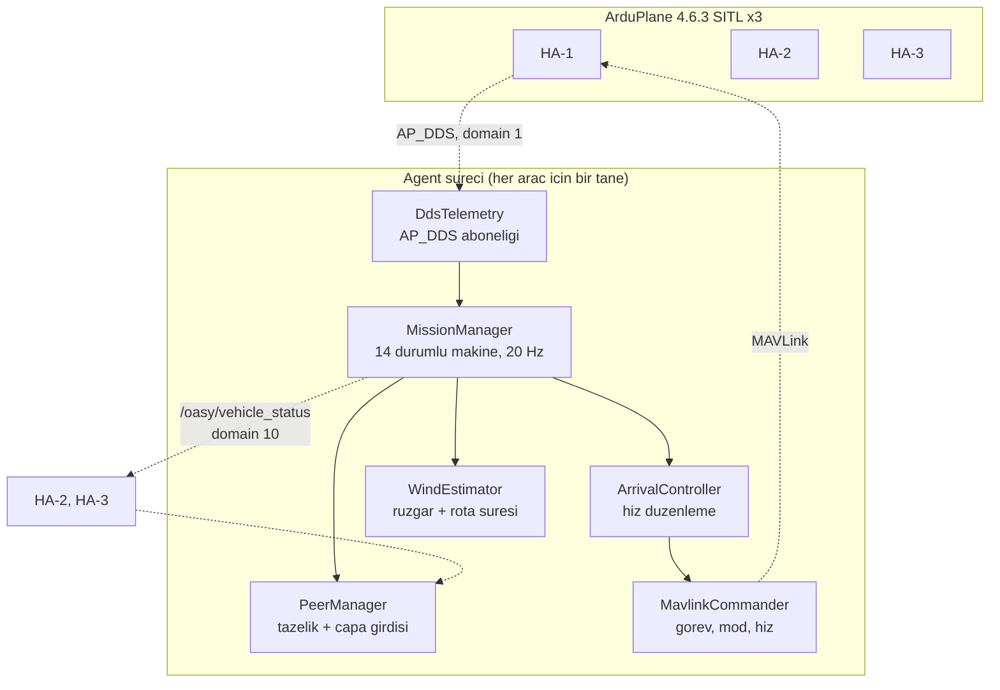

# 1. Sistem Mimarisi ve Merkeziyetsiz Kontrol Yaklaşımı

> Vaka belgesi, teknik raporda **"Genel sistem mimarisi ve merkeziyetsiz kontrol
> yaklaşımı"** başlığını istiyor. Bu bölüm o başlığın karşılığıdır.

## 1.1 Problem

Üç sabit kanatlı İHA, farklı pistlerden otonom kalkıp kendi rotaları üzerinden
ortak bir hedefe **HA-1 → HA-2 → HA-3** sırasıyla ve aralarında **tam 20 saniye**
farkla varacak. Merkezi bir yer kontrol istasyonu ya da master node
kullanılmayacak; her araç kendi kararını diğerlerini dinleyerek bağımsız
verecek.

Zorluk, sıranın geometriyle uyuşmamasıdır:

| Araç | Rota uzunluğu | Nominal süre | Varış sırası |
|---|---|---|---|
| HA-1 | 12205 m | 533 s | **1.** |
| HA-2 | 12329 m | 538 s | **2.** |
| HA-3 | 9269 m | 405 s | **3.** |

HA-3 en kısa rotaya sahip ama en son varmalı. HA-2'nin rotası HA-1'inkinden uzun
ama ikinci varmalı. Yani sistem yalnızca "herkes yoluna gitsin" diyemez; aktif
olarak zaman yönetmek zorunda.

## 1.2 Merkeziyetsizlik Nasıl Sağlanıyor

Merkezi bir karar noktası yok. Bunun yerine her araç **aynı veriden aynı
sonucu** hesaplıyor.

### Ortak çıpa

Her araç "en erken ne zaman varabilirim" değerini ($E_i$) yayınlar. Ortak zaman
referansı, **çıpa**, herkesin bu değerinden türetilir:

$$A = \max_i \left( E_i - 20\,(i-1) \right), \qquad T_i = A + 20\,(i-1)$$

`max` sırasız bir işlemdir; aynı veriyi gören üç araç aynı $A$'yı bulur. Kimse
kimseye komut vermez, ama hepsi aynı takvimde buluşur.

**Çıpayı en kısıtlı araç belirler.** Bu, madde 8'in ("bekleme süreleri en az")
karşılığıdır: $A$ mümkün olan en küçük değerdir.

Ayrıntı: [02 - Merkeziyetsiz Çıpa](kavramlar/02-merkeziyetsiz-capa.md)

### Merkeziyetsizliğin zayıf noktası

Dürüst olmak gerekir: karar merkezi yok ama **bilgi kaynağı tek**. Yerdeki
araçlar kendi rüzgârlarını ölçemez ve öncünün ölçümünü kullanır. Öncünün
kestirimi kötüyse hata zincirin tamamına yayılır.

Bu, mimarinin bilinen bir kırılganlığıdır ve
[04 - Plan Revizyonu](kavramlar/04-plan-revizyonu.md)'nda ölçülmüş bir
başarısızlıkla birlikte belgelenmiştir.

## 1.3 Katmanlar

Sistem, zaman kazanma yetkisi **giderek daralan** dört katmandan oluşur:

| Katman | Yetki | Nerede | Maliyet |
|---|---|---|---|
| **Kalkış gecikmesi** | sınırsız | yerde | **sıfır** |
| **Plan revizyonu** | sınırsız | kalkış öncesi/sonrası | sıfır |
| **Kapı loiteri** | sınırsız, tek seferlik | 2.5 km çemberi öncesi | yakıt + risk |
| **Hız kontrolü** | ±%20 civarı | her yerde | düşük |

Tasarım ilkesi: **düzeltmeyi mümkün olan en ucuz katmanda yap.** Ölçülen sonuç
bunu doğruluyor, sakin ve değişken rüzgâr senaryolarında havada bekleme
**sıfır**, tüm bekleme yerde.

```
  YETKI PIRAMIDI (yukaridan asagiya daralir)

  ┌──────────────────────────────────────────────┐
  │  KALKIS GECIKMESI          sinirsiz, bedava  │  yerde
  ├──────────────────────────────────────────────┤
  │  PLAN REVIZYONU            sinirsiz, bedava  │  kalkis civari
  ├────────────────────────────────────────┐     │
  │  KAPI LOITERI     sinirsiz ama TEK KEZ │     │  2.5 km oncesi
  ├──────────────────────────────────┐     │     │
  │  HIZ KONTROLU     +-%20          │     │     │  her yerde
  └──────────────────────────────────┘     │     │
                                     ▲
                            2 km icinde YALNIZCA bu
```

## 1.4 Bileşenler



| Bileşen | Sorumluluk | Kavram sayfası |
|---|---|---|
| `MissionManager` | 14 durumlu görev akışı, 20 Hz döngü | [01](kavramlar/01-gorev-durum-makinesi.md) |
| `arrival_schedule` | Çıpa ve referans varış hesabı | [02](kavramlar/02-merkeziyetsiz-capa.md) |
| `PeerManager` | Peer durumu, tazelik sınıflaması | [03](kavramlar/03-peer-yonetimi-ve-tazelik.md) |
| `WindEstimator` | Rüzgâr kestirimi ve rota süresi modeli | [06](kavramlar/06-ruzgar-kestirimi.md), [07](kavramlar/07-ruzgar-duzeltmeli-rota-suresi.md) |
| `EtaEstimator` | Aktif waypoint, kalan mesafe | [08](kavramlar/08-eta-ve-kalan-mesafe.md) |
| `geodesy` | Mesafe, yerel düzlem, çember kesişimi | [09](kavramlar/09-jeodezi.md) |
| `ArrivalDetector` | 5 m çemberine giriş, interpolasyon | [10](kavramlar/10-varis-tespiti.md) |
| `ArrivalController` | Hızla zamanlama düzeltmesi | [11](kavramlar/11-varis-zamani-kontrolcusu.md) |
| `DdsTelemetry` / `MavlinkCommander` | Hibrit kontrol düzlemi | [15](kavramlar/15-dds-mimarisi-ve-domain-ayrimi.md) |

## 1.5 Hibrit Kontrol Düzlemi

Belge telemetriyi AP_DDS ile almayı şart koşuyor. Ancak AP_DDS 4.6.3'te görev
yükleme servisi ve hız komutu karşılığı yok. Bu yüzden:

| İş | Kanal | Gerekçe |
|---|---|---|
| Telemetri okuma | **AP_DDS** | Belge şartı |
| Görev yükleme | MAVLink | AP_DDS'te servis yok |
| Hız komutu | MAVLink | `DO_CHANGE_SPEED` karşılığı yok |
| Mod değiştirme | MAVLink | Aynı |
| GUIDED konum hedefi | AP_DDS | `/ap/cmd_gps_pose` mevcut |

Bu bir eksiklik değil, **bilinçli bir tasarım kararıdır**: her iş, o iş için
mevcut olan en uygun kanaldan gider.

## 1.6 Domain Ayrımı

AP_DDS konu adları araç bazında ön ek almaz, üç araç da `/ap/twist/filtered`
yayınlar. Aynı ağda olsalardı telemetri karışırdı.

Çözüm: **araç başına ayrı DDS domaini** (1, 2, 3) ve **ortak koordinasyon
domaini** (10). Her agent iki `rclpy.Context` ile iki domaine birden bağlanır.

Yanlış bağlanma sessiz bir arızadır; bu yüzden ilk telemetri örneğinin gerçekten
kendi aracına ait olduğu **doğrulanır** (kalkış noktaları en yakın çiftte
7754 m ayrı; eşik 1000 m).

Ayrıntı: [15 - DDS Mimarisi](kavramlar/15-dds-mimarisi-ve-domain-ayrimi.md)

## 1.7 Zaman Sözleşmesi

Tüm zaman değerleri **mutlak monotonik an** olarak taşınır, göreli süre olarak
değil.

$$T_{\text{alınan}} = T_{\text{gönderilen}} \quad \text{(gecikmeye bağışık)}$$

"ETA + 20 saniye" bir süredir ve mesaj 0.3 s geç ulaşırsa anlamı kayar. Mutlak
zaman damgası bu sorunu ortadan kaldırır.

İkinci kural: **yalnızca taahhüt edilmiş değerler referans alınır.** Anlık
ETA'ya bağlanmak, öncünün tahmin gürültüsünü zincirleme büyütür.

## 1.8 Doğrulanmış Davranış

Mevcut derlemeyle, senaryo başına iki koşu:

| Senaryo | Koşu 1 | Koşu 2 | Havada bekleme |
|---|---|---|---|
| Sakin | −0.00 / −0.00 s | −0.00 / −0.01 s | 0 s |
| Sabit 8 m/s | −0.20 / +0.02 s | −0.29 / +0.09 s | 62 s |
| Değişken rüzgâr | −0.13 / +0.10 s | −0.11 / +0.17 s | 0 s |

Altı koşunun altısı da kabul ölçütlerini geçti: sıra doğru, sapmalar ±1 s
içinde, üç araç da hedefin 5 m çemberine girdi, rota sapması 500 m sınırının
çok altında (en yüksek 127 m).

Ayrıntı: [04 - Geliştirme ve Testler](04-gelistirme-ve-testler.md)

## 1.9 Bilinen Sınırlamalar

Dürüstlük gereği açıkça listelenir:

- **`FAILSAFE` durumu boş.** Enum'da tanımlı, `safety_manager.py` dosyası mevcut
  ama **0 satır**. Telemetri kesintisi, GPS kaybı, arm reddi için işleyici yok.
- **Öncüye tek nokta bağımlılık.** Rüzgâr bilgisi zincirin başından gelir.
- **S-manevrası uygulanmadı.** Madde 5'in dört yönteminden biri; üçünü
  kullanıyoruz. Yürütme mekanizması geliştirildi ve uçuşta doğrulandı, ancak
  geometri asgari hızda uçurulamadığı için kaldırıldı. Gerekçesi ve ölçümleri
  [04 - Geliştirme ve Testler](04-gelistirme-ve-testler.md)'de.
- **Uç durum rüzgârında bozulma.** Fırtına çıkış cephesi seviyesindeki rüzgâr
  değişiminde (5.5 °/s) sapma −2.55 s'ye çıkıyor. Bu, algoritmanın ölçülmüş
  sınırıdır.
- **Tek makine varsayımı.** `monotonic_ns` süreç yereldir; gerçek dağıtık
  donanımda ortak zaman kaynağı gerekirdi.

## 1.10 Kavram Sayfaları

Her mekanizma ayrı bir sayfada; neden var, nasıl çalışır, matematiği, gerçek
uçuş verisiyle çalışılmış örneği ve sınırlamaları:

**Koordinasyon**
[01 - Görev Durum Makinesi](kavramlar/01-gorev-durum-makinesi.md) ·
[02 - Merkeziyetsiz Çıpa](kavramlar/02-merkeziyetsiz-capa.md) ·
[03 - Peer Yönetimi ve Tazelik](kavramlar/03-peer-yonetimi-ve-tazelik.md) ·
[04 - Plan Revizyonu](kavramlar/04-plan-revizyonu.md) ·
[05 - Kalkış Slotu ve Yer Gecikmesi](kavramlar/05-kalkis-slotu-ve-yer-gecikmesi.md)

**Kestirim**
[06 - Rüzgâr Kestirimi](kavramlar/06-ruzgar-kestirimi.md) ·
[07 - Rüzgâr Düzeltmeli Rota Süresi](kavramlar/07-ruzgar-duzeltmeli-rota-suresi.md) ·
[08 - ETA ve Kalan Mesafe](kavramlar/08-eta-ve-kalan-mesafe.md) ·
[09 - Jeodezi](kavramlar/09-jeodezi.md) ·
[10 - Varış Tespiti](kavramlar/10-varis-tespiti.md)

**Kontrol**
[11 - Varış Zamanı Kontrolcüsü](kavramlar/11-varis-zamani-kontrolcusu.md) ·
[12 - Son Yasal Kapı](kavramlar/12-son-yasal-kapi.md) ·
[13 - Terminal Rezerv](kavramlar/13-terminal-rezerv.md) ·
[14 - Robust E/L Sınırları](kavramlar/14-robust-e-l-sinirlari.md)

**Altyapı ve doğrulama**
[15 - DDS Mimarisi ve Domain Ayrımı](kavramlar/15-dds-mimarisi-ve-domain-ayrimi.md) ·
[16 - Rüzgâr Profili ve Gerçekçilik](kavramlar/16-ruzgar-profili-ve-gercekcilik.md)
