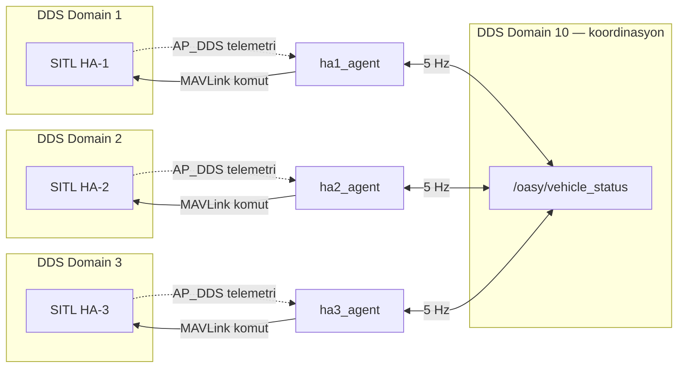
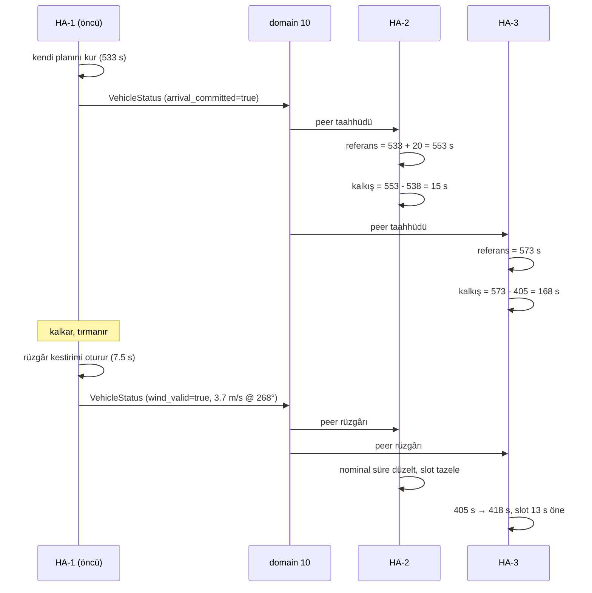
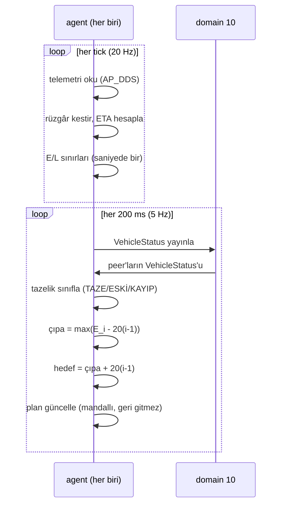

# 2. Node'lar Arası Haberleşme Akışı ve Paket Yapısı

> Vaka belgesi, teknik raporda **"Node'lar arası haberleşme akışı ve haberleşme
> paketlerini gösteren akış şemaları"** başlığını istiyor. Bu bölüm o başlığın
> karşılığıdır.

## 2.1 Genel Görünüm

Sistemde üç bağımsız süreç var — her araç için bir agent. Aralarında **tek bir
mesaj tipi** dolaşıyor: `VehicleStatus`. Başka koordinasyon kanalı yok.



**Kritik ayrım:** hiçbir araç diğerinin ham telemetrisine erişmez. Yalnızca
yayınlanan **özeti** görür. Bu, merkeziyetsizliğin yapısal garantisidir —
bir araç diğerinin verisini "okuyup karar veremez", yalnızca beyan edilene
güvenir.

## 2.2 Kanallar ve Yönleri

| # | Kanal | Yön | Taşınan | Hız |
|---|---|---|---|---|
| 1 | AP_DDS (araç domaini) | SITL → agent | Konum, hız, yönelim, hava hızı vektörü | ~20 Hz |
| 2 | MAVLink (SERIAL0) | agent → SITL | Görev, mod, arm, hız komutu | olay bazlı |
| 3 | AP_DDS (araç domaini) | agent → SITL | GUIDED konum hedefi | tick bazlı |
| 4 | **DDS domain 10** | agent ↔ agent | `VehicleStatus` | **5 Hz** |
| 5 | MAVLink (SERIAL1) | doğrulama betiği → SITL | Rüzgâr profili | 180 s'de bir |

Kanal 5 yalnızca doğrulama içindir; uçuş kodu ondan habersizdir.

### Neden hibrit

Belge telemetriyi AP_DDS ile almayı şart koşuyor. Ancak AP_DDS 4.6.3'te görev
yükleme servisi ve `DO_CHANGE_SPEED` karşılığı yok. Her iş, o iş için mevcut
olan kanaldan gider:

| İş | Kanal | Gerekçe |
|---|---|---|
| Telemetri okuma | AP_DDS | **Belge şartı** |
| Görev yükleme | MAVLink | AP_DDS'te servis yok |
| Hız komutu | MAVLink | DDS karşılığı yok |
| Mod değiştirme | MAVLink | Aynı |
| GUIDED konum hedefi | AP_DDS | `/ap/cmd_gps_pose` mevcut |

## 2.3 Okunan AP_DDS Konuları

| Konu | Tip | Kullanım |
|---|---|---|
| `/ap/navsat` | `NavSatFix` | Konum (enlem, boylam) |
| `/ap/twist/filtered` | `TwistStamped` | Yer hızı (ENU) |
| `/ap/pose/filtered` | `PoseStamped` | Yönelim (kuaterniyon), irtifa |
| `/ap/airspeed_vector` | `Vector3Stamped` | Hava hızı vektörü (**FLU gövde**) |

Son ikisi birlikte rüzgâr kestirimini üretir
([06](kavramlar/06-ruzgar-kestirimi.md)). Çerçeve farkı kritik: yer hızı ENU,
hava hızı gövde — doğrudan çıkarılamazlar.

## 2.4 `VehicleStatus` Paketi

Araçlar arasındaki **tek sözleşme**. Alanlar ve neden var oldukları:

### Kimlik ve durum

| Alan | Tip | Amaç |
|---|---|---|
| `header` | `std_msgs/Header` | Duvar saati — yalnızca kayıt ve video için |
| `vehicle_id` | `uint8` | Üç araç aynı konuya yazar; ayrım budur |
| `seq` | `uint32` | **Mesaj kaybı bu sayacın atlamalarından ölçülür** |
| `mission_state` | `uint8` | `STATE_*` sabitleriyle aynı sayılar |

### Zaman — sistemin omurgası

| Alan | Tip | Amaç |
|---|---|---|
| `monotonic_ns` | `uint64` | **Bütün zamanlama matematiği bu alan üzerinden yürür** |
| `planned_arrival_monotonic_ns` | `uint64` | Taahhüt edilen varış anı |
| `arrival_committed` | `bool` | Taahhüt geçerli mi |
| `earliest_feasible_arrival_monotonic_ns` | `uint64` | Çıpa hesabının girdisi ($E_i$) |
| `actual_arrival_monotonic_ns` | `uint64` | Gerçekleşen varış — tahmin değil **olgu** |
| `target_reached` | `bool` | Varış mandalı |

**Neden mutlak an?** Göreli süre mesaj gecikmesiyle anlamını yitirir:

$$\Delta t_{\text{alınan}} = \Delta t_{\text{gönderilen}} - \tau_{\text{gecikme}}$$

Mutlak damga bu bozulmadan bağışıktır.

### Konum ve ilerleme

| Alan | Tip | Not |
|---|---|---|
| `latitude`, `longitude` | **`float64`** | Zorunlu: hedef koordinatı sekiz anlamlı basamak taşıyor |
| `altitude_msl`, `groundspeed` | `float32` | Yeterli |
| `remaining_distance` | `float32` | **Düz çizgi değil**, kalan rota segmentlerinin toplamı |
| `eta_seconds` | `float32` | Tanılama |

`float64` seçimi önemsiz görünür ama değil: `float32` ile enlem/boylam ~7
anlamlı basamak taşır, bu da metre mertebesinde hata demektir. 5 metrelik kabul
yarıçapıyla çalışan bir sistemde kabul edilemez.

### Rüzgâr — sürünün ortak bilgisi

| Alan | Tip | Amaç |
|---|---|---|
| `wind_valid` | `bool` | Kestirim oturdu mu |
| `wind_speed` | `float32` | m/s |
| `wind_dir_deg` | `float32` | Meteorolojik (geldiği yön) |

**Yerdeki araçlar kendi rüzgârlarını ölçemez.** Havadaki öncünün ölçümünü
kullanarak nominal uçuş sürelerini düzeltir ve kalkış slotlarını hesaplarlar.

`wind_valid` bayrağı bu projede bir kez pahalıya mal oldu: varmış bir aracın
donmuş kestirimi hâlâ geçerli sayılıyordu, maliyeti **12 saniye** zamanlama
hatasıydı. Düzeltme: bayrak yalnızca araç havadayken ve kestirim oturmuşken
doğru olur.

## 2.5 QoS Seçimi

```python
qos = QoSProfile(depth=10, reliability=ReliabilityPolicy.BEST_EFFORT)
```

**Neden BEST_EFFORT?** Kod yorumunda: *"Durum yayini yuksek frekansli ve eskiyen
veri oldugu icin kaybolan bir ornegin yeniden gonderilmesinin degeri yok."*

RELIABLE seçilseydi kayıp mesaj yeniden gönderilirdi — ama o mesaj çoktan
bayatlamış olurdu.

QoS ile tazelik eşikleri **birlikte** tasarlandı:

$$n_{\text{tolere edilen kayıp}} = f \times t_{\text{eski}} = 5 \times 2 = 10\ \text{mesaj}$$

Ardışık 10 kayıp normal sayılır; 25 kayıp (5 s) peer'ı kayıp ilan eder.

## 2.6 Akış Şemaları

### Kalkış zinciri



### Uçuş boyunca çıpa döngüsü



### Varış ve olgu yayını

```mermaid
sequenceDiagram
    participant H2 as HA-2
    participant D as domain 10
    participant H3 as HA-3

    H2->>H2: 5 m çemberine giriş (interpolasyonlu)
    H2->>H2: arrival_monotonic_ns mandallanır
    H2->>D: VehicleStatus (target_reached=true,<br/>actual_arrival_monotonic_ns)
    D->>H3: varış OLGUSU
    Note over H3: artık tahmin değil kesin an;<br/>çıpa hesabına olgu olarak girer
    H3->>H3: kendi hedefini bu ana göre doğrula
```

**Neden gerçek varış anı yayınlanır?** Varmış bir araç sıfır ya da donmuş bir
tahmin yayınlasaydı çıpa kümesinden düşer ve çıpa çökerdi. Gerçek an, kalan
araçlar için **kesin bir kısıt** oluşturur.

## 2.7 Ölçülen Haberleşme Sağlığı

Doğrulama koşularından:

| Metrik | Değer |
|---|---|
| Kayıp mesaj (seq atlaması) | **0** |
| Reddedilen mesaj (sırasız teslim) | **0** |
| Tipik peer yaşı | 0.0–0.2 s |
| Telemetri yaşı | 0.00–0.04 s |

Telemetri yaşının 0.04 s'nin altında kalması, AP_DDS'in 20 Hz besleme yaptığını
ve DDS katmanının tıkanmadığını gösterir.

**Tıkanma riski gerçektir.** `MavlinkCommander.drain()` düzenli çağrılmazsa
SITL'in TCP tamponu dolar, ana döngü tıkanır ve **AP_DDS yayını tamamen durur**.
Belirti telemetri yaşının sürekli büyümesidir. Bu yüzden alım tamponu her
tick'te boşaltılır.

## 2.8 ROS 2 Mesajının colcon Uyumu

Belge: *"Sonradan eklenen ROS mesajları colcon builde hazır halde ayrıca
verilmeli ve açıklanmalıdır."*

`oasy_interfaces` ayrı bir ROS 2 paketidir:

```
ros2_ws/src/oasy_interfaces/
├── CMakeLists.txt
├── package.xml
└── msg/
    └── VehicleStatus.msg
```

Derleme:

```bash
cd ros2_ws
colcon build --packages-select oasy_interfaces
source install/setup.bash
```

Bağımlılık: `std_msgs`. Başka özel mesaj eklenmemiştir.

## 2.9 İlgili Kavram Sayfaları

- [15 - DDS Mimarisi ve Domain Ayrımı](kavramlar/15-dds-mimarisi-ve-domain-ayrimi.md) — iki context, domain doğrulama
- [03 - Peer Yönetimi ve Tazelik](kavramlar/03-peer-yonetimi-ve-tazelik.md) — mesajların nasıl değerlendirildiği
- [02 - Merkeziyetsiz Çıpa](kavramlar/02-merkeziyetsiz-capa.md) — yayınlanan verinin amacı
- [06 - Rüzgâr Kestirimi](kavramlar/06-ruzgar-kestirimi.md) — AP_DDS konularının birleştirilmesi
