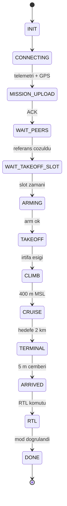

# Görev Durum Makinesi (14 Durum, Tek Yönlü Akış)

## 1. Sezgisel Tanım

Bir görev baştan sona düz bir çizgi değildir. Araç önce bağlanır, sonra görevi
yükler, peer'ları bekler, kalkış slotunu bekler, arm olur, kalkar, tırmanır,
seyreder, terminale girer, varır, döner. Her adımın kendi ön koşulları ve kendi
kararları vardır.

Durum makinesi bu adımları **açık** hale getirir: her an aracın hangi aşamada
olduğu tek bir sayıyla bilinir, ve o aşamada hangi kodun çalışacağı kesindir.

Sezgi: Uçuş kontrol listesi gibi. "Motoru çalıştır" maddesine, "yakıt kontrol
edildi" maddesi tamamlanmadan geçilmez. Liste tek yönlüdür, geri dönülmez.

Bu sistemde 14 durum var ve akış **tek yönlüdür**: `INIT` → … → `DONE`. Geri
dönüş yok. Tek istisna `FAILSAFE`, her yerden oraya düşülebilir.

## 2. Neden Var? Hangi Problemi Çözüyor?

Üç problem:

**1. Hangi kod ne zaman çalışır?** Hız kontrolü yerdeyken anlamsızdır. Kapı
loiteri kalkıştan önce çalışamaz. Rüzgâr kestirimi yerdeyken yapılamaz. Durum,
bu koşulları tek yerde toplar.

**2. Peer'lara ne bildirilir?** Her araç kendi durumunu yayınlar. Diğerleri
"HA-2 henüz kalkmadı" ya da "HA-1 vardı" bilgisini buradan alır. `VehicleStatus`
mesajındaki `STATE_*` sabitleri enum ile **birebir aynı sayılardır**.

**3. Geri dönüşü engellemek.** Bir araç `TERMINAL`'e girdikten sonra `CRUISE`'a
dönerse ne olur? Kapı mandalı, varış tespiti, rezerv mantığı, hepsi tek yönlü
ilerleme varsayar. Durum makinesi bu varsayımı zorlar.

## 3. Nasıl Çalışır? (Adım Adım)

### Durumlar

| # | Durum | Ne yapar | Çıkış koşulu |
|---|---|---|---|
| 0 | `INIT` | Başlangıç | hemen |
| 1 | `CONNECTING` | MAVLink bağlantısı, GPS fix bekler | telemetri geçerli + GPS hazır |
| 2 | `MISSION_UPLOAD` | Görev listesini yükler | ACK alındı |
| 3 | `WAIT_PEERS` | Referans varışı bekler | taahhüt çözüldü (ya da öncüyse hemen) |
| 4 | `WAIT_TAKEOFF_SLOT` | Kalkış anını bekler, slotu rüzgârla tazeler | slot zamanı geldi |
| 5 | `ARMING` | Arm eder | arm başarılı |
| 6 | `TAKEOFF` | AUTO'ya geçer, kalkış öğesini uçar | irtifa eşiği |
| 7 | `CLIMB` | Seyir irtifasına tırmanır | 400 m MSL |
| 8 | `CRUISE` | Rota takibi, hız kontrolü, çıpa düzeltmesi | hedefe 2 km |
| 9 | `TERMINAL` | Kapı, rezerv, son yaklaşma | 5 m çemberine giriş |
| 10 | `ARRIVED` | Varış anını mandallar | RTL komutu |
| 11 | `RTL` | Dönüş | mod doğrulandı |
| 12 | `DONE` | Bitti | yok |
| 13 | `FAILSAFE` | Arıza | yok |

### Döngü

```python
def _run(self):
    while not self._stop.is_set():
        self.step()
        self._stop.wait(TICK_INTERVAL_S)     # 0.05 s -> 20 Hz
```

Görev yöneticisi **kendi thread'inde** çalışır. Neden: MAVLink çağrıları
bloklayıcıdır ve rclpy executor'larını tıkamamalıdır.

### Adım dağıtımı

```python
_HANDLERS = {
    MissionState.INIT: MissionManager._on_init,
    MissionState.CONNECTING: MissionManager._on_connecting,
    ...
    MissionState.TERMINAL: MissionManager._on_terminal,
    MissionState.ARRIVED: MissionManager._on_arrived,
}
```

Her tick'te mevcut duruma karşılık gelen işleyici çağrılır. Bu, "hangi kod ne
zaman" sorusunu tek bir sözlükte cevaplar.

### Geçiş

```python
def _transition(self, new_state: MissionState) -> None:
    with self._lock:
        self._state = new_state
    logger.info("durum: %s -> %s", old.name, new_state.name)
```

Her geçiş loglanır. Bu loglar `analyze_run.py` tarafından okunur ve varış
zamanlarının çıkarıldığı kaynaktır.

### Mesaj sabitleriyle hizalama

```python
class MissionState(IntEnum):
    """VehicleStatus.STATE_* sabitleriyle ayni sayisal degerler."""
    INIT = 0
    CONNECTING = 1
    ...
```

Bir birim testi bu hizalamayı doğrular:

```python
for state in MissionState:
    assert getattr(vehicle_status, f"STATE_{state.name}") == state.value
```

Enum ile mesaj sabitleri ayrışırsa peer'lar durumu yanlış yorumlar, sessiz ve
tehlikeli bir hata. Test bunu derleme zamanına yakın yakalar.

## 4. Matematiksel Temel

Bu modül sayısal hesap içermez; ama iki yapısal özelliği vardır.

### Tek yönlü sıralama

Durumlar tam sıralı bir küme oluşturur ve geçişler monotondur:

$$s_{n+1} \ge s_n \quad \text{(FAILSAFE hariç)}$$

Bu, aşağıdaki karşılaştırmaları anlamlı kılar:

```python
AIRBORNE_STATES = frozenset(
    state for state in MissionState if state < MissionState.ARRIVED
)
```

```python
if status.mission_state >= VehicleStatus.STATE_ARRIVED:
    ...
```

Sıralama olmasaydı bu karşılaştırmalar yerine küme üyeliği gerekirdi.

### Zaman bütçesi

Tick aralığı $\Delta t = 0.05$ s. Her tick'te yapılan iş:

| İş | Yaklaşık maliyet |
|---|---|
| Telemetri anlık görüntüsü | O(1) |
| ETA/kalan mesafe | O(kalan waypoint) |
| Model tabanlı ETA | O(kalan bacak) |
| Robust E/L (saniyede bir) | O(61 aday × blok) |
| Kontrol | O(1) |

E/L hesabı en pahalısıdır ve bu yüzden `ROBUST_BOUNDS_INTERVAL_S = 1` s ile
seyreltilir, her tick değil, saniyede bir.

## 5. Geometrik/Görsel Sezgi

```
  GOREV AKISI (tek yonlu)

  INIT
   │
   ▼
  CONNECTING ──────────► MAVLink + GPS
   │
   ▼
  MISSION_UPLOAD ──────► gorev listesi yuklendi
   │
   ▼
  WAIT_PEERS ──────────► referans varis cozuldu
   │                      (oncu: hemen gecer)
   ▼
  WAIT_TAKEOFF_SLOT ───► YERDE BEKLEME (bedava)
   │                      slot ruzgarla surekli tazelenir
   ▼
  ARMING ──────────────► EKF oturmasi, 15 s'ye kadar
   │
   ▼
  TAKEOFF ─────────────► AUTO, kalkis ogesi
   │
   ▼
  CLIMB ───────────────► 400 m MSL
   │
   ▼
  CRUISE ──────────────► rota takibi + hiz kontrolu + capa
   │                      (gorev suresinin cogu burada)
   ▼
  TERMINAL ────────────► hedefe 2 km; kapi + rezerv
   │
   ▼
  ARRIVED ─────────────► 5 m cemberine giris (interpolasyonlu)
   │
   ▼
  RTL ─────────────────► donus
   │
   ▼
  DONE

  FAILSAFE ◄──────────── her yerden
```



## 6. Parametreler ve Etkileri

| Parametre | Değer | Etki |
|---|---|---|
| `TICK_INTERVAL_S` | 0.05 s | Kontrol döngüsü hızı (20 Hz). Varış tespitinin çözünürlüğünü de belirler. |
| `TERMINAL_RADIUS_M` | 2000 m | `CRUISE` → `TERMINAL` eşiği. Belgenin yasak yarıçapıyla aynı. |
| `ROBUST_BOUNDS_INTERVAL_S` | 1 s | Pahalı E/L hesabının seyreltilmesi. |
| `PEER_WAIT_LOG_INTERVAL_S` | 10 s | `WAIT_PEERS`'te log gürültüsünü kısar. |
| `cruise_alt_msl_m` | 400 m | `CLIMB` → `CRUISE` eşiği. Belge madde 3. |

## 7. Çalışılmış Örnek (Gerçek Sayılarla)

**Bağlam:** `logs/run_20260804_172043`, HA-3'ün durum geçişleri.

Loglardan çıkarılan gerçek zaman çizelgesi:

| Zaman | Geçiş | Aşama süresi |
|---|---|---|
| 17:20:50 | `INIT` → `CONNECTING` | yok |
| 17:20:55 | `CONNECTING` → `MISSION_UPLOAD` | 5 s |
| 17:20:55 | `MISSION_UPLOAD` → `WAIT_PEERS` | < 1 s |
| 17:21:09 | `WAIT_PEERS` → `WAIT_TAKEOFF_SLOT` | 14 s |
| 17:23:40 | `WAIT_TAKEOFF_SLOT` → `ARMING` | **151 s** |
| 17:23:40 | `ARMING` → `TAKEOFF` | < 1 s |
| 17:23:53 | `TAKEOFF` → `CLIMB` | 13 s |
| 17:24:59 | `CLIMB` → `CRUISE` | 66 s |
| 17:27:08 | `CRUISE` → `TERMINAL` | **129 s** |
| 17:30:42 | `TERMINAL` → `ARRIVED` | **214 s** |
| 17:30:42 | `ARRIVED` → `RTL` → `DONE` | < 1 s |

**Toplam görev süresi:** 17:20:50 → 17:30:42 = **592 saniye**.

**Dağılım:**

| Aşama | Süre | Oran |
|---|---|---|
| Hazırlık | 19 s | %3 |
| **Yerde bekleme** | **151 s** | **%26** |
| Arm + kalkış + tırmanış | 79 s | %13 |
| Seyir | 129 s | %22 |
| **Terminal** | **214 s** | **%36** |

Görev süresinin **dörtte biri yerde bekleyerek** geçiyor, madde 8'in istediği
"optimal senaryo", bekleme havada değil yerde. (Analiz aracının raporladığı
168.1 s, `MISSION_UPLOAD`'dan `ARMING`'e kadar olan toplamı ölçer; durum
makinesindeki 151 s yalnızca `WAIT_TAKEOFF_SLOT` süresidir.)

**Terminal faz görevin en uzun aşaması**, 214 saniye,
%36. Bu beklenmedik ve mimariyi açıklıyor.

Sebep [09 - Jeodezi](09-jeodezi.md)'de görülen geometri: hedefin 2 km çemberine
girildiğinde rota olarak **hâlâ 4307 metre** kalıyor, çünkü rota ilmek atıyor.
Yani "son 2 km" aslında 4.3 kilometrelik bir uçuş.

Bunun iki sonucu var:

1. **İyi haber:** erkenliği düzeltmek için 214 saniye var, 71 değil.
2. **Kötü haber:** bu 214 saniyenin tamamında **loiter yasak** (madde 6). Elde
   yalnızca hız var, ve kuyruk rüzgârında hız yetkisi sıfıra inebiliyor
   ([07](07-ruzgar-duzeltmeli-rota-suresi.md)).

Kapı ([12](12-son-yasal-kapi.md)) ve terminal rezerv
([13](13-terminal-rezerv.md)) mekanizmaları tam olarak bu 214 saniyelik yasak
bölge için vardır.

## 8. Sonuç Nasıl Olur?

Durum, `MissionSnapshot` içinde peer'lara yayınlanır ve loglarda her satırın
başında görünür:

```
TERMINAL | WP4 | rota kalan 352 m | ETA 15 s | zamanlama hatasi +0.1 s | ...
```

Geçişler ayrı satırlarda:

```
17:29:31 HA-3 durum: CRUISE -> TERMINAL
17:30:42 HA-3 durum: TERMINAL -> ARRIVED
```

`analyze_run.py` bu satırlardan varış anlarını çıkarır ve kabul ölçütlerini
denetler.

## 9. Sınırlamalar / Yapamayacağı

- **Geri dönüş yok.** Araç `TERMINAL`'e girdikten sonra `CRUISE`'a dönemez.
  Rota hedefin 2 km çemberine girip çıksa bile durum korunur, bilinçli, çünkü
  kapı ve varış mandalları tek yönlü ilerleme varsayar.
- **`FAILSAFE` boş.** `safety/safety_manager.py` dosyası var ama **0 satır**.
  Durum tanımlı ama hiçbir yerde tetiklenmiyor. Bu, sistemin bilinen bir
  eksiğidir: telemetri kesintisi, GPS kaybı, arm reddi gibi durumlar için
  işleyici yok.
- **Yeniden başlatma yok.** Bir adım başarısız olursa (görev yükleme hariç)
  kurtarma yolu yoktur.
- **Tek görev.** Süreç bir görev çalıştırır ve `DONE`'da durur.
- **Durum başına zaman aşımı yok.** `CONNECTING`'de sonsuza kadar beklenebilir.
  Pratikte GPS bekleme fonksiyonunun kendi zaman aşımı var, ama durum
  seviyesinde genel bir koruma yok.

## 10. Kodda Nerede

| Bileşen | Yer |
|---|---|
| Enum | [`mission_manager.py:129` `MissionState`](../../ros2_ws/src/oasy_uav_agent/oasy_uav_agent/mission_manager.py#L129) |
| Döngü | [`mission_manager.py:339` `_run`](../../ros2_ws/src/oasy_uav_agent/oasy_uav_agent/mission_manager.py#L339) |
| Adım dağıtımı | [`mission_manager.py:360` `step`](../../ros2_ws/src/oasy_uav_agent/oasy_uav_agent/mission_manager.py#L360) |
| Geçiş | [`mission_manager.py:352` `_transition`](../../ros2_ws/src/oasy_uav_agent/oasy_uav_agent/mission_manager.py#L352) |
| İşleyici tablosu | `_HANDLERS` (dosya sonu) |
| Mesaj sabitleri | [`VehicleStatus.msg`](../../ros2_ws/src/oasy_interfaces/msg/VehicleStatus.msg) |
| Hizalama testi | `tests/unit/test_mission_manager.py::test_durum_degerleri_mesaj_sabitleriyle_ayni` |

## 11. Kod Örneği

Enum ile mesaj sabitlerinin hizalanması ve testi:

```python
class MissionState(IntEnum):
    """VehicleStatus.STATE_* sabitleriyle ayni sayisal degerler."""
    INIT = 0
    CONNECTING = 1
    MISSION_UPLOAD = 2
    ...
```

```python
def test_durum_degerleri_mesaj_sabitleriyle_ayni():
    """VehicleStatus sabitleri ile enum ayni sayilari kullanmali."""
    for state in MissionState:
        assert getattr(vehicle_status, f"STATE_{state.name}") == state.value
```

Sıralamanın kullanımı:

```python
AIRBORNE_STATES = frozenset(
    state for state in MissionState if state < MissionState.ARRIVED
)
```

## 12. İlgili Kavramlar

- [05 - Kalkış Slotu](05-kalkis-slotu-ve-yer-gecikmesi.md) `WAIT_PEERS` ve `WAIT_TAKEOFF_SLOT`.
- [12 - Son Yasal Kapı](12-son-yasal-kapi.md) `TERMINAL` işleyicisi.
- [10 - Varış Tespiti](10-varis-tespiti.md) `ARRIVED` geçişini tetikler.
- [15 - DDS Mimarisi](15-dds-mimarisi-ve-domain-ayrimi.md) durumun yayınlandığı kanal.
- [03 - Peer Yönetimi](03-peer-yonetimi-ve-tazelik.md) `mission_state` alanının tüketicisi.

## 13. Kaynaklar

- Vaka belgesi madde 2: *"noktaya varıldıktan sonra HA'lar RTL moduna
  alınmalıdır"*, `ARRIVED` → `RTL` geçişinin gerekçesi.
- Vaka belgesi madde 3: 400 m MSL `CLIMB` → `CRUISE` eşiği.
- Vaka belgesi madde 1: *"Kalkış işlemini manuel olarak veya GCS üzerinden
  tetiklemeyiniz"*, `ARMING` ve `TAKEOFF`'un otomatik olması.
