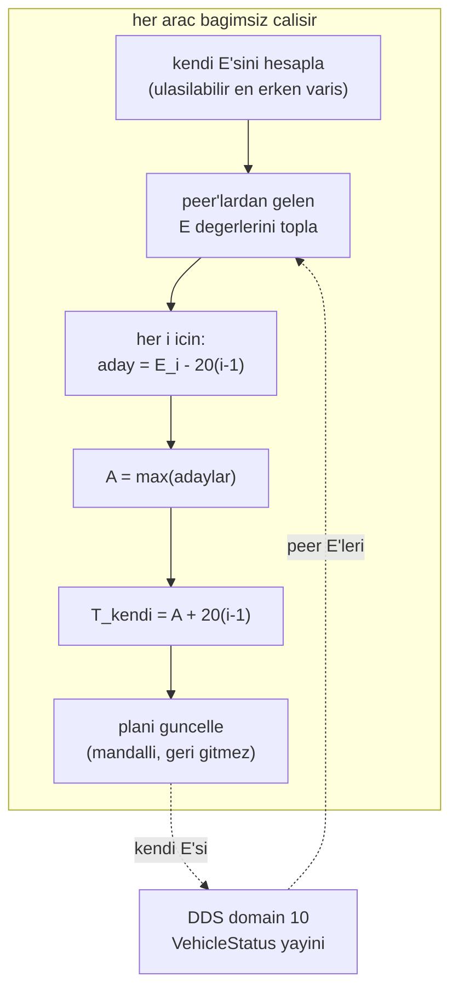

# Merkeziyetsiz Çıpa (Ortak Zaman Referansının Komutsuz Kurulması)

## 1. Sezgisel Tanım

Üç araç hedefe 20 saniye arayla varacak. Kimse kimseye komut vermeyecek.
Peki **kim ne zaman varacağına** nasıl karar verilir?

Merkezi bir yer kontrol istasyonu olsaydı basit olurdu: "HA-1 sen 12:00:00'da,
HA-2 sen 12:00:20'de var." Ama belge bunu yasaklıyor — merkez yok, master node
yok.

Çözüm bir **çıpa** (anchor) fikrine dayanır: ortak bir zaman referansı. Her araç
bu referansı **kendi başına hesaplar**, ama hepsi aynı veriye baktığı için aynı
sonuca varır. Sonra her araç kendi hedefini basitçe türetir:

$$T_i = A + 20(i-1)$$

Sezgi: Üç arkadaş buluşacak, telefonları yok, kimse "saat 8'de gelin" diyemiyor.
Ama üçü de aynı tren tarifesine bakıyor. Herkes "en geç gelebilecek olan kim?"
diye bakar ve buluşmayı ona göre ayarlar. Kimse emir vermedi; ortak veriye
bakarak aynı sonuca vardılar.

**Çıpayı en yavaş araç belirler.** Çünkü herkesin ulaşabileceği bir takvim
kurulacaksa, en kısıtlı olanın kısıtı bağlayıcıdır.

## 2. Neden Var? Hangi Problemi Çözüyor?

Belge madde 1: *"Sistemi merkeziyetsiz (decentralized) bir yapıda kurgulayınız;
her HA kendi kararını ağdaki diğer araçları dinleyerek bağımsız olarak
vermelidir. Merkezi bir Yer Kontrol İstasyonu (GCS) veya 'Master Node'
kullanmayınız."*

Bu modül o şartın **doğrudan karşılığıdır**. Ama merkeziyetsizlik bedava değil;
üç zor problem getirir:

1. **Tutarlılık.** Üç araç farklı çıpa hesaplarsa takvim çöker. Hesabın
   **deterministik** olması, yani aynı girdiden aynı çıktıyı vermesi şart.
2. **Mesaj gecikmesi.** "20 saniye sonra" göreli bir ifadedir; mesaj 0.3 s geç
   ulaşırsa anlamı kayar. Çözüm: **mutlak an** taşımak.
3. **Peer kaybı.** Bir araç düşerse kalanlar takvimi sürdürebilmeli.

## 3. Nasıl Çalışır? (Adım Adım)

### İki ayrı hesap var

Kod iki fonksiyon sunar ve **farklı sorulara** cevap verirler:

| Fonksiyon | Soru | Girdi |
|---|---|---|
| `compute_reference_arrival` | Önümdekilere göre en erken ne zaman varabilirim? | **taahhüt edilmiş** varışlar |
| `compute_feasible_anchor` | Hepimizin ulaşabileceği ortak çıpa nedir? | **ulaşılabilir** varışlar |

Birincisi kalkış slotu için, ikincisi uçuş boyunca plan düzeltmesi için.

### Adım 1 — Referans varış (kalkış öncesi)

```python
for peer_id, arrival_ns in sorted(committed_arrivals.items()):
    if peer_id >= vehicle_id:
        continue                      # yalnizca ONUMDEKILER
    candidate = arrival_ns + separation_ns * (vehicle_id - peer_id)
    if reference_ns is None or candidate > reference_ns:
        reference_ns = candidate      # en GEC kisit baglayici
```

HA-3 için: HA-1 varışına +40 s, HA-2 varışına +20 s. İkisinden **geç olanı**
alınır — her iki kısıt da sağlanmalı.

Öncü araç (en küçük numara) için referans yoktur; kendi nominal planını kullanır.

### Adım 2 — Ulaşılabilir çıpa (uçuş boyunca)

```python
for vehicle_id, arrival_ns in feasible_arrivals.items():
    offset_ns = int((vehicle_id - 1) * separation_s * NANOSECONDS_PER_SECOND)
    candidate = arrival_ns - offset_ns    # kendi sira gecikmesini CIKAR
    if anchor_ns is None or candidate > anchor_ns:
        anchor_ns = candidate             # en GEC aday baglayici
```

Her araç "ben en erken ne zaman varabilirim" değerini yayınlar. Çıpa adayı, o
değerden **kendi sıra gecikmesi çıkarılarak** bulunur — böylece hepsi ortak bir
zaman eksenine indirgenir. Bağlayıcı olan en geç adaydır.

### Adım 3 — Kendi hedefini türet

```python
def target_arrival(anchor_ns, vehicle_id, separation_s=20.0):
    return anchor_ns + int((vehicle_id - 1) * separation_s * 1e9)
```

Bu satır tüm koordinasyonun özüdür: çıpa ortak, gecikme sabit, hedef bireysel.

## 4. Matematiksel Temel

### Referans varış

Araç $i$, taahhüt kümesi $C = \{(j, t_j)\}$, ayrım $\Delta = 20$ s:

$$T_i^{\text{ref}} = \max_{j < i} \left( t_j + \Delta\,(i - j) \right)$$

$j < i$ koşulu sırayı garanti eder: küçük numaralı araç **daima** önce varır ve
hiçbir zaman büyük numaralıyı takip etmez.

### Ulaşılabilir çıpa

Araç $i$'nin en erken ulaşabileceği an $E_i$:

$$A = \max_{i} \left( E_i - \Delta\,(i-1) \right)$$

$$T_i = A + \Delta\,(i-1)$$

**Neden `max`?** Her araç için $T_i \ge E_i$ olmalı (kimse ulaşamayacağı bir ana
taahhüt edemez). Bu $A \ge E_i - \Delta(i-1)$ demektir, her $i$ için. Hepsini
sağlayan en küçük $A$, maksimumdur.

**Optimallik.** Bu, madde 8'in ("havada kalma / bekleme süreleri en az")
karşılığıdır: $A$ mümkün olan en küçük değerdir, dolayısıyla toplam bekleme
minimize edilir. Daha küçük seçilse takvim ulaşılamaz olur.

### Determinizm

Aynı $\{E_i\}$ kümesini gören her araç aynı $A$'yı hesaplar — `max` sırasız bir
işlemdir, girdi sırası sonucu değiştirmez. Merkezî karar noktası oluşmaz.

Determinizmi bozan tek şey **farklı girdi kümesi** görmektir: bir araç peer'ı
kayıp sayarken diğeri saymıyorsa çıpalar ayrışır. Tazelik kuralları bu yüzden
kritiktir ([03 - Peer Yönetimi](03-peer-yonetimi-ve-tazelik.md)).

### Mutlak zaman sözleşmesi

Tüm anlar `monotonic_ns` olarak taşınır — göreli süre değil. Nedeni:

$$T_{\text{alınan}} = T_{\text{gönderilen}} \quad \text{(mutlak, gecikmeye bağışık)}$$

$$\Delta t_{\text{alınan}} = \Delta t_{\text{gönderilen}} - \tau_{\text{gecikme}} \quad \text{(göreli, bozulur)}$$

## 5. Geometrik/Görsel Sezgi

```
  CAPA HESABI: her arac kendi E'sini yayinlar, hepsi ayni A'yi bulur

  zaman ekseni ────────────────────────────────────────────────►

  HA-1  E_1 = 100 s          capa adayi: 100 - 0  = 100
        ●──────────────────────────────►

  HA-2  E_2 = 115 s          capa adayi: 115 - 20 =  95
        ●─────────────────────────────────►

  HA-3  E_3 = 145 s          capa adayi: 145 - 40 = 105  ◄── EN GEC
        ●───────────────────────────────────────►

                    A = max(100, 95, 105) = 105
                    ────────────────────────────
  Hedefler:
    T_1 = 105 + 0  = 105  (E_1=100 iken 5 s bekler)
    T_2 = 105 + 20 = 125  (E_2=115 iken 10 s bekler)
    T_3 = 105 + 40 = 145  (E_3=145, tam sinirda — capayi O belirledi)

  HA-3 en kisitli araç: capa onun tarafindan belirlendi,
  bu yuzden hic beklemiyor. Digerleri ona uyum sagliyor.
```



## 6. Parametreler ve Etkileri

| Parametre | Değer | Etki |
|---|---|---|
| `ARRIVAL_SEPARATION_S` | **20.0** | Belge madde 1'den: *"tam olarak 20 saniyelik bir zaman farkı"*. Tüm takvimin temeli. |
| Sıra | `vehicle_id` (1, 2, 3) | Belge madde 2'den: *"HA-1, HA-2, HA-3 olacak sırayla"*. Kod bunu `peer_id >= vehicle_id` filtresiyle zorlar. |
| Mandal | `max(nominal_plan, hedef)` | Plan ileri gider, geri gelmez. Aksi halde ulaşılabilirliğin doğal sürüklenmesi planı sonsuza kadar öteler. |

## 7. Çalışılmış Örnek (Gerçek Sayılarla)

**Bağlam:** Doğrulama koşusu `logs/run_20260804_172043`, sakin başlangıç.
Konfigürasyondan hesaplanan gerçek rota uzunlukları ve nominal süreler
(rüzgârsız, 22.9 m/s):

| Araç | Rota (home dahil) | Nominal süre |
|---|---|---|
| HA-1 | 12205 m | **533 s** |
| HA-2 | 12329 m | **538 s** |
| HA-3 | 9269 m | **405 s** |

Dikkat: HA-2'nin rotası HA-1'inkinden **daha uzun** olduğu halde HA-2 ikinci
varmalı. HA-3 ise en kısa rotaya sahip ama en son varmalı. Sıra belgeyle sabit,
geometriyle değil — koordinasyonun asıl zorluğu burada.

**Kalkış slotu hesabı.** HA-1 öncüdür, $t=0$'da kalkar:

$$T_1 = 0 + 533 = 533\ \text{s}$$

HA-2 için referans varış:

$$T_2^{\text{ref}} = T_1 + 20 \times (2-1) = 533 + 20 = 553\ \text{s}$$

$$t_{\text{kalkış},2} = 553 - 538 = \mathbf{15\ s}$$

HA-3 için iki kısıt — ikisi de sağlanmalı:

$$\text{HA-1'den: } 533 + 20 \times 2 = 573\ \text{s}$$
$$\text{HA-2'den: } 553 + 20 \times 1 = 573\ \text{s}$$

İkisi de 573 — zincir tutarlı. Kalkış anı:

$$t_{\text{kalkış},3} = 573 - 405 = \mathbf{168\ s}$$

**Ölçülen yer beklemeleri:**

| Araç | Hesaplanan | Ölçülen | Fark |
|---|---|---|---|
| HA-1 | 0 s | 0.0 s | — |
| HA-2 | 15 s | **14.5 s** | 0.5 s |
| HA-3 | 168 s | **168.1 s** | 0.1 s |

Hesap ölçümü **0.5 saniye içinde** öngörüyor. Kalan fark, kalkış anının rüzgâra
göre düzeltilmesinden ve arm süresinden geliyor.

**Çıpanın rolü.** Bu koşuda toplam beklemenin tamamı **yerde** yapıldı (havada
0 s). Çıpa doğru kurulduğunda araçlar havalanmadan senkronize olur; havada
düzeltme yalnızca rüzgârın getirdiği sapma kadar kalır. Madde 8'in
("bekleme süreleri en az") istediği tam budur — yerde beklemek bedava, havada
beklemek yakıt ve risk.

**Sonuç:** HA-2 − HA-1 = 19.89 s, HA-3 − HA-2 = 20.17 s. Sapmalar −0.11 ve
+0.17 s.

## 8. Sonuç Nasıl Olur?

`compute_feasible_anchor` bir mutlak an (`monotonic_ns`) ya da `None` döndürür
(hiç veri yoksa). `target_arrival` bundan aracın kendi hedefini türetir.

Bu hedef, `_apply_feasible_anchor` içinde **mandallanarak** plana yazılır:

```python
new_plan_ns = max(self._nominal_plan_ns, target_ns)
```

Plan ileri gidebilir, geri gelemez. Neden: ulaşılabilirlik değerleri doğal
olarak sürüklenir; geri gitmeye izin verilse plan salınır ve araçlar birbirinin
gürültüsünü besler.

## 9. Sınırlamalar / Yapamayacağı

- **Sıra sabittir.** HA-1 → HA-2 → HA-3, belgeden. Sistem sırayı optimize etmez;
  HA-3 en kısa rotaya sahip olduğu halde en son varmak zorundadır ve bu yüzden
  168 s yerde bekler.
- **Mandal tek yönlüdür.** Bir kez ileri giden plan geri alınamaz. Bu, bu
  oturumda gerçek bir arızaya yol açtı: şişen bir ETA planı 4474 saniyeye kadar
  ittirdi ve görev bitmedi. Mandalın kendisi doğru ama **şişen girdiye karşı
  korumasız**.
- **Peer kaybında sessiz daralma.** Kayıp araç çıpa kümesinden düşer; kalanlar
  kendi aralarında tutarlı bir takvim kurar ama kaybolan aracın kısıtı yok olur.
  Geri döndüğünde çıpa sıçrayabilir.
- **Ortak veri varsayımı.** Determinizm, üç aracın **aynı** peer kümesini
  görmesine bağlı. Tazelik eşikleri farklı yorumlanırsa çıpalar ayrışır.
- **Saat senkronizasyonu yok.** `monotonic_ns` her süreçte kendi başlangıcına
  göredir. Aynı makinede çalıştığı için karşılaştırılabilir; gerçek dağıtık
  donanımda ortak zaman kaynağı gerekirdi.

## 10. Kodda Nerede

| Fonksiyon | Yer |
|---|---|
| `compute_reference_arrival` | [`arrival_schedule.py:41`](../../ros2_ws/src/oasy_uav_agent/oasy_uav_agent/coordination/arrival_schedule.py#L41) |
| `compute_feasible_anchor` | [`arrival_schedule.py:68`](../../ros2_ws/src/oasy_uav_agent/oasy_uav_agent/coordination/arrival_schedule.py#L68) |
| `target_arrival` | [`arrival_schedule.py:89`](../../ros2_ws/src/oasy_uav_agent/oasy_uav_agent/coordination/arrival_schedule.py#L89) |
| `compute_takeoff_time` | [`arrival_schedule.py:98`](../../ros2_ws/src/oasy_uav_agent/oasy_uav_agent/coordination/arrival_schedule.py#L98) |
| `compute_gate_release_window` | [`arrival_schedule.py:104`](../../ros2_ws/src/oasy_uav_agent/oasy_uav_agent/coordination/arrival_schedule.py#L104) |
| Çıpa uygulaması | [`mission_manager.py:1119` `_apply_feasible_anchor`](../../ros2_ws/src/oasy_uav_agent/oasy_uav_agent/mission_manager.py#L1119) |
| E değerinin üretimi | [`mission_manager.py:871` `_update_feasible_arrival`](../../ros2_ws/src/oasy_uav_agent/oasy_uav_agent/mission_manager.py#L871) |

## 11. Kod Örneği

Çıpanın tamamı — sekiz satır:

```python
def compute_feasible_anchor(feasible_arrivals, separation_s=ARRIVAL_SEPARATION_S):
    """Butun araclarin ulasabilecegi ortak zamanlama capasini bulur.

    Ayni yayin verisini goren butun araclar ayni sonucu bagimsiz hesaplar,
    dolayisiyla merkezi bir karar noktasi olusmaz.
    """
    anchor_ns = None
    for vehicle_id, arrival_ns in feasible_arrivals.items():
        offset_ns = int((vehicle_id - 1) * separation_s * NANOSECONDS_PER_SECOND)
        candidate = arrival_ns - offset_ns
        if anchor_ns is None or candidate > anchor_ns:
            anchor_ns = candidate
    return anchor_ns
```

Sıra garantisi — tek satırlık filtre:

```python
if peer_id >= vehicle_id:
    continue          # yalnizca kucuk numarali araclar kisit uretir
```

## 12. İlgili Kavramlar

- [03 - Peer Yönetimi ve Tazelik](03-peer-yonetimi-ve-tazelik.md) — çıpa girdisinin hangi peer'lardan geleceğine karar verir.
- [05 - Kalkış Slotu](05-kalkis-slotu-ve-yer-gecikmesi.md) — `compute_reference_arrival`'ın tüketicisi.
- [04 - Plan Revizyonu](04-plan-revizyonu.md) — nominal planın rüzgârla düzeltilmesi.
- [11 - Varış Zamanı Kontrolcüsü](11-varis-zamani-kontrolcusu.md) — çıpadan gelen hedefe hızla yakınsar.
- [15 - DDS Mimarisi](15-dds-mimarisi-ve-domain-ayrimi.md) — peer yayınlarının taşındığı kanal.

## 13. Kaynaklar

- Vaka belgesi madde 1: merkeziyetsizlik şartı ve 20 saniye kuralı.
- Vaka belgesi madde 2: varış sırası HA-1 / HA-2 / HA-3.
- Vaka belgesi madde 8: *"havada kalma / bekleme süreleri en az olacak şekilde
  optimal senaryo"* — çıpanın `max` seçiminin gerekçesi.
- Doğrulama koşusu `logs/run_20260804_172043`.
