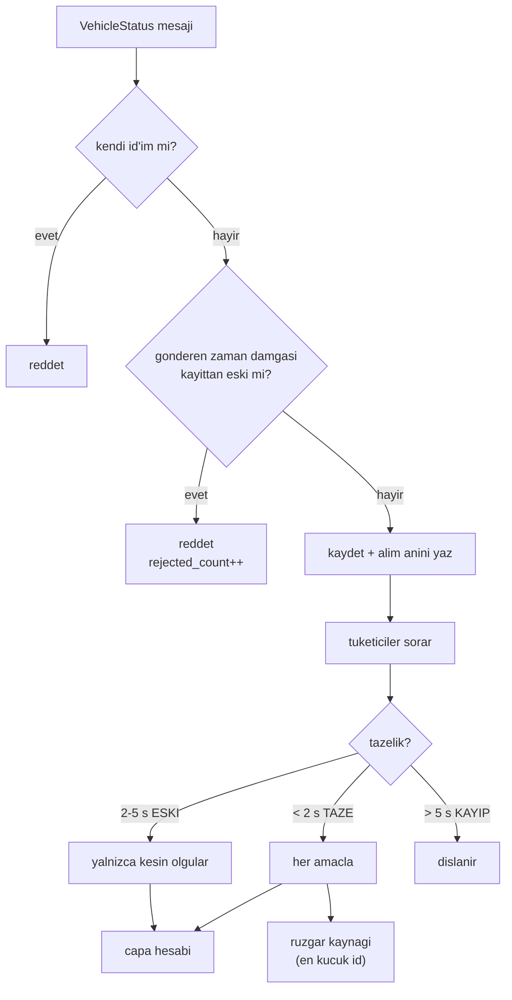

# Peer Yönetimi ve Tazelik (Kime, Ne Zamana Kadar Güvenilir)

## 1. Sezgisel Tanım

Merkeziyetsiz sistemde her araç kararını **başkalarının söylediklerine** göre
verir. Peki söylenen ne zaman geçerliliğini yitirir?

Bir peer'dan son mesaj 0.1 saniye önce geldiyse güvenilir. 3 saniye önce
geldiyse? 10 saniye önce? Araç düşmüş, ağ kopmuş ya da süreç ölmüş olabilir.
Eski bir konuma göre plan yapmak, olmayan bir uçağa yol vermek demektir.

Sezgi: Karanlıkta el fenerleriyle yürüyen üç kişisiniz. Birinin ışığını en son
bir saniye önce gördüysen yerini bilirsin. On saniyedir görmüyorsan — durdu mu,
düştü mü, yön mü değiştirdi, bilemezsin. Ona göre adım atmaya devam edersen
çarpışırsın.

Bu modül üç seviye tanır:

| Seviye | Anlam | Sonuç |
|---|---|---|
| **TAZE** | son mesaj < 2 s | her amaçla kullanılır |
| **ESKİ** | 2–5 s | yalnızca kesin olgular kullanılır |
| **KAYIP** | > 5 s | tamamen dışlanır |

## 2. Neden Var? Hangi Problemi Çözüyor?

Merkeziyetsiz çıpanın determinizmi ([02](02-merkeziyetsiz-capa.md)) **üç aracın
aynı peer kümesini görmesine** bağlıdır. Tazelik kuralları bu kümeyi tanımlar.

Dört somut problem çözer:

1. **Bayat veriyle plan kurmak.** Bu projede ölçüldü: varmış bir aracın donmuş
   rüzgâr kestirimi hâlâ yayınlanıyordu ve diğer araçlar onu kullanıyordu.
   Maliyeti **12 saniye** zamanlama hatasıydı.

2. **Sırasız teslim.** DDS mesajları sırasız gelebilir. Eski bir mesaj yeniyi
   ezerse durum geriye gider.

3. **Kendi yayınını dinlemek.** Araç kendi mesajını da alır; hesaba katarsa
   kendini iki kez sayar.

4. **Kaynak seçiminde belirsizlik.** Rüzgâr kestirimi için birden fazla peer
   uygunsa hangisi seçilir? Seçim **deterministik** olmalı, yoksa üç araç farklı
   rüzgâra göre plan yapar.

## 3. Nasıl Çalışır? (Adım Adım)

### Adım 1 — Kendi yayınını ele

```python
if status.vehicle_id == self._own_vehicle_id:
    return False
```

### Adım 2 — Geriye giden mesajı reddet

```python
if existing is not None and status.monotonic_ns < existing.status.monotonic_ns:
    self.rejected_count += 1
    return False
```

Karşılaştırma **gönderenin** zaman damgasına göre yapılır, alım anına göre
değil. Sırasız teslimde eski mesaj yeniyi ezemez. `rejected_count` sayacı
tanılama için tutulur.

### Adım 3 — Alım anını kaydet

```python
self._peers[status.vehicle_id] = PeerRecord(status, received_monotonic_ns)
```

Tazelik **alım anına** göre ölçülür, gönderim anına göre değil — süreçler arası
saat farkı ve gecikme bu şekilde soğurulur.

### Adım 4 — Tazelik sınıfla

```python
def freshness(self, vehicle_id, now_monotonic_ns) -> PeerFreshness:
    age = self.age_s(vehicle_id, now_monotonic_ns)
    if age >= self._lost_after_s:   # 5.0 s
        return PeerFreshness.LOST
    if age >= self._stale_after_s:  # 2.0 s
        return PeerFreshness.STALE
    return PeerFreshness.FRESH
```

### Adım 5 — Amaca göre filtrele

Farklı tüketiciler farklı tazelik ister:

| Kullanım | Kabul edilen | Neden |
|---|---|---|
| `committed_arrivals` | KAYIP değil | Taahhüt bir **sözleşmedir**, eskimekle geçersizleşmez |
| `feasible_arrivals` | KAYIP değil | Ulaşılabilirlik yavaş değişir |
| `settled_wind` | KAYIP değil | Rüzgâr yavaş değişir |

Kesin olgular (varış anı gibi) ESKİ peer'dan bile kabul edilir; hareketli
kestirimler ise tazelik ister.

### Adım 6 — Rüzgâr kaynağını deterministik seç

```python
for vehicle_id in sorted(peers):        # EN KUCUK ID
    if not record.status.wind_valid:
        continue
    if freshness is LOST:
        continue
    return (record.status.wind_speed, record.status.wind_dir_deg)
```

**En taze mesajı seçmek cazip görünür ama yanlıştır.** Kod yorumunda gerekçesi
yazılı: iki araç aynı anda havadayken agent saniyede birkaç kez ikisinin
tahmini arasında zıplar; nominal uçuş süresi her sıçramada yeniden hesaplanır ve
araçlar birbirinin gürültüsünü besler. **Sabit sıra** (en küçük id) üç aracın da
aynı kaynağı seçmesini garanti eder.

## 4. Matematiksel Temel

### Tazelik eşiklerinin seçimi

Yayın hızı $f = 5$ Hz → mesaj aralığı $T = 0.2$ s.

$$t_{\text{eski}} = 2.0\ \text{s} = 10T, \qquad t_{\text{kayıp}} = 5.0\ \text{s} = 25T$$

**Neden 10 mesaj?** Tek bir kayıp paket araç durumunu değiştirmemeli. DDS
BEST_EFFORT ile ardışık birkaç kayıp normaldir. 10 ardışık kayıp ise gerçek bir
sorunun işaretidir.

**Neden 25 mesaj?** Kayıp ilan etmek çıpa kümesini daraltır ve takvimi değiştirir
— bu ağır bir karardır, acele edilmemeli.

### Yanlış sınıflandırma maliyeti asimetriktir

| Hata | Sonuç |
|---|---|
| Çalışan peer'ı KAYIP saymak | Çıpa kümesi daralır, takvim kayar, o araç dışlanır |
| Ölü peer'ı TAZE saymak | Olmayan araca yer açılır, kendi planı gereksiz gecikir |

İkincisi daha zararsızdır (fazladan bekleme), birincisi sırayı bozabilir. Bu
yüzden eşikler **cömert** seçilmiştir.

### Determinizm koşulu

Üç aracın aynı çıpayı hesaplaması için:

$$\forall i, j: \quad \mathcal{P}_i(t) = \mathcal{P}_j(t)$$

$\mathcal{P}_i$ = araç $i$'nin gördüğü geçerli peer kümesi. Bu, eşiklerin
**aynı** olmasına ve mesajların yaklaşık aynı anda ulaşmasına bağlıdır. Sınırda
(yaş tam 2.0 s) araçlar ayrışabilir — kaçınılmaz bir yarış, ama sonucu geçicidir.

## 5. Geometrik/Görsel Sezgi

```
  TAZELIK PENCERELERI (yayin 5 Hz, mesaj araligi 0.2 s)

  mesaj yasi ──────────────────────────────────────────────────►
  0s        1s        2s        3s        4s        5s        6s
  │         │         │         │         │         │         │
  ├─────────────────── TAZE ────┤
  │  her amacla kullanilir      │
  │  (10 mesaj kaybina tolerans)│
  │                             ├──── ESKI ─────────┤
  │                             │ yalnizca kesin    │
  │                             │ olgular (varis)   │
  │                             │                   ├─── KAYIP ──►
  │                             │                   │ tamamen
  │                             │                   │ dislanir
  ▼                             ▼                   ▼
```



## 6. Parametreler ve Etkileri

| Parametre | Değer | Etki |
|---|---|---|
| `peer_stale_after_s` | 2.0 s | 10 mesaj. Düşürmek gürültülü ağda peer'ları gereksiz eskitir. |
| `peer_lost_after_s` | 5.0 s | 25 mesaj. Düşürmek çıpa kümesini erken daraltır ve takvimi sarsar. |
| `status_publish_hz` | 5.0 Hz | Yayın hızı. Eşikler buna göre anlamlıdır; değiştirilirse eşikler de gözden geçirilmeli. |
| Rüzgâr kaynağı | **en küçük id** | Sabit sıra. "En taze"ye çevirmek salınım üretir (kod yorumunda kayıtlı). |

## 7. Çalışılmış Örnek (Gerçek Sayılarla)

**Bağlam:** Doğrulama koşusu `logs/run_20260804_172043`. Loglarda peer yaşları
her durum satırında raporlanır.

**Tipik durum (normal işleyiş):**

```
peer: HA-1: 0.2 s, HA-2: 0.0 s
```

Yaşlar 0.0–0.2 s — yayın aralığının içinde. İkisi de TAZE, çıpa kümesinde.

**Rüzgâr kaynağı seçimi.** HA-2 ve HA-3 havada, ikisinin de rüzgâr kestirimi
oturmuş. Deterministik kural en küçük id'yi seçer → **HA-2**. Üç araç da aynı
kaynağı kullanır.

Alternatif "en taze" kuralı seçilseydi: HA-2'nin mesajı 0.05 s, HA-3'ünki 0.03 s
yaşındaysa HA-3 seçilirdi; bir sonraki tick'te sıra değişebilirdi. Nominal uçuş
süresi her seferinde yeniden hesaplanır, kalkış slotu titrer.

**Kayıp mesaj sayacı.** Koşu boyunca `kayip mesaj 0` — sırasız teslim yaşanmadı.
Bu sayaç sıfırdan farklı olsaydı DDS katmanında sorun var demekti.

**Bayat veri olayının maliyeti.** Bu proje boyunca ölçülen en pahalı tazelik
hatası: varmış bir aracın **donmuş rüzgâr kestirimi** hâlâ geçerli sayılıyordu.
Araç RTL'e girmiş, rüzgâr ölçümü anlamını yitirmişti ama `wind_valid` bayrağı
hâlâ doğruydu. Diğer araçlar bu ölü değere göre plan kuruyordu.

**Maliyet: 12 saniye** zamanlama hatası. Düzeltme: yayınlanan alanın tazelik
bilgisi taşıması — `wind_valid` yalnızca araç havadayken ve kestirim oturmuşken
doğru olur.

## 8. Sonuç Nasıl Olur?

`PeerManager` dört sorgu sunar:

| Metod | Döndürür |
|---|---|
| `committed_arrivals(now)` | Taahhüt edilmiş varış anları |
| `feasible_arrivals(now)` | Ulaşılabilir en erken varışlar |
| `settled_wind(now)` | (hız, yön) çifti ya da `None` |
| `freshness(id, now)` | TAZE / ESKİ / KAYIP |

Hepsi `now_monotonic_ns` alır — tazelik sorgu anında değerlendirilir, önceden
hesaplanmaz.

## 9. Sınırlamalar / Yapamayacağı

- **Ayrılığı çözemez.** Ağ bölünürse iki araç birbirini kayıp sayıp ayrı
  takvimler kurar. Tekrar birleştiklerinde çıpa sıçrar. Split-brain koruması
  yoktur.
- **Sınırda yarış.** Yaş tam eşikteyken araçlar farklı sınıflandırabilir.
  Histerezis yok.
- **Kaynak seçimi kaliteye bakmaz.** En küçük id seçilir; o aracın kestirimi
  daha kötü olabilir. Determinizm doğruluğa tercih edilmiştir — bilinçli.
- **Kimlik doğrulama yok.** Sahte bir `vehicle_id` yayını sisteme girer.
  Simülasyon ortamı için kabul edilebilir.
- **Yaş, alım anına göre.** Gönderen tarafın saati geri giderse tespit edilmez;
  yalnızca sıralama korunur.

## 10. Kodda Nerede

| Bileşen | Yer |
|---|---|
| Yönetici | [`peer_manager.py`](../../ros2_ws/src/oasy_uav_agent/oasy_uav_agent/coordination/peer_manager.py) |
| Tazelik sınıflaması | `PeerFreshness`, `freshness()` |
| Deterministik rüzgâr kaynağı | `settled_wind()` |
| Yayın tarafı | [`status_publisher.py`](../../ros2_ws/src/oasy_uav_agent/oasy_uav_agent/coordination/status_publisher.py) |
| Mesaj tanımı | [`VehicleStatus.msg`](../../ros2_ws/src/oasy_interfaces/msg/VehicleStatus.msg) |
| Abonelik | [`agent_node.py`](../../ros2_ws/src/oasy_uav_agent/oasy_uav_agent/agent_node.py) — koordinasyon domain'i |

## 11. Kod Örneği

Deterministik kaynak seçimi ve gerekçesi:

```python
def settled_wind(self, now_monotonic_ns):
    """Ruzgari oturmus peer'lar icinde en kucuk id'ninki (hiz, yon).

    En taze mesaji secmek cazip gorunuyor ama iki arac ayni anda
    havadayken agent saniyede birkac kez ikisinin tahmini arasinda
    ziplar; nominal ucus suresi her sicramada yeniden hesaplanir ve
    araclar birbirinin gurultusunu besler. Sabit bir sira, uc agentin
    de ayni kaynagi secmesini garanti eder.
    """
    peers = self.snapshot()
    for vehicle_id in sorted(peers):
        record = peers[vehicle_id]
        if not record.status.wind_valid:
            continue
        if self.freshness(vehicle_id, now_monotonic_ns) is PeerFreshness.LOST:
            continue
        return (record.status.wind_speed, record.status.wind_dir_deg)
    return None
```

Sırasız teslime karşı koruma:

```python
# Sirasiz teslimde eski bir mesaj yeniyi ezmemeli.
if existing is not None and status.monotonic_ns < existing.status.monotonic_ns:
    self.rejected_count += 1
    return False
```

## 12. İlgili Kavramlar

- [02 - Merkeziyetsiz Çıpa](02-merkeziyetsiz-capa.md) — peer verisinin ana tüketicisi.
- [15 - DDS Mimarisi](15-dds-mimarisi-ve-domain-ayrimi.md) — mesajların taşındığı kanal.
- [06 - Rüzgâr Kestirimi](06-ruzgar-kestirimi.md) — `settled_wind`'in kaynağı.
- [05 - Kalkış Slotu](05-kalkis-slotu-ve-yer-gecikmesi.md) — yerdeki aracın peer rüzgârına bağımlılığı.

## 13. Kaynaklar

- Vaka belgesi madde 1: *"her HA kendi kararını ağdaki diğer araçları dinleyerek
  bağımsız olarak vermelidir"* — bu modülün varlık sebebi.
- Kod yorumu, `peer_manager.py` — "en taze" yerine "en küçük id" seçiminin
  ölçülmüş gerekçesi.
