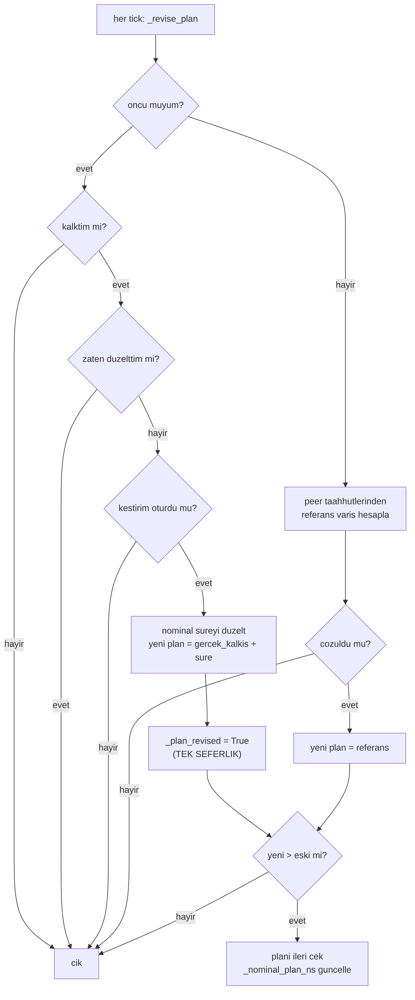

# Plan Revizyonu (Rüzgâr Öğrenilince Takvimi İleri Çekmek)

## 1. Sezgisel Tanım

Plan, rüzgâr bilinmeden kurulur. Sonra rüzgâr öğrenilir. Plan ne olacak?

Sorun şu: **taahhüt anında kimse rüzgârı bilmiyor.** Öncü henüz havalanmamıştır,
dolayısıyla hiçbir ölçüm yoktur. Rüzgârsız hesaplanan uçuş süresi fazla
iyimserdir, gerçek uçuş daha uzun sürer. Bütün takvim sıkışır.

Sezgi: Üç kişiye "yürüyüş 40 dakika sürer" deyip 20'şer dakika arayla
çıkardınız. Yolda yokuş olduğunu fark ettiniz; gerçekte 55 dakika sürüyor.
Şimdi herkesin varış hedefini **ileri** çekmelisiniz. Ama sakın geri
çekmeyin, yola çıkmış olan zaten geç kalacak, ona daha erken bir hedef vermek
onu imkânsız bir işe koşmaktır.

İki kural:

- **Yalnızca ileri.** Plan geciktirilir, öne alınmaz.
- **Yalnızca öncü kendi ölçümünden düzeltir.** Takipçiler öncünün kaymasını
  izler.

İkinci kural sezgiye aykırı görünüyor, "herkes kendi ölçümünü kullansa daha
iyi olmaz mı?" Denendi, geri alındı. Nedeni [§2](#2-neden-var-hangi-problemi-çözüyor)'de.

## 2. Neden Var? Hangi Problemi Çözüyor?

### Problem: taahhüt anı çok erken

Zaman çizelgesi:

```
t=0     HA-1 taahhut eder    (ruzgar BILINMIYOR)
t=0     HA-1 kalkar
t=~15s  HA-1'in kestirimi oturur    ← ruzgar ilk kez BILINIYOR
t=15s   HA-2 kalkar                  ← plani coktan kurulmus
t=168s  HA-3 kalkar
```

Rüzgâr ilk kez öğrenildiğinde HA-1 çoktan havada, HA-2 kalkmak üzere. Plan
düzeltilmezse hepsi iyimser bir takvimle uçar ve hatayı havada kapatmaya
çalışır, kapatamazlar.

### Neden takipçi kendi ölçümünü kullanmıyor

Bu, **denenip geri alınan** bir tasarımdır ve gerekçesi kodda kayıtlıdır:

> Havadaki araç kestirimi oturur oturmaz tek seferlik düzeltmeyi yapıyor,
> tırmanış sırasında ölçülen rüzgâr ise henüz sapmalı oluyor ve bu değer
> kalıcılaşıyor. Ölçümü tekrar tekrar düzeltebilen yerdeki araç yakınsıyor,
> havadaki araç rastgele bir ana kilitleniyordu.

**Ölçülen sonuç** (`run_20260802_015849`): HA-2 tırmanışta 6.3 m/s @ 24°
ölçtü, nominal süresini 538 → **728 s** yaptı. HA-2 − HA-1 arası **105 saniyeye**
çıktı, 20 saniyelik şartın beş katı.

Tırmanış sırasındaki rüzgâr kestiriminin neden sapmalı olduğu
[06 - Rüzgâr Kestirimi](06-ruzgar-kestirimi.md)'nde: gövde→ENU dönüşünde pitch
ihmal edilirse tırmanışta rüzgâr zayıf ölçülür.

### Neden yalnızca ileri

Plan geriye alınsaydı **doygun bir araca imkânsız bir hedef** verilebilirdi.
Araç azami hızda uçuyorsa ve hedef öne çekilirse yapabileceği bir şey yoktur;
kontrolcü kalıcı olarak doygun kalır.

## 3. Nasıl Çalışır? (Adım Adım)

### Öncü dalı tek seferlik

```python
if self._is_leader():
    if self._takeoff_actual_ns <= 0 or self._plan_revised:
        return                       # henuz kalkmadi ya da zaten duzeltti
    if self._wind is None:
        return                       # kestirim oturmadi
    self._refresh_nominal_flight_time(now_ns)
    revised_ns = self._takeoff_actual_ns + int(
        self._nominal_flight_s * NANOSECONDS_PER_SECOND
    )
    self._plan_revised = True        # BIR KEZ
```

Üç koruma: gerçekten kalkmış olmalı, kestirim oturmuş olmalı, ve düzeltme
**yalnızca bir kez** yapılmalı.

`_plan_revised` bayrağı kritiktir. Her tick düzeltme yapılsaydı plan rüzgâr
gürültüsüyle sürekli ileri kayar, hiç sabitlenmezdi.

Düzeltilmiş varış, **gerçek kalkış anına** eklenir, planlanan kalkışa değil.
Arm süresindeki belirsizlik böylece soğurulur.

### Takipçi dalı öncüyü izle

```python
else:
    reference = compute_reference_arrival(
        self._config.vehicle_id, self._peer_commitments(now_ns)
    )
    if not reference.resolved:
        return
    revised_ns = reference.monotonic_ns
```

Takipçi kendi rüzgârını hiç kullanmaz. Öncünün taahhüdü kaydıkça kendi hedefi
de kayar, zincir korunur.

### Uygulama tek yönlü mandal

```python
def _revise_plan_later(self, revised_ns: int, reason: str) -> None:
    with self._lock:
        if revised_ns <= self._nominal_plan_ns:
            return                                    # GERI GITMEZ
        self._nominal_plan_ns = revised_ns
        self._planned_arrival_ns = max(self._planned_arrival_ns, revised_ns)
```

İki alan birden güncellenir:

| Alan | Rolü |
|---|---|
| `_nominal_plan_ns` | Taahhüt edilen sabit referans; kayma bunun üzerinden ölçülür |
| `_planned_arrival_ns` | Aktif çalışma hedefi; çıpa bunu kırpabilir |

## 4. Matematiksel Temel

### Öncünün düzeltmesi

$$T_1^{\text{yeni}} = t_{\text{kalkış,gerçek}} + t_{\text{uçuş}}(\vec{w}_{\text{ölçülen}})$$

### Takipçinin izlemesi

$$T_i^{\text{yeni}} = \max_{j<i}\left(T_j^{\text{taahhüt}} + 20(i-j)\right)$$

Öncünün kayması $\delta$ ise takipçilerin hedefi de $\delta$ kadar kayar
ayrım korunur.

### Tek yönlülük

$$T^{\text{yeni}} = \max\left(T^{\text{eski}},\; T^{\text{aday}}\right)$$

Bu, monoton artan bir dizi üretir. Yakınsama garantisi: rüzgâr sınırlıysa
düzeltme sınırlıdır ve `_plan_revised` bayrağı tekrarı engeller.

### Neden yerdeki araç yakınsar, havadaki kilitlenir

Yerdeki araç `_resync_takeoff_slot` ile **her tick** düzeltir
([05](05-kalkis-slotu-ve-yer-gecikmesi.md)). Kestirim iyileştikçe slot da
iyileşir:

$$t_{\text{kalkış}}^{(n)} = T - t_{\text{uçuş}}(\vec{w}^{(n)}), \qquad \vec{w}^{(n)} \to \vec{w}_{\text{gerçek}}$$

Havadaki araç ise **tek seferlik** düzeltir. Düzeltme anındaki kestirim ne ise
o kalıcılaşır:

$$T^{\text{yeni}} = t_0 + t_{\text{uçuş}}(\vec{w}^{(k)})$$

$k$ = kestirimin oturduğu ilk an. Tırmanış henüz bitmemişse $\vec{w}^{(k)}$
sapmalıdır ve bu sapma kalıcı olur. **Ölçülen: 190 saniyelik kalıcı hata.**

## 5. Geometrik/Görsel Sezgi

```
  PLAN REVIZYONU: oncu kayar, takipciler izler

  taahhut anı (ruzgar bilinmiyor)
  ├─────────────────────────────────────────────────────────►
  │
  │  HA-1 plan: 533 s ────────────────────────────●
  │  HA-2 plan: 553 s ──────────────────────────────●
  │  HA-3 plan: 573 s ────────────────────────────────●
  │
  │  t=15s: HA-1 kestirimi oturdu, ruzgar 3.7 m/s 268d
  │         nominal ucus 533 -> 503 s
  │         ama gercek kalkis ani t0 = 2 s idi
  │         yeni plan: 2 + 503 = 505 s
  │
  │  505 < 533 oldugu icin GERI GITMEZ -> plan degismez
  │
  │  (ruzgar tersine olsaydi, ornegin 533 -> 580 s:)
  │  HA-1 plan: 533 ──► 582 s      (+49 s ileri)
  │  HA-2 plan: 553 ──► 602 s      (oncuyu izler)
  │  HA-3 plan: 573 ──► 622 s      (zincir korunur)
```



## 6. Parametreler ve Etkileri

| Parametre | Değer | Etki |
|---|---|---|
| `_plan_revised` | bool bayrak | Öncünün düzeltmeyi bir kez yapmasını sağlar. Kaldırılırsa plan rüzgâr gürültüsüyle sürekli kayar. |
| `ANCHOR_LOG_THRESHOLD_S` | kod sabiti | Bu eşiğin üstündeki kaymalar loglanır. |
| Öncü tanımı | `vehicle_id == 1` | Yalnızca HA-1 kendi ölçümünden düzeltir. |
| Yön | tek yönlü (`max`) | Geri alma yok. Doygun araca imkânsız hedef vermeyi engeller. |

## 7. Çalışılmış Örnek (Gerçek Sayılarla)

**Bağlam:** Doğrulama koşusu `logs/run_20260804_172043`. Öncü havalandıktan
sonra rüzgâr ölçümü yayınlanıyor: **3.7 m/s, 268°'den**.

**HA-1'in düzeltmesi:**

```
17:21:31 HA-1  nominal ucus suresi ruzgara gore duzeltildi: 533 s -> 503 s
```

Rüzgâr HA-1'in rotasına yardım ediyor; süre **30 saniye kısalıyor**.

Yeni plan adayı:

$$T_1^{\text{aday}} = t_{\text{kalkış,gerçek}} + 503\ \text{s}$$

Gerçek kalkış ~2 s olduğuna göre aday ≈ 505 s. Mevcut plan 533 s.

$$505 \le 533 \;\Longrightarrow\; \text{GERİ GİTMEZ, plan değişmez}$$

**Tek yönlü mandal tam burada devreye giriyor.** Rüzgâr işimize yaradığı halde
planı öne almıyoruz, çünkü HA-2 ve HA-3 zaten 553 ve 573'e göre kalkış
slotlarını kurdular. Öncü planını öne alsaydı zincir kopar, takipçiler geç
kalırdı.

**HA-3'ün aynı andaki düzeltmesi:**

```
17:21:31 HA-3  nominal ucus suresi ruzgara gore duzeltildi: 405 s -> 418 s
```

Aynı rüzgâr HA-3'ün rotasına **engel**; süre 13 saniye uzuyor. HA-3 henüz yerde
olduğu için bu düzeltme **plana değil kalkış slotuna** yansıyor: slot 13 saniye
öne çekilir, yerde bekleme 133.4 s'ye iner.

**Sonuç:** Plan sabit kaldı, kalkış slotları rüzgâra göre ayarlandı ve varış
sapmaları −0.11 / +0.17 s oldu.

**Karşı örnek, geri alınan tasarım.** `run_20260802_015849` koşusunda takipçiye
de kendi ölçümüne dayalı düzeltme verilmişti:

| | Değer |
|---|---|
| HA-2'nin tırmanışta ölçtüğü rüzgâr | 6.3 m/s @ 24° |
| Nominal süre düzeltmesi | 538 → **728 s** |
| HA-2 − HA-1 arası | **105 s** (hedef 20 s) |

190 saniyelik yanlış düzeltme kalıcılaştı çünkü tek seferlikti ve tırmanış
sırasında yapılmıştı.

## 8. Sonuç Nasıl Olur?

Revizyon `_nominal_plan_ns` ve `_planned_arrival_ns` alanlarını günceller.
Kayma `ANCHOR_LOG_THRESHOLD_S`'i aşarsa loglanır:

```
varis plani X.X s ileri cekildi (ruzgar duzeltmesi (tek seferlik))
varis plani X.X s ileri cekildi (peer (1,) taahhudu guncellendi)
```

Bu iki mesaj zincirin iki ucunu gösterir: öncü kendi ölçümünden, takipçi
öncünün taahhüdünden.

## 9. Sınırlamalar / Yapamayacağı

- **Tek seferlik, dolayısıyla ana bağımlı.** Öncünün düzeltmesi kestirimin
  oturduğu ilk anda yapılır. O an tırmanış içindeyse sapma kalıcılaşır. Bu,
  ölçülmüş ve pahalıya mal olmuş bir zayıflıktır; şu anki çözüm düzeltmeyi
  öncüye sınırlamaktır, sorunu ortadan kaldırmak değil.
- **Geri alınamaz.** Rüzgâr uçuş ortasında lehe dönerse plan hâlâ eski
  pesimist değerde kalır. Fazla bekleme üretir ama sırayı bozmaz, bilinçli
  bir asimetri.
- **Öncüye tek nokta bağımlılık.** HA-1'in kestirimi kötüyse hata zincirin
  tamamına yayılır. Merkeziyetsizlik iddiasının en zayıf noktası burasıdır:
  karar merkezi yok ama **bilgi kaynağı** tek.
- **Uçuş ortası rüzgâr değişimini yakalamaz.** Bu katman yalnızca başlangıç
  hatasını düzeltir. Sonraki değişimler çıpa düzeltmesi
  ([02](02-merkeziyetsiz-capa.md)) ve hız kontrolü
  ([11](11-varis-zamani-kontrolcusu.md)) tarafından ele alınır.

## 10. Kodda Nerede

| Bileşen | Yer |
|---|---|
| Revizyon mantığı | [`mission_manager.py:815` `_revise_plan`](../../ros2_ws/src/oasy_uav_agent/oasy_uav_agent/mission_manager.py#L815) |
| Tek yönlü uygulama | [`mission_manager.py:860` `_revise_plan_later`](../../ros2_ws/src/oasy_uav_agent/oasy_uav_agent/mission_manager.py#L860) |
| Nominal süre düzeltmesi | [`mission_manager.py:421` `_refresh_nominal_flight_time`](../../ros2_ws/src/oasy_uav_agent/oasy_uav_agent/mission_manager.py#L421) |
| Referans hesabı | [`arrival_schedule.py:41`](../../ros2_ws/src/oasy_uav_agent/oasy_uav_agent/coordination/arrival_schedule.py#L41) |

## 11. Kod Örneği

Geri alınan tasarımın gerekçesi, kodda kalıcı kayıt:

```python
"""Ruzgar ogrenilince plani ileri ceker; asla one almaz.

Duzeltmeyi yalnizca oncu kendi olcumunden yapar; takipciler oncunun
taahhudundeki kaymayi izler. Takipciye de kendi olcumune dayali
duzeltme verilmesi denendi ve geri alindi: havadaki arac kestirimi
oturur oturmaz tek seferlik duzeltmeyi yapiyor, tirmanis sirasinda
olculen ruzgar ise henuz sapmali oluyor ve bu deger kalicilasiyor.
Olcumu tekrar tekrar duzeltebilen yerdeki arac yakinsiyor, havadaki
arac rastgele bir ana kilitleniyordu (bkz. run_20260802_015849:
HA-2 6.3 m/s @ 24 derece olcup nominali 538 -> 728 s yapti,
HA-2 - HA-1 arasi 105 s'ye cikti).

Kaydirma tek yonlu: geriye alinsaydi doygun bir araca imkansiz bir
hedef verilebilirdi.
"""
```

Tek yönlü mandal:

```python
with self._lock:
    if revised_ns <= self._nominal_plan_ns:
        return                                    # geri gitmez
    self._nominal_plan_ns = revised_ns
    self._planned_arrival_ns = max(self._planned_arrival_ns, revised_ns)
```

## 12. İlgili Kavramlar

- [05 - Kalkış Slotu](05-kalkis-slotu-ve-yer-gecikmesi.md) yerdeki aracın sürekli düzeltmesi; bu sayfanın karşıtı.
- [02 - Merkeziyetsiz Çıpa](02-merkeziyetsiz-capa.md) planın uçuş boyunca ayarlanması.
- [06 - Rüzgâr Kestirimi](06-ruzgar-kestirimi.md) tırmanışta sapma sorununun kaynağı.
- [03 - Peer Yönetimi](03-peer-yonetimi-ve-tazelik.md) takipçinin izlediği taahhüt verisi.

## 13. Kaynaklar

- Kod yorumu, `mission_manager.py:815` geri alınan takipçi düzeltmesinin ölçülmüş gerekçesi.
- Koşu `run_20260802_015849` 105 saniyelik başarısızlığın kaydı.
- Doğrulama koşusu `logs/run_20260804_172043` çalışan düzeltmenin log satırları.
