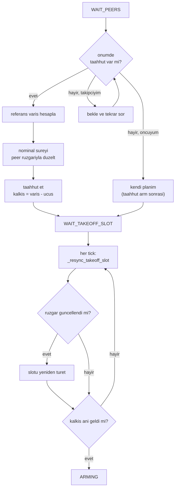

# Kalkış Slotu ve Yer Gecikmesi (Bedava Bekleme)

## 1. Sezgisel Tanım

Üç araç 20 saniye arayla varacak. Bunu sağlamanın **en ucuz** yolu, farklı
zamanlarda kalkmaktır.

Neden en ucuz? Çünkü **yerde beklemek bedavadır**. Havada beklemek yakıt yakar,
risk taşır, rota sapması üretir ve belgenin madde 8'i onu açıkça asgariye
indirmemizi ister. Yerde beklemenin ise hiçbir maliyeti yoktur.

Sezgi: Üç kişi aynı yere farklı mesafelerden yürüyecek ve 20 dakika arayla
varmaları isteniyor. En yakın olanın erken çıkıp yolda oyalanması saçmadır —
evde bekler, sonra çıkar. Oyalanmak enerji harcar, evde beklemek harcamaz.

Hesap basittir: **hedefteki varış anından, uçuş süresini geriye say.**

$$t_{\text{kalkış}} = T_{\text{varış}} - t_{\text{uçuş}}$$

Zor kısım $t_{\text{uçuş}}$'tur — rüzgâra bağlıdır ve araç henüz yerdeyken kendi
rüzgârını ölçemez.

## 2. Neden Var? Hangi Problemi Çözüyor?

Belge madde 5'in ilk yöntemi: *"Farklı zamanlarda kalkış yapma (Kalkış
geciktirme)."* Madde 8 ise havada beklemenin asgariye indirilmesini istiyor.
Bu ikisi birlikte şunu söyler: **mümkün olan gecikmeyi yerde yap.**

Ölçülen sonuç bunu doğruluyor. Doğrulama koşularında:

| | Yerde | Havada |
|---|---|---|
| Sakin | 182 s | **0 s** |
| Değişken rüzgâr | 183 s | **0 s** |
| Sabit 8 m/s | 183 s | 62 s |

Toplam beklemenin neredeyse tamamı yerde. Havada bekleme yalnızca sabit rüzgâr
senaryosunda ve yalnızca kapı loiteri olarak ortaya çıkıyor.

**Ama bir zorluk var:** yerdeki araç kendi rüzgârını ölçemez. Hava hızı vektörü
anlamsızdır. Çözüm: **öncü araç rüzgâr sondası görevi görür.**

## 3. Nasıl Çalışır? (Adım Adım)

### Adım 1 — Referans varışı bul (`_on_wait_peers`)

```python
reference = compute_reference_arrival(
    self._config.vehicle_id, self._peer_commitments(now_ns)
)
```

Önündeki araçların **taahhüt edilmiş** varışlarından kendi hedefini türetir
([02 - Merkeziyetsiz Çıpa](02-merkeziyetsiz-capa.md)).

### Adım 2 — Nominal uçuş süresini rüzgâra göre düzelt

```python
corrected_s = route_duration_with_wind_s(
    self._config.home, self._config.route,
    self._config.nominal_cruise_speed_mps, wind,
)
```

Rüzgâr `_known_wind()`'den gelir: kendi kestirimi yoksa **peer'ınki** kullanılır.
Yerdeki araç için bu daima peer'ınkidir.

Düzeltme %1'den küçükse uygulanmaz (gürültü kovalamamak için).

### Adım 3 — Taahhüt et ve kalkış anını hesapla (`_commit`)

```python
takeoff_ns = compute_takeoff_time(planned_arrival_ns, self._nominal_flight_s)
```

Bu an artık **kilitlidir**: peer'lar yalnızca taahhüt edilmiş değeri referans
alır. Anlık ETA'ya bağlanmak öncünün tahmin gürültüsünü zincirleme büyütürdü.

### Adım 4 — Öncünün özel durumu

```python
elif self._is_leader():
    # Oncu arac taahhudunu burada degil, gercekten kalktigi anda verir.
    # Ilk arm isleminde EKF oturmasi 15 saniyeye kadar surebiliyor ve bu
    # sure plana girerse takipciler oncuyle ayni anda kalkiyor.
    self._takeoff_time_ns = now_ns
```

Öncünün önünde kimse yok; kendi planını kurar. Ama taahhüdünü **arm bittikten
sonra** verir. Neden: ilk arm işleminde EKF oturması 15 saniyeye kadar sürebilir.
Bu süre plana girerse takipçiler öncüyle aynı anda kalkar ve tüm takvim çöker.

### Adım 5 — Yerde beklerken slotu yeniden senkronize et

```python
def _resync_takeoff_slot(self, now_ns):
    """Kalkis anini guncel plan ve ruzgar duzeltmesine gore yeniden kurar."""
    self._refresh_nominal_flight_time(now_ns)
    new_takeoff_ns = compute_takeoff_time(
        self._planned_arrival_ns, self._nominal_flight_s
    )
```

**Bu adım kritiktir.** Taahhüt anı çok erkendir — öncü henüz havalanmamıştır,
dolayısıyla rüzgâr kestirimi yoktur. Düzeltme yalnızca `WAIT_PEERS`'te yapılsaydı
**hiçbir zaman uygulanmazdı**. Bu yüzden slot her tick'te yeniden türetilir.

### Adım 6 — Zamanı gelince kalk

```python
if time.monotonic_ns() >= self._takeoff_time_ns:
    self._transition(MissionState.ARMING)
```

## 4. Matematiksel Temel

### Temel bağıntı

$$t_{\text{kalkış},i} = T_i - t_{\text{uçuş},i}(\vec w)$$

$T_i$ referans varış ([02](02-merkeziyetsiz-capa.md)), $t_{\text{uçuş}}$ rüzgâr
düzeltmeli rota süresi ([07](07-ruzgar-duzeltmeli-rota-suresi.md)).

### Yerde bekleme süresi

$$t_{\text{bekleme},i} = \max\left(0,\; t_{\text{kalkış},i} - t_{\text{şimdi}}\right)$$

Negatifse slot geçmişte kalmıştır — araç hemen kalkar ve fark hız kontrolüyle
kapatılmaya çalışılır. Bu durum `LATE_TAKEOFF_TOLERANCE_S = 1.0` s'yi aşarsa
uyarı üretilir.

### Rüzgâr düzeltmesinin büyüklüğü

HA-3'ün rotası için (9269 m, nominal 22.9 m/s):

$$t_{\text{rüzgârsız}} = \frac{9269}{22.9} = 405\ \text{s}$$

9.4 m/s rüzgâr altında bacak bacak hesap yapıldığında süre **iki katına**
yaklaşabilir ([07](07-ruzgar-duzeltmeli-rota-suresi.md#5-geometrikgörsel-sezgi)
tablosu). Düzeltme yapılmazsa araç yüzlerce saniye erken kalkar ve hatayı havada
kapatmaya çalışır — kapatamaz.

### Neden yerde beklemek "bedava"

Havada bekleme maliyeti:

$$C_{\text{hava}} = \underbrace{\text{yakıt}}_{\text{doğrusal}} + \underbrace{\text{rota sapması}}_{\text{madde 4 riski}} + \underbrace{\text{çarpışma riski}}_{\text{loiter yasağı}}$$

Yerde bekleme maliyeti: sıfır. Madde 8'in "optimal senaryo" tanımı bu asimetriye
dayanır.

## 5. Geometrik/Görsel Sezgi

```
  ZAMAN EKSENI: geriye sayarak kalkis ani

                                                    varis hedefleri
  t=0                                               ↓      ↓      ↓
  ├──────────────────────────────────────────────────────────────────►
  │                                                533s   553s   573s
  │
  │ HA-1 (12205 m, 533 s ucus)
  ●━━━━━━━━━━━━━━━━━━━━━━━━━━━━━━━━━━━━━━━━━━━━━━━━━━━●
  │ kalkis: 0 s (oncu, hemen)                        varis 533
  │
  │      HA-2 (12329 m, 538 s ucus)
  │ ▓▓▓▓ ●━━━━━━━━━━━━━━━━━━━━━━━━━━━━━━━━━━━━━━━━━━━━━━━●
  │ 15s   kalkis: 15 s                                  varis 553
  │ yerde
  │
  │                        HA-3 (9269 m, 405 s ucus)
  │ ▓▓▓▓▓▓▓▓▓▓▓▓▓▓▓▓▓▓▓▓▓▓ ●━━━━━━━━━━━━━━━━━━━━━━━━━━━━━━●
  │        168 s yerde      kalkis: 168 s              varis 573
  │
  ▓ = yerde bekleme (bedava)   ━ = ucus
```



## 6. Parametreler ve Etkileri

| Parametre | Değer | Etki |
|---|---|---|
| `nominal_cruise_speed_mps` | 22.9 | Rüzgârsız seyir hızı, SITL ölçümünden. Yanlışsa tüm slotlar kayar. |
| `LATE_TAKEOFF_TOLERANCE_S` | 1.0 s | Slot geçmişte kaldığında uyarı eşiği. |
| Düzeltme eşiği | %1 (`rel_tol=0.01`) | Bundan küçük değişimde nominal süre güncellenmez — gürültü kovalamayı engeller. |
| Öncü tanımı | `vehicle_id == 1` | Belge sırasından. |

## 7. Çalışılmış Örnek (Gerçek Sayılarla)

**Bağlam:** Doğrulama koşusu `logs/run_20260804_172043`, gerçek rota uzunlukları:

| Araç | Rota | Nominal süre |
|---|---|---|
| HA-1 | 12205 m | 533 s |
| HA-2 | 12329 m | 538 s |
| HA-3 | 9269 m | 405 s |

**HA-1 (öncü).** Önünde kimse yok, $t=0$'da kalkar:

$$T_1 = 0 + 533 = 533\ \text{s}$$

**HA-2.** Referans varış:

$$T_2 = T_1 + 20 = 553\ \text{s}$$

$$t_{\text{kalkış},2} = 553 - 538 = \mathbf{15\ s}$$

**HA-3.** İki kısıt, ikisi de 573 s veriyor:

$$t_{\text{kalkış},3} = 573 - 405 = \mathbf{168\ s}$$

**Ölçülen yer beklemeleri:**

| Araç | Hesaplanan | Ölçülen | Fark |
|---|---|---|---|
| HA-1 | 0 s | 0.0 s | — |
| HA-2 | 15 s | 14.5 s | 0.5 s |
| HA-3 | 168 s | 168.1 s | **0.1 s** |

**Hesap ölçümü yarım saniye içinde öngörüyor.** Kalan fark rüzgâr düzeltmesinden
ve arm süresinden geliyor.

**Dikkat çekici nokta.** HA-2'nin rotası HA-1'inkinden **daha uzun** (12329 vs
12205 m) ama ikinci varması gerekiyor. Bu, kalkış gecikmesini küçültür: yalnızca
15 saniye. HA-3 ise en kısa rotaya sahip ama en son varmalı — bu yüzden 168
saniye bekliyor.

Yani yer gecikmesi rota uzunluğuyla değil, **rota uzunluğu ile sıra
gereksinimi arasındaki uyumsuzlukla** belirleniyor.

**Rüzgâr düzeltmesinin etkisi — aynı rüzgâr, zıt yönde düzeltme.** Öncü
havalanınca kestirimini yayınlıyor ve yerdeki araçlar sürelerini düzeltiyor.
Aynı andaki iki log satırı:

```
17:21:31 HA-1  nominal ucus suresi ruzgara gore duzeltildi: 533 s -> 503 s
               (peer olcumu 3.7 m/s, 268 dereceden)
17:21:31 HA-3  nominal ucus suresi ruzgara gore duzeltildi: 405 s -> 418 s
               (peer olcumu 3.7 m/s, 268 dereceden)
```

**Aynı rüzgâr (3.7 m/s, 268°), aynı an, zıt yönde düzeltme:** HA-1'in süresi
30 saniye **kısalıyor**, HA-3'ünki 13 saniye **uzuyor**.

Sebebi rota geometrisi. Rüzgâr 268°'den geliyor, yani doğuya doğru esiyor.
HA-1'in rotası ağırlıklı olarak kuzeydoğuya, HA-3'ünki kuzeybatıya bakıyor —
biri rüzgârı arkasına alıyor, diğeri karşısına.

Bu, "rüzgâr düzeltmesi" denen şeyin neden tek bir katsayı olamayacağını
gösteriyor: her aracın kendi rotası üzerinden bacak bacak hesaplanması gerekir
([07](07-ruzgar-duzeltmeli-rota-suresi.md)).

Sonuç kalkış slotuna yansıyor:

```
kalkis slotu guncellendi | nominal ucus 418 s | yerde kalan bekleme 133.4 s
```

## 8. Sonuç Nasıl Olur?

Çıktı tek bir mutlak an: `_takeoff_time_ns`. Araç bu ana kadar
`WAIT_TAKEOFF_SLOT` durumunda bekler, sonra `ARMING`'e geçer.

Taahhüt edilen varış anı (`_planned_arrival_ns`) peer'lara yayınlanır ve
onların referans hesabına girer. Bu, zincirin bir sonraki halkasını kurar.

## 9. Sınırlamalar / Yapamayacağı

- **Peer rüzgârına bağımlı.** Yerdeki araç kendi rüzgârını ölçemez. Öncü
  havalanmadan hiçbir düzeltme yapılamaz; ilk taahhüt rüzgârsız varsayımla
  kurulur ve sonra düzeltilir.
- **Öncü kendi rüzgârını bilmez.** HA-1 kalkarken hiç rüzgâr bilgisi yoktur.
  Nominal süresi rüzgârsız hesaplanır ve uçuş sırasında düzeltilir — ama kalkış
  anı çoktan geçmiştir. Öncünün hatası zincirin tamamına yayılır.
- **Geçmiş slot telafi edilemez.** Kalkış anı geçmişte kalırsa araç geç kalkar
  ve farkı hızla kapatmaya çalışır. 15 saniyeden büyük bir gecikme kapatılamaz.
- **Rüzgâr uçuş boyunca değişir.** Kalkış anındaki rüzgâra göre hesaplanan süre,
  uçuş ortasında geçersizleşebilir. Bu, sonraki katmanların (çıpa düzeltmesi,
  kapı, hız kontrolü) işidir.
- **Arm süresi değişkendir.** EKF oturması 15 saniyeye kadar sürebilir ve
  öngörülemez. Öncünün taahhüdü bu yüzden arm sonrasına ertelenir.

## 10. Kodda Nerede

| Bileşen | Yer |
|---|---|
| Referans ve taahhüt | [`mission_manager.py:500` `_commit`](../../ros2_ws/src/oasy_uav_agent/oasy_uav_agent/mission_manager.py#L500) |
| Rüzgâr düzeltmesi | [`mission_manager.py:421` `_refresh_nominal_flight_time`](../../ros2_ws/src/oasy_uav_agent/oasy_uav_agent/mission_manager.py#L421) |
| Slot yeniden senkronizasyonu | [`mission_manager.py:531` `_resync_takeoff_slot`](../../ros2_ws/src/oasy_uav_agent/oasy_uav_agent/mission_manager.py#L531) |
| Kalkış anı formülü | [`arrival_schedule.py:98` `compute_takeoff_time`](../../ros2_ws/src/oasy_uav_agent/oasy_uav_agent/coordination/arrival_schedule.py#L98) |
| Öncü istisnası | `_on_wait_peers` içinde `_is_leader()` dalı |

## 11. Kod Örneği

Slotun her tick'te yeniden türetilmesi ve gerekçesi:

```python
def _on_wait_takeoff_slot(self) -> None:
    # Yerde beklerken ruzgar olcumu gelebilir; slot ona gore guncellenir.
    # Taahhut ani cok erken oldugu icin (oncu daha havalanmadan) duzeltme
    # yalnizca WAIT_PEERS'te yapilsaydi hicbir zaman uygulanmazdi.
    self._resync_takeoff_slot(time.monotonic_ns())
    if time.monotonic_ns() >= self._takeoff_time_ns:
        self._transition(MissionState.ARMING)
```

Öncünün taahhüdünün neden ertelendiği:

```python
elif self._is_leader():
    # Oncu arac taahhudunu burada degil, gercekten kalktigi anda verir.
    # Ilk arm isleminde EKF oturmasi 15 saniyeye kadar surebiliyor ve bu
    # sure plana girerse takipciler oncuyle ayni anda kalkiyor.
    with self._lock:
        self._takeoff_time_ns = now_ns
```

## 12. İlgili Kavramlar

- [02 - Merkeziyetsiz Çıpa](02-merkeziyetsiz-capa.md) — referans varışı üretir.
- [07 - Rüzgâr Düzeltmeli Rota Süresi](07-ruzgar-duzeltmeli-rota-suresi.md) — uçuş süresini hesaplar.
- [06 - Rüzgâr Kestirimi](06-ruzgar-kestirimi.md) — öncünün sonda görevi.
- [04 - Plan Revizyonu](04-plan-revizyonu.md) — kalkıştan sonra planın rüzgârla düzeltilmesi.
- [01 - Görev Durum Makinesi](01-gorev-durum-makinesi.md) — `WAIT_PEERS` → `WAIT_TAKEOFF_SLOT` → `ARMING` akışı.

## 13. Kaynaklar

- Vaka belgesi madde 5: *"Farklı zamanlarda kalkış yapma (Kalkış geciktirme)."*
- Vaka belgesi madde 8: *"havada kalma / bekleme süreleri en az olacak şekilde
  optimal senaryo"* — yerde beklemeyi tercih etmenin gerekçesi.
- Doğrulama koşusu `logs/run_20260804_172043` — ölçülen yer beklemeleri.
