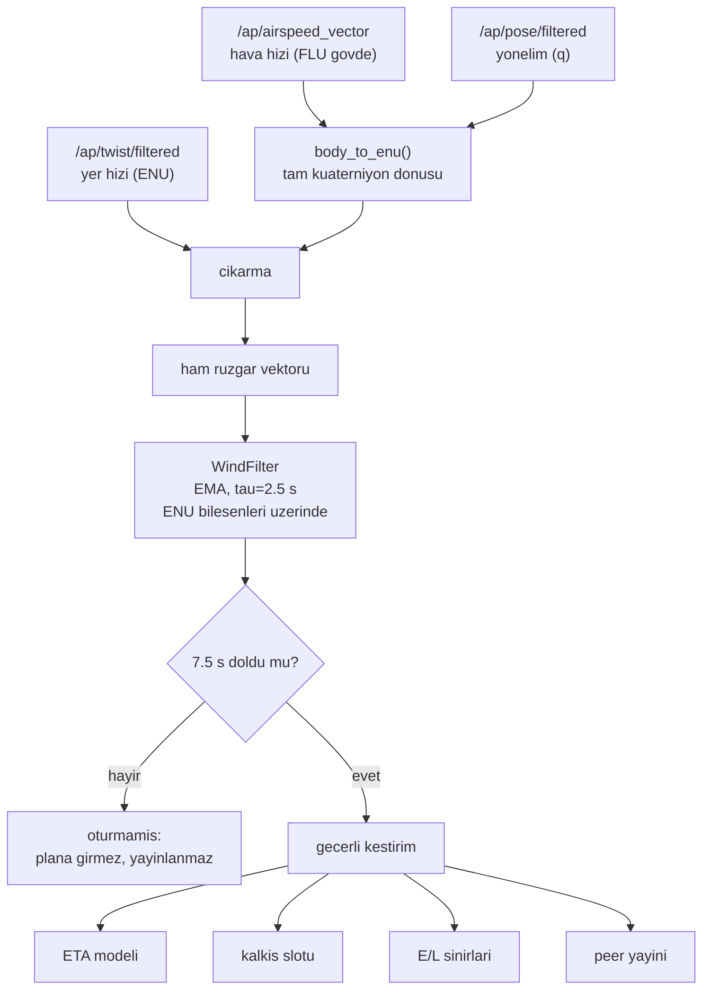

# Rüzgâr Kestirimi (Yer Hızı − Hava Hızı Farkı)

## 1. Sezgisel Tanım

Rüzgâr, aracın **yer üzerindeki hızı** ile **hava içindeki hızı** arasındaki farktır.

Sezgi: Akıntılı bir nehirde yüzüyorsun. Suya göre saatte 4 km hızla, burnun tam
karşı kıyıya dönük yüzüyorsun, bu senin "hava hızın". Ama kıyıdan bakan biri
seni çapraz gittiğini görüyor; sahile göre hızın farklı, bu senin "yer hızın".
İkisinin **vektör farkı** akıntının kendisidir. Akıntıyı ölçmek için akıntıyı
görmene gerek yok; iki hızı bilmen yeter.

$$\vec{v}_{\text{rüzgâr}} = \vec{v}_{\text{yer}} - \vec{v}_{\text{hava}}$$

Uçakta bu iki büyüklük zaten var: yer hızı GPS'ten, hava hızı pitot tüpünden ve
EKF'ten. Yapmamız gereken tek şey ikisini **aynı çerçeveye** getirip çıkarmak.

Ama burada, bu projede geç fark ettiğimiz kritik bir incelik var: ArduPilot'un
verdiği hava hızı vektörü ham bir sensör okuması değil, **EKF'in kendi rüzgâr
tahmininin içine gömülü olduğu** bir büyüklük. Yani bu çıkarma işlemi bize yeni
bilgi üretmiyor, EKF'in rüzgâr durumunu geri okuyor. Bunun ne anlama geldiği
[§4](#4-matematiksel-temel) ve [§9](#9-sınırlamalar--yapamayacağı)'da.

## 2. Neden Var? Hangi Problemi Çözüyor?

**Rüzgârsız kurulan plan, rüzgâr altında ulaşılamaz.** Sistemin tamamı şu
sözleşmeye dayanıyor: her araç hedefe *belirli bir anda* varacak. O anı
hesaplamak için "bu rotayı kaç saniyede uçarım" sorusunu cevaplamak gerekiyor.
Rüzgârsız cevap fazla iyimser:

| | HA-3 rotası (9269 m, home dahil) |
|---|---|
| Rüzgârsız nominal süre (22.9 m/s) | **405 s** |
| 9.4 m/s rüzgâr altında bacak bacak hesap | **~800 s** |

Ölçülen bacak sürelerinden ([07](07-ruzgar-duzeltmeli-rota-suresi.md#5-geometrikgörsel-sezgi)):
rüzgâr bir bacakta yer hızını 7.45 m/s'ye düşürüyor, diğerinde 25.71'e
çıkarıyor. Rüzgâr yok sayılırsa plan **yüzlerce saniye** yanlış kurulur
20 saniyelik varış farkı şartının yanında ezici bir hata.

Üç somut kullanım yeri var:

1. **Kalkış slotu.** Yerdeki araç, nominal uçuş süresini rüzgâra göre düzeltip
   kalkış anını buna göre seçer ([05 - Kalkış Slotu ve Yer Gecikmesi](05-kalkis-slotu-ve-yer-gecikmesi.md)).
   Havalanmadan önce kendi rüzgârını ölçemeyeceği için **öncü aracın ölçümünü**
   kullanır, öncü, sürüye rüzgâr sondası görevi görür.
2. **ETA modeli.** Kalan sürenin her tick'te hesaplanması rüzgâr düzeltmeli rota
   modeliyle yapılır ([07 - Rüzgâr Düzeltmeli Rota Süresi](07-ruzgar-duzeltmeli-rota-suresi.md)).
3. **Ulaşılabilirlik sınırları.** "En erken/en geç ne zaman varabilirim"
   hesabı rüzgâr zarfı üzerinden kurulur ([14 - Robust E/L Sınırları](14-robust-e-l-sinirlari.md)).

## 3. Nasıl Çalışır? (Adım Adım)

### Adım 1 İki vektörü telemetriden al

AP_DDS iki ayrı konu yayınlar:

| Büyüklük | DDS konusu | Çerçeve |
|---|---|---|
| Yer hızı | `/ap/twist/filtered` | ENU (doğu, kuzey, yukarı) |
| Hava hızı vektörü | `/ap/airspeed_vector` | **FLU gövde** (ileri, sol, yukarı) |
| Yönelim | `/ap/pose/filtered` | kuaterniyon (x, y, z, w) |

İki vektör **farklı çerçevelerde**. Doğrudan çıkarılamazlar.

### Adım 2 Hava hızını gövdeden ENU'ya döndür

`body_to_enu()` ([wind_estimator.py:62](../../ros2_ws/src/oasy_uav_agent/oasy_uav_agent/estimation/wind_estimator.py#L62))
kuaterniyonla **tam yönelim** dönüşümü yapar, yalnızca yaw değil, roll ve pitch
dahil.

Bu, bu projede düzeltilen gerçek bir hatadır. İlk sürüm yalnızca yaw ile
döndürüyordu; düz ve seviye uçuşta doğru, tırmanışta ve dönüşte yanlış sonuç
veriyordu. **Ölçülen etki: tırmanışta 8 m/s'lik rüzgâr 6.3 m/s olarak
kestiriliyordu**, %21 hata.

### Adım 3 Çıkar

`estimate_wind()` ([wind_estimator.py:89](../../ros2_ws/src/oasy_uav_agent/oasy_uav_agent/estimation/wind_estimator.py#L89))
yalnızca **yatay** bileşenleri kullanır; dikey rüzgâr rota süresini etkilemez.

### Adım 4 Filtrele

Tek örnek gürültülüdür. `WindFilter` ([wind_estimator.py:110](../../ros2_ws/src/oasy_uav_agent/oasy_uav_agent/estimation/wind_estimator.py#L110))
üstel hareketli ortalama uygular. Kritik ayrıntı: filtre **ENU bileşenleri
üzerinde** çalışır, hız/yön çifti üzerinde değil.

> Neden: yön derece cinsinden 0/360'ta sarmalanır. 359° ve 1° ölçümlerinin
> ortalaması 180° çıkar, tam ters yön. Vektör bileşenlerinde bu sorun yoktur.

### Adım 5 Oturmasını bekle

Filtre `WIND_SETTLE_AFTER_S = 7.5` saniye boyunca beslenene kadar kestirim
"oturmamış" sayılır ve ne planda kullanılır ne peer'lara yayınlanır. Oturmamış
bir değerle plan kurmak, tek örnekten çıkan sapmalı bir rüzgâra bağlanmak
demektir.

## 4. Matematiksel Temel

### Temel bağıntı

$$\vec{v}_{\text{rüzgâr}}^{\,ENU} = \vec{v}_{\text{yer}}^{\,ENU} - R(q)\,\vec{v}_{\text{hava}}^{\,FLU}$$

$R(q)$: kuaterniyon $q = (x, y, z, w)$ ile tanımlı gövde→ENU dönme matrisi.
Kodda matris kurulmaz, doğrudan kuaterniyon çarpımı uygulanır:

$$\vec{v}' = \vec{v} + 2w(\vec{q}_v \times \vec{v}) + 2\,\vec{q}_v \times (\vec{q}_v \times \vec{v})$$

### Meteorolojik dönüşüm

Rüzgâr yönü meteorolojide **geldiği** yönle ifade edilir (kuzeyden saat yönünde):

$$\phi = \left(\arctan2(-v_E,\; -v_N)\right) \bmod 360°, \qquad
\|\vec{v}\| = \sqrt{v_E^2 + v_N^2}$$

Eksi işaretleri "gittiği yön"ü "geldiği yön"e çevirir.

### Filtre

$dt$'den türetilen ağırlıkla üstel hareketli ortalama:

$$\alpha = \frac{dt}{\tau + dt}, \qquad
\vec{v}_{n} = \vec{v}_{n-1} + \alpha\left(\vec{v}_{\text{ölçüm}} - \vec{v}_{n-1}\right)$$

$\tau = 2.5$ s. $\alpha$'nın sabit değil $dt$'den türetilmesi önemli: telemetri
düzensiz aralıklarla gelir, sabit $\alpha$ örnekleme hızına göre farklı zaman
sabitleri üretirdi.

### Kritik olgu: bu bir geri okumadır

ArduPilot'un yayınladığı hava hızı vektörü
([`AP_NavEKF3_Outputs.cpp:209-221`](../../ardupilot/libraries/AP_NavEKF3/AP_NavEKF3_Outputs.cpp)):

```cpp
vel = (outputDataNew.velocity + velOffsetNED).tofloat();  // yer hizi (NED)
if (!inhibitWindStates) {
    vel.x -= stateStruct.wind_vel.x;                      // EKF ruzgar DURUMU
    vel.y -= stateStruct.wind_vel.y;
}
Matrix3f Tnb;
outputDataNew.quat.inverse().rotation_matrix(Tnb);
vel = Tnb * vel;                                          // nav -> govde
```

Yani:

$$\vec{v}_{\text{hava}}^{\,FLU} = R^{-1}(q)\left(\vec{v}_{\text{yer}} - \vec{v}_{\text{rüzgâr}}^{\,EKF}\right)$$

Bizim hesabımıza koyalım:

$$\vec{v}_{\text{rüzgâr}} = \vec{v}_{\text{yer}} - R(q)R^{-1}(q)\left(\vec{v}_{\text{yer}} - \vec{v}_{\text{rüzgâr}}^{\,EKF}\right) = \vec{v}_{\text{rüzgâr}}^{\,EKF}$$

**Cebirsel olarak EKF'in kendi rüzgâr durumunu geri okuyoruz.** Yeni bilgi
üretmiyoruz.

Bu, bir kusur değil bir **olgu**, ama sonucu şu: kestirimimizin kalitesi
tamamen EKF'in rüzgâr durumunun kalitesine bağlı. Bizim filtremizi iyileştirmek
işe yaramaz; **EKF'i ayarlamak** gerekir. Bu yüzden `ARSPD_USE` ve
`EK3_WIND_P_NSE` parametreleri, filtre sabitlerinden çok daha belirleyicidir
([§6](#6-parametreler-ve-etkileri)).

## 5. Geometrik/Görsel Sezgi

Vektör üçgeni, [§7](#7-çalışılmış-örnek-gerçek-sayılarla)'deki gerçek ölçüm,
kuşbakışı (kuzey yukarı, doğu sağa; araç güneydoğuya uçuyor):

```
        ●  baslangic noktasi
        │╲
        │ ╲  v_hava = 16.8 m/s, burun 126.7 dereceye bakiyor
        │  ╲       (FLU govde vektorunun ENU karsiligi)
        │   ╲
        │    ╲
 v_ruzgar     ╲
 9.4 m/s       ╲
 330d'den       ╲
 (150d'ye        ▼ ────────►  v_yer = 25.7 m/s, iz 135 derece
 dogru eser)      ╲        ╱        (GPS'ten okunan)
                   ╲     ╱
                    ╲  ╱   yengec acisi 8.3 derece
                     ╲╱     (burun ile iz arasindaki fark)

  Ucgen kapanir:  v_yer = v_hava + v_ruzgar
  Biz tersini kullaniriz:  v_ruzgar = v_yer - v_hava
```

Üçgenin kapanması: hava hızı vektörünün ucundan yer hızı vektörünün ucuna giden
ok, rüzgârdır. Araç burnu izinden 8.3° farklı yöne bakar, buna **yengeç açısı**
(crab angle) denir ve yan rüzgârda kaçınılmazdır. Rüzgâr büyük ölçüde arkadan
geldiği için yer hızı (25.7) hava hızından (16.8) belirgin şekilde büyüktür.



## 6. Parametreler ve Etkileri

### Bizim kodumuzdaki

| Parametre | Değer | Etki |
|---|---|---|
| `WIND_FILTER_TIME_CONSTANT_S` | 2.5 s | Filtre zaman sabiti. Küçük → gürültülü ama hızlı; büyük → düzgün ama geç. |
| `WIND_SETTLE_AFTER_S` | 7.5 s | Bu süre dolmadan kestirim kullanılmaz. |
| `_MIN_GROUND_SPEED_MPS` | 1.0 | Rota süresi hesabında sıfıra bölmeyi engeller. |

### ArduPilot tarafındaki (asıl belirleyiciler)

| Parametre | Değer | Neden bu değer |
|---|---|---|
| `ARSPD_USE` | **1** | 0 iken EKF rüzgârı yalnızca GPS ve manevralardan çıkarmaya çalışıyor. **Ölçülen: SITL rüzgârı 5 m/s 45°'den iken kestirim 4.2 m/s 215°'den yön 170° ters.** |
| `EK3_WIND_P_NSE` | **1.0** | 0.1 iken EKF rüzgâr durumunu çok yavaş güncelliyordu. **Ölçülen: gerçek rüzgâr değişmişken kestirim 5.2 m/s 52°'de takılı kaldı; son 10 saniyede yer hızını 11'den 29 m/s'ye çıkaran arkadan rüzgârı görünmez yaptı.** 1.0 ile takip iki kat hızlanır. |

**Ayar ipucu:** Kestirim yanlışsa önce bu iki ArduPilot parametresine bakın,
bizim filtre sabitlerine değil, [§4](#4-matematiksel-temel)'teki geri okuma
olgusu yüzünden asıl kaldıraç oradadır.

## 7. Çalışılmış Örnek (Gerçek Sayılarla)

**Bağlam:** HA-3, son bacakta (WP4 → hedef, rota 135°), doğrulama koşusu
`logs/run_20260804_153014`, hedefe 352 m kala. Telemetriden okunan üç değer:

| Büyüklük | Ölçülen |
|---|---|
| Rüzgâr | 9.4 m/s, 330°'den |
| Komut edilen hava hızı | 16.8 m/s |
| Yer hızı | 25.7 m/s |

Aşağıda bu üç sayının **birbirini doğruladığını** gösteriyoruz; hesap tersine
çalıştırılarak rüzgâr yeniden üretiliyor.

**Adım 1, rüzgârı ENU'ya çevir.** 330°'den gelen rüzgâr 150°'ye doğru eser:

$$v_E = 9.4 \sin(150°) = +4.70, \qquad v_N = 9.4 \cos(150°) = -8.14$$

$$\vec{v}_{\text{rüzgâr}} = (4.70,\; -8.14)\ \text{m/s}$$

**Adım 2, yer hızını ENU'ya çevir.** Yer izi bacak rotası olan 135°, büyüklük
25.7 m/s:

$$\vec{v}_{\text{yer}} = \left(25.7 \sin 135°,\; 25.7 \cos 135°\right) = (18.17,\; -18.17)\ \text{m/s}$$

**Adım 3, hava hızı vektörü ne olmalı?**

$$\vec{v}_{\text{hava}} = \vec{v}_{\text{yer}} - \vec{v}_{\text{rüzgâr}} = (18.17 - 4.70,\; -18.17 + 8.14) = (13.47,\; -10.03)$$

$$\|\vec{v}_{\text{hava}}\| = \sqrt{13.47^2 + 10.03^2} = \sqrt{181.4 + 100.6} = \sqrt{282.0} = \mathbf{16.79\ \text{m/s}}$$

**Komut edilen hava hızı 16.8 m/s idi.** Üç bağımsız telemetri büyüklüğü
0.01 m/s içinde tutarlı, kestirim zinciri doğru çalışıyor.

**Yengeç açısı.** Burun yönü:

$$\psi = \arctan2(13.47,\; -10.03) = 126.7°$$

Yer izi 135°, burun 126.7° → araç izinden **8.3° sola yengeçliyor**. Yan rüzgârda
kaçınılmazdır ve [§5](#5-geometrikgörsel-sezgi)'teki üçgenin görünür karşılığıdır.

**Yorum, bu sayının sisteme anlamı.** Rüzgâr 150°'ye doğru esiyor, bacak rotası
135°; bileşen büyük ölçüde **kuyruk rüzgârı**:

$$v_{\parallel} = 9.4 \cos(150° - 135°) = 9.4 \times 0.966 = +9.08\ \text{m/s}$$

Araç bu bacakta **asgari** hava hızına (13 m/s) inseydi yer hızı şu olurdu:

$$13 \cos(8.3°) + 9.08 = 12.86 + 9.08 = 21.9\ \text{m/s}$$

Planın varsaydığı nominal yer hızı ise 22.9 m/s. Yani **gaz tamamen kesilse bile
araç nominal hızda gider, o bacakta yavaşlama yetkisi pratikte sıfırdır.**

Bu, sistemin en zorlu kısıtıdır ve mimarideki iki mekanizmanın varlık sebebidir:
erkenlik son bacağa **girmeden** kapatılmalıdır
([12 - Son Yasal Kapı](12-son-yasal-kapi.md)), ve terminal fazda hız yetkisinin
bir kısmı yedekte tutulmalıdır ([13 - Terminal Rezerv](13-terminal-rezerv.md)).
Ölçülen koşuda araç bu yüzden 16.8 m/s'de uçuyordu, tabanda değil, 3.8 m/s'lik
yavaşlama payını elinde tutarak.

## 8. Sonuç Nasıl Olur?

Çıktı, ENU bileşenleriyle tutulan tek bir `WindEstimate` nesnesidir; `speed_mps`
ve `from_direction_deg` özellikleriyle meteorolojik gösterime çevrilebilir.

Oturduktan sonra dört yere birden beslenir: ETA modeli, kalkış slotu hesabı,
E/L sınırları ve peer yayını. Yayın önemlidir, **yerdeki araçlar kendi
rüzgârlarını ölçemez**, havadaki öncünün ölçümünü kullanırlar.

İyi vaka: sabit rüzgârda kestirim 7.5 s içinde oturur ve ±0.3 m/s içinde kalır.
Kötü vaka: rüzgâr hızla dönerse filtre ve EKF birlikte geride kalır; 2.5 s'lik
filtre sabiti ve EKF'in kendi gecikmesi üst üste biner.

## 9. Sınırlamalar / Yapamayacağı

- **Bağımsız bilgi üretmez.** [§4](#4-matematiksel-temel)'te gösterildiği gibi
  hesap EKF'in rüzgâr durumunu geri okur. EKF yanılıyorsa biz de yanılırız ve
  bunu fark edecek ikinci bir kaynağımız yoktur.
- **Uzamsal değil zamansal.** Kestirim aracın **bulunduğu noktadaki** rüzgârdır.
  İlerideki bir bacakta rüzgârın farklı olacağını bilemez. Bu oturumda
  "peer'ın rüzgârını uzamsal önizleme olarak kullanalım" fikri denendi ve
  çürütüldü: doğrulama enjektörü rüzgârı üç araca **aynı anda** uyguluyor, yani
  ortada uzamsal bir cephe yok.
- **Değişim hızına duyarlı.** Rüzgâr hızlı dönerse kestirim geride kalır.
  Ölçüldü: 5.5 °/s'lik dönüşte (fırtına çıkış cephesi seviyesi) plan anındaki
  rüzgâr ile uçuş anındaki rüzgâr 110° farklı olabiliyordu
  ([16 - Rüzgâr Profili ve Gerçekçilik](16-ruzgar-profili-ve-gercekcilik.md)).
- **Yerde çalışmaz.** Hava hızı vektörü anlamlı olmadığından kalkıştan önce
  kestirim yapılamaz; öncünün yayınına bağımlılık buradan doğar.
- **Dikey rüzgâr yok sayılır.** Rota süresini etkilemediği için yatay
  bileşenlere indirgenir.

## 10. Kodda Nerede

| Bileşen | Yer |
|---|---|
| Gövde→ENU dönüşü | [`wind_estimator.py:62` `body_to_enu`](../../ros2_ws/src/oasy_uav_agent/oasy_uav_agent/estimation/wind_estimator.py#L62) |
| Çıkarma | [`wind_estimator.py:89` `estimate_wind`](../../ros2_ws/src/oasy_uav_agent/oasy_uav_agent/estimation/wind_estimator.py#L89) |
| Filtre ve oturma | [`wind_estimator.py:110` `WindFilter`](../../ros2_ws/src/oasy_uav_agent/oasy_uav_agent/estimation/wind_estimator.py#L110) |
| Meteorolojik dönüşüm | [`wind_estimator.py:37` `WindEstimate`](../../ros2_ws/src/oasy_uav_agent/oasy_uav_agent/estimation/wind_estimator.py#L37) |
| Telemetri beslemesi | [`mission_manager.py:1276` `_update_wind`](../../ros2_ws/src/oasy_uav_agent/oasy_uav_agent/mission_manager.py#L1276) |
| Kendi/peer seçimi | [`mission_manager.py:409` `_known_wind`](../../ros2_ws/src/oasy_uav_agent/oasy_uav_agent/mission_manager.py#L409) |
| Peer rüzgâr kaynağı | [`peer_manager.py` `settled_wind`](../../ros2_ws/src/oasy_uav_agent/oasy_uav_agent/coordination/peer_manager.py) |
| ArduPilot tarafı | `ardupilot/libraries/AP_NavEKF3/AP_NavEKF3_Outputs.cpp:209` |

## 11. Kod Örneği

Çekirdek hesap ([`wind_estimator.py:89`](../../ros2_ws/src/oasy_uav_agent/oasy_uav_agent/estimation/wind_estimator.py#L89)):

```python
def estimate_wind(
    ground_velocity_en: Tuple[float, float],
    airspeed_body_flu: Tuple[float, float, float],
    orientation_xyzw: Tuple[float, float, float, float],
) -> Optional[WindEstimate]:
    """Yer hizi ve hava hizi vektorlerinin farkindan ruzgari kestirir."""
    if math.sqrt(sum(c ** 2 for c in airspeed_body_flu)) <= 0.0:
        return None

    east, north, _up = body_to_enu(airspeed_body_flu, orientation_xyzw)
    return WindEstimate(
        east_mps=ground_velocity_en[0] - east,
        north_mps=ground_velocity_en[1] - north,
    )
```

Sarmalanma sorunundan kaçınan filtre ([`wind_estimator.py:110`](../../ros2_ws/src/oasy_uav_agent/oasy_uav_agent/estimation/wind_estimator.py#L110)):

```python
# filtre ENU bileşenleri üzerinde çalışır, hız/yön çifti üzerinde değil:
# 359 ve 1 derecenin ortalaması 180 derece çıkar, yani tam ters
alpha = dt_s / (WIND_FILTER_TIME_CONSTANT_S + dt_s)
self._east += alpha * (sample.east_mps - self._east)
self._north += alpha * (sample.north_mps - self._north)
```

## 12. İlgili Kavramlar

- [07 - Rüzgâr Düzeltmeli Rota Süresi](07-ruzgar-duzeltmeli-rota-suresi.md) kestirimin ilk tüketicisi; rota süresini bacak bacak hesaplar.
- [05 - Kalkış Slotu ve Yer Gecikmesi](05-kalkis-slotu-ve-yer-gecikmesi.md) yerdeki aracın öncünün rüzgârını neden kullandığı.
- [14 - Robust E/L Sınırları](14-robust-e-l-sinirlari.md) kestirim etrafında bozucu zarfı kurar.
- [03 - Peer Yönetimi ve Tazelik](03-peer-yonetimi-ve-tazelik.md) rüzgâr kaynağı peer'ın deterministik seçimi.
- [16 - Rüzgâr Profili ve Gerçekçilik](16-ruzgar-profili-ve-gercekcilik.md) kestirimin takip edebileceği değişim hızının sınırı.

## 13. Kaynaklar

- Vaka belgesi madde 7: *"değişken şiddet ve yönde rüzgar parametreleri kullanınız. Algoritmanızın rüzgara karşı dirençli (robust) olmasını... sağlayınız."*
- ArduPilot `AP_NavEKF3_Outputs.cpp:209-221` `getAirSpdVec` gövdesi; geri okuma olgusunun kaynağı.
- `ros2_ws/src/oasy_bringup/params/ha1.parm` `ARSPD_USE` ve `EK3_WIND_P_NSE` seçimlerinin ölçüm gerekçeleri.
- Doğrulama koşusu `logs/run_20260804_153014` [§7](#7-çalışılmış-örnek-gerçek-sayılarla)'deki sayıların kaynağı (HA-3, hedefe 352 m kala).
