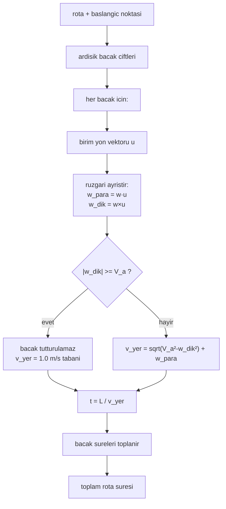

# Rüzgâr Düzeltmeli Rota Süresi (Bacak Bacak Yer Hızı Modeli)

## 1. Sezgisel Tanım

"Bu rotayı kaç saniyede uçarım?" sorusunun rüzgâr altındaki cevabı.

Naif cevap: *mesafe ÷ hız*. Bu, rüzgârsız havada doğrudur ve başka hiçbir yerde
doğru değildir. Çünkü uçağın kontrol ettiği şey **hava içindeki** hızıdır; yer
üzerinde ne kadar ilerlediği rüzgâra bağlıdır.

Sezgi: Yürüyen merdivende yürüyorsun. Adım hızın sabit (hava hızı), ama yere göre
ne kadar hızlı gittiğin merdivenin yönüne bağlı — arkandan gidiyorsa hızlanırsın,
karşıdan geliyorsa yavaşlarsın. Ayrıca merdiven **yana** kayıyorsa, düz gitmek
için yana doğru eğik yürümen gerekir; bu da ileri hızından çalar.

Bu üçüncü etki (yan rüzgâr) çoğu kişinin atladığı yerdir ve modelimizin en
ayırt edici parçasıdır: **yan rüzgâr, hiç yavaşlatmıyormuş gibi görünse de
yavaşlatır.**

Rota tek bir doğru değil, farklı yönlere bakan bacaklardan oluşur. Aynı rüzgâr
bir bacakta kuyruk, diğerinde karşı, üçüncüsünde yan olur. Bu yüzden süre
**bacak bacak** hesaplanır ve toplanır.

## 2. Neden Var? Hangi Problemi Çözüyor?

Bu fonksiyon sistemin **tek zaman referansıdır**. Şu soruların hepsi buradan
cevaplanır:

| Soru | Kullanan |
|---|---|
| Kalkışı ne kadar geciktireyim? | [05 - Kalkış Slotu](05-kalkis-slotu-ve-yer-gecikmesi.md) |
| Şu an hedefe kaç saniye kaldı? | [08 - ETA ve Kalan Mesafe](08-eta-ve-kalan-mesafe.md) |
| En erken/en geç ne zaman varabilirim? | [14 - Robust E/L Sınırları](14-robust-e-l-sinirlari.md) |
| Kapıda ne kadar bekleyebilirim? | [12 - Son Yasal Kapı](12-son-yasal-kapi.md) |

**Bu projede en pahalıya mal olan hata buradaydı.** Önceki sürüm ETA'yı
*ölçülen yer hızına bölerek* hesaplıyordu:

$$\text{ETA} = \frac{\text{kalan mesafe}}{\text{ölçülen yer hızı}}$$

Görünüşte masum. Ama ölçülen yer hızı gürültülüdür ve dönüşlerde anlık olarak
çöker. Sonuç: ETA ±15 saniye salınıyordu. Kontrolcü bu salınımı kovalıyor, hız
komutu titriyor, plan sürekli yeniden kuruluyordu.

Model tabanlı hesaba geçince **salınım ±15 s'den ±0.7 s'ye indi.** Üstelik bu
tek bir düzeltme üç ayrı belirtiyi birden kapattı — hepsi aynı kök nedenden
geliyordu. Ders, kod yorumlarında da kayıtlı: *ölçülen hıza bölmeyin, modeli
kullanın.*

## 3. Nasıl Çalışır? (Adım Adım)

### Adım 1 — Rotayı bacaklara ayır

`route_duration_with_wind_s(home, route, airspeed, wind)`
([wind_estimator.py:156](../../ros2_ws/src/oasy_uav_agent/oasy_uav_agent/estimation/wind_estimator.py#L156))
başlangıç noktasını rotanın başına ekleyip ardışık çiftler üretir:

```
noktalar = [baslangic, WP1, WP2, ..., hedef]
bacaklar = (baslangic→WP1), (WP1→WP2), ..., (WPn→hedef)
```

### Adım 2 — Her bacak için birim yön vektörü

Bacak, başlangıç noktası merkezli yerel düzleme izdüşürülür ve normalize edilir:

```python
east_m, north_m = to_local_xy(end, start)
length_m = math.hypot(east_m, north_m)
along = (east_m / length_m, north_m / length_m)
```

### Adım 3 — Rüzgârı bacak eksenine ayrıştır

Rüzgâr vektörü iki bileşene ayrılır: bacak **boyunca** ve bacağa **dik**.

```python
wind_along = wind.east * along[0] + wind.north * along[1]   # nokta carpim
wind_cross = -wind.east * along[1] + wind.north * along[0]  # dik bilesen
```

### Adım 4 — Yengeç düzeltmesi ve ileri hız

Uçak bacak doğrultusunu tutturmak için burnunu rüzgâra kırar (crab). Bu, hava
hızının bir kısmını yana harcar; ileri kalan bileşen Pisagor'dan çıkar:

```python
forward = math.sqrt(airspeed**2 - wind_cross**2) + wind_along
```

### Adım 5 — Süreyi topla, tabanı uygula

$$t_{\text{bacak}} = \frac{L_{\text{bacak}}}{v_{\text{yer}}}, \qquad
t_{\text{toplam}} = \sum_{\text{bacaklar}} t_{\text{bacak}}$$

Yer hızı `_MIN_GROUND_SPEED_MPS = 1.0` ile alttan sınırlanır — aksi halde rüzgâr
hava hızını aştığında süre sonsuza gider ve plan hesabı çöker.

## 4. Matematiksel Temel

### Bacak yer hızı

Bacak birim vektörü $\hat{u}$, rüzgâr $\vec{w}$, hava hızı büyüklüğü $V_a$:

$$w_{\parallel} = \vec{w} \cdot \hat{u}, \qquad w_{\perp} = \vec{w} \times \hat{u}$$

Uçak bacak doğrultusunu tutturmak için yan bileşeni dengelemek zorundadır. Hava
hızı vektörünün bacak dikindeki bileşeni $-w_{\perp}$ olmalıdır. Kalan ileri
bileşen:

$$V_{a,\parallel} = \sqrt{V_a^2 - w_{\perp}^2}$$

Yer hızı bu iki katkının toplamıdır:

$$\boxed{\;v_{\text{yer}} = \sqrt{V_a^2 - w_{\perp}^2} + w_{\parallel}\;}$$

### Fizibilite koşulu

Karekökün içi negatif olamaz:

$$|w_{\perp}| < V_a$$

Yan rüzgâr hava hızını aşarsa uçak **o bacak doğrultusunu tutturamaz** — rüzgâr
onu yanlara sürükler. Kod bu durumda tabana düşer:

```python
if abs(wind_cross) >= airspeed_mps:
    return _MIN_GROUND_SPEED_MPS
```

Bu, bizim zarfımızda gerçekleşebilir: asgari hava hızı 13 m/s, doğrulama
rüzgârının tepesi 10 m/s. Tam yan rüzgârda $|w_\perp| = 10 < 13$ — sınırın
altında ama payı dar.

### Yan rüzgârın gizli maliyeti

Yan rüzgâr "ileri gitmeye yardım da etmez, engel de olmaz" diye düşünülür.
Yanlış. $V_a = 13$, $w_\perp = 10$ için:

$$V_{a,\parallel} = \sqrt{169 - 100} = \sqrt{69} = 8.31\ \text{m/s}$$

**Hava hızının %36'sı yengeç açısına gidiyor.** Süre neredeyse 1.6 katına çıkar
— hiç boylamsal rüzgâr olmadan.

### Toplam süre

$$T = \sum_{i=1}^{n} \frac{L_i}{\max\!\left(\sqrt{V_a^2 - w_{\perp,i}^2} + w_{\parallel,i},\; v_{\min}\right)}$$

Semboller: $L_i$ bacak uzunluğu, $\hat{u}_i$ bacak yönü, $v_{\min} = 1.0$ m/s.

## 5. Geometrik/Görsel Sezgi

Yengeç üçgeni — uçak bacak doğrultusunu tutturmak için burnunu kırar:

```
                    bacak dogrultusu (u)
        ●───────────────────────────────────────►
         ╲          ↑                       v_yer
          ╲         │ w_dik (yana surukler)
           ╲        │
            ╲       │      Ucak burnunu w_dik'i dengeleyecek
     V_a     ╲      │      kadar kirar. Kalan ileri bilesen:
   (hava      ╲     │         sqrt(V_a^2 - w_dik^2)
    hizi)      ╲    │
               ╲   │      Bacak boyunca ruzgar (w_para) bunun
                ╲  │      uzerine eklenir ya da cikarilir.
                 ╲ │
                  ╲▼
```

**Aynı rüzgâr, farklı bacaklarda bambaşka etki.** HA-3'ün gerçek rotası, rüzgâr
9.4 m/s 330°'den, hava hızı 16.8 m/s sabit varsayılarak:

| Bacak | Rota | Uzunluk | $w_{\parallel}$ | $w_{\perp}$ | **Yer hızı** | Süre |
|---|---|---|---|---|---|---|
| WP1→WP2 | 22° | 1529 m | −5.73 | −7.45 | **9.32** | 164.1 s |
| WP2→WP3 | 339° | 1668 m | −9.29 | −1.44 | **7.45** | 223.9 s |
| WP3→WP4 | 294° | 3003 m | −7.60 | +5.53 | **8.26** | 363.5 s |
| WP4→hedef | 135° | 1304 m | +9.08 | −2.43 | **25.71** | 50.7 s |

Yer hızı 7.45 ile 25.71 m/s arasında değişiyor — **3.4 kat fark**, tek bir
rüzgârla. Rota ilmek attığı için araç önce rüzgâra karşı tırmanıyor, son bacakta
arkasına alıyor.

İki gözlem:

- **WP2→WP3 en yavaş bacak** ($w_\perp$ neredeyse sıfır, $w_\parallel = -9.29$)
  — saf karşı rüzgâr, yengeç maliyeti yok ama boylamsal kayıp maksimum.
- **WP1→WP2'de gizli maliyet var:** $w_\perp = -7.45$ olduğu için hava hızının
  $16.8 - \sqrt{16.8^2 - 7.45^2} = 1.75$ m/s'si yengeç açısına gidiyor. Bu,
  boylamsal kayba (−5.73) ek olarak binen ve kolayca gözden kaçan bir etkidir.

Bu tablo aynı zamanda toplam E/L sınırlarının neden son bacaktaki kısıtı
**gizlediğini** açıklıyor: 7504 m'lik rota gövdesinin (WP1'den hedefe) toplamında rüzgâr ortalanıyor ve
"esneme payı var" görünüyor; oysa son 1304 m'de yer hızı 25.71 ile çakılı.



## 6. Parametreler ve Etkileri

| Parametre | Değer | Etki |
|---|---|---|
| `airspeed_mps` (argüman) | çağrıya göre | Modelin varsaydığı hava hızı. Kritik: **uçuşta komut edilen hızla aynı olmalı**, yoksa model ile gerçek ayrışır. |
| `_MIN_GROUND_SPEED_MPS` | 1.0 m/s | Rüzgâr hava hızını aştığında sonsuz süreyi engeller. Bu tabana düşmek "bu bacak uçulamaz" demektir; sessizce yutulmamalı. |
| `wind` (argüman) | kestirimden | [06 - Rüzgâr Kestirimi](06-ruzgar-kestirimi.md)'nden gelir. Oturmamışsa sıfır rüzgâr varsayılır. |

**Ayar ipucu:** Bu fonksiyonda ayarlanacak bir şey yok — model fiziktir. Süre
yanlış çıkıyorsa hata ya rüzgâr kestiriminde ya da geçilen `airspeed_mps`
değerindedir. Bu oturumda tam bu ikincisi bir kez ısırdı: manevra planlaması
13 m/s varsayarken araç 28 m/s uçuyordu.

## 7. Çalışılmış Örnek (Gerçek Sayılarla)

**Bağlam:** HA-3'ün son bacağı, WP4 → hedef. Gerçek ölçüm
(`logs/run_20260804_153014`, hedefe 352 m kala): rüzgâr 9.4 m/s 330°'den, komut
edilen hava hızı 16.8 m/s.

**Bacak geometrisi.** WP4 (47.543977, −122.240829) → hedef (47.535683,
−122.228584). Uzunluk 1304 m, rota **135°**. Birim vektör:

$$\hat{u} = (\sin 135°,\; \cos 135°) = (0.7071,\; -0.7071)$$

**Rüzgâr vektörü.** 330°'den gelen = 150°'ye doğru esen:

$$\vec{w} = (9.4 \sin 150°,\; 9.4 \cos 150°) = (4.70,\; -8.14)\ \text{m/s}$$

**Ayrıştırma:**

$$w_{\parallel} = 4.70(0.7071) + (-8.14)(-0.7071) = 3.324 + 5.756 = +9.08\ \text{m/s}$$

$$w_{\perp} = -4.70(-0.7071) + (-8.14)(0.7071) = 3.324 - 5.756 = -2.43\ \text{m/s}$$

**Fizibilite:** $|{-2.43}| = 2.43 < 16.8$ ✓ — bacak tutturulabilir.

**İleri bileşen:**

$$V_{a,\parallel} = \sqrt{16.8^2 - 2.43^2} = \sqrt{282.2 - 5.9} = \sqrt{276.3} = 16.62\ \text{m/s}$$

**Yer hızı:**

$$v_{\text{yer}} = 16.62 + 9.08 = \mathbf{25.70\ \text{m/s}}$$

**Telemetride okunan: 25.7 m/s.** Model ile ölçüm birebir.

**Bacak süresi:**

$$t = \frac{1304}{25.70} = 50.7\ \text{s}$$

**Karşılaştırma — rüzgâr yok sayılsaydı:**

$$t_{\text{naif}} = \frac{1304}{16.8} = 77.6\ \text{s}$$

**Fark 26.9 saniye** — tek bir bacakta, 20 saniyelik varış şartının bir buçuk
katı. Rüzgâr modeli olmadan bu bacak tek başına takvimi yıkardı.

**Asgari hızda ne olurdu?** $V_a = 13$ için:

$$v_{\text{yer}} = \sqrt{169 - 5.9} + 9.08 = 12.77 + 9.08 = 21.85\ \text{m/s}$$

Nominal seyir yer hızı 22.9 m/s. Yani **gaz tamamen kesilse bile araç nominalden
yavaş gitmiyor** — bu bacakta zaman kazanma yetkisi yok. Sistemin en zorlu
kısıtı budur ve [12 - Son Yasal Kapı](12-son-yasal-kapi.md) ile
[13 - Terminal Rezerv](13-terminal-rezerv.md) bunun için vardır.

## 8. Sonuç Nasıl Olur?

Çıktı tek bir sayıdır: saniye cinsinden beklenen uçuş süresi. Rota boyunca her
tick'te yeniden hesaplanır (rüzgâr ve komut edilen hız değiştikçe güncellenir).

İyi vaka: model ile ölçüm 0.1 m/s içinde örtüşür ([§7](#7-çalışılmış-örnek-gerçek-sayılarla)).
Kötü vaka: rüzgâr kestirimi bayatsa ya da geçilen hava hızı uçuştakinden
farklıysa model sessizce yanılır — süre makul görünür ama yanlıştır. Bu sessizlik
tehlikelidir; hatayı ancak varış anında görürsünüz.

## 9. Sınırlamalar / Yapamayacağı

- **Tek ve sabit rüzgâr varsayar.** Fonksiyon rotanın tamamına aynı $\vec{w}$'yi
  uygular. Rüzgâr uçuş sırasında dönerse model geride kalır.
  [14 - Robust E/L Sınırları](14-robust-e-l-sinirlari.md) bu eksikliği rotayı
  zaman bloklarına ayırarak kısmen kapatır.
- **Dönüşleri yok sayar.** Bacaklar arası dönüşlerin yol ve süre maliyeti
  modelde yok; rota köşeleri keskin varsayılır. Kabul yarıçapı (120 m) ile
  gerçek yol biraz kısalır, dönüş yayı ile biraz uzar; ikisi kısmen dengelenir.
- **Rampa yok.** Hava hızının anında değiştiğini varsayar. Gerçekte hız değişimi
  rate-limitlidir (1.5 m/s²). Bunun önemli olduğu yerde ayrı bir fonksiyon
  kullanılır: `route_duration_with_airspeed_ramp_s`
  ([wind_estimator.py:184](../../ros2_ws/src/oasy_uav_agent/oasy_uav_agent/estimation/wind_estimator.py#L184)).
- **Taban sessizdir.** $|w_\perp| \ge V_a$ olduğunda 1.0 m/s döner ve bunu
  çağırana bildirmez. Süre absürt büyük çıkar ama "neden" bilgisi kaybolur.
- **Dikey rüzgâr ve irtifa değişimi yok.** Tüm görev 400 m MSL'de olduğu için
  tırmanış/alçalma süresi modele girmez.

## 10. Kodda Nerede

| Bileşen | Yer |
|---|---|
| Rota süresi | [`wind_estimator.py:156` `route_duration_with_wind_s`](../../ros2_ws/src/oasy_uav_agent/oasy_uav_agent/estimation/wind_estimator.py#L156) |
| Bacak yer hızı | [`wind_estimator.py:270` `_ground_speed_along_leg_mps`](../../ros2_ws/src/oasy_uav_agent/oasy_uav_agent/estimation/wind_estimator.py#L270) |
| Rampalı sürüm | [`wind_estimator.py:184` `route_duration_with_airspeed_ramp_s`](../../ros2_ws/src/oasy_uav_agent/oasy_uav_agent/estimation/wind_estimator.py#L184) |
| ETA tüketicisi | [`mission_manager.py:766` `_model_eta_s`](../../ros2_ws/src/oasy_uav_agent/oasy_uav_agent/mission_manager.py#L766) |
| Nominal süre düzeltmesi | [`mission_manager.py:421` `_refresh_nominal_flight_time`](../../ros2_ws/src/oasy_uav_agent/oasy_uav_agent/mission_manager.py#L421) |
| Yerel düzlem izdüşümü | [`geodesy.py` `to_local_xy`](../../ros2_ws/src/oasy_uav_agent/oasy_uav_agent/estimation/geodesy.py) |

## 11. Kod Örneği

Çekirdek: bacak yer hızı ([`wind_estimator.py:270`](../../ros2_ws/src/oasy_uav_agent/oasy_uav_agent/estimation/wind_estimator.py#L270)):

```python
def _ground_speed_along_leg_mps(start, end, airspeed_mps, wind):
    """Bacak dogrultusunda elde edilebilecek yer hizi."""
    east_m, north_m = to_local_xy(end, start)
    length_m = math.hypot(east_m, north_m)
    along = (east_m / length_m, north_m / length_m)

    # Ruzgarin bacaga dik bileseni crab ile dengelenir; bu, ileri yonde
    # kullanilabilir hava hizini azaltir.
    wind_along = wind.east_mps * along[0] + wind.north_mps * along[1]
    wind_cross = -wind.east_mps * along[1] + wind.north_mps * along[0]

    if abs(wind_cross) >= airspeed_mps:
        # Yan ruzgar hava hizini asiyorsa bacak dogrultusu tutturulamaz.
        return _MIN_GROUND_SPEED_MPS

    forward = math.sqrt(airspeed_mps ** 2 - wind_cross ** 2) + wind_along
    return max(forward, _MIN_GROUND_SPEED_MPS)
```

## 12. İlgili Kavramlar

- [06 - Rüzgâr Kestirimi](06-ruzgar-kestirimi.md) — girdi olan $\vec{w}$'yi üretir.
- [08 - ETA ve Kalan Mesafe](08-eta-ve-kalan-mesafe.md) — bu modeli her tick'te çağırır.
- [14 - Robust E/L Sınırları](14-robust-e-l-sinirlari.md) — modeli bir rüzgâr zarfı üzerinde tarar.
- [05 - Kalkış Slotu](05-kalkis-slotu-ve-yer-gecikmesi.md) — nominal uçuş süresini buradan alır.
- [11 - Varış Zamanı Kontrolcüsü](11-varis-zamani-kontrolcusu.md) — modelin ürettiği ETA'yı hata sinyaline çevirir.

## 13. Kaynaklar

- Vaka belgesi madde 5: seyir hızının dinamik yönetimi — bu modelin hangi
  yöntemi beslediği.
- Doğrulama koşusu `logs/run_20260804_153014` — [§7](#7-çalışılmış-örnek-gerçek-sayılarla)'deki
  25.70 m/s model çıktısının telemetriyle karşılaştırıldığı koşu.
- Kod yorumu, `mission_manager.py` — ölçülen hıza bölme kusurunun ve ±15 s → ±0.7 s
  düzelmesinin kaydı.
