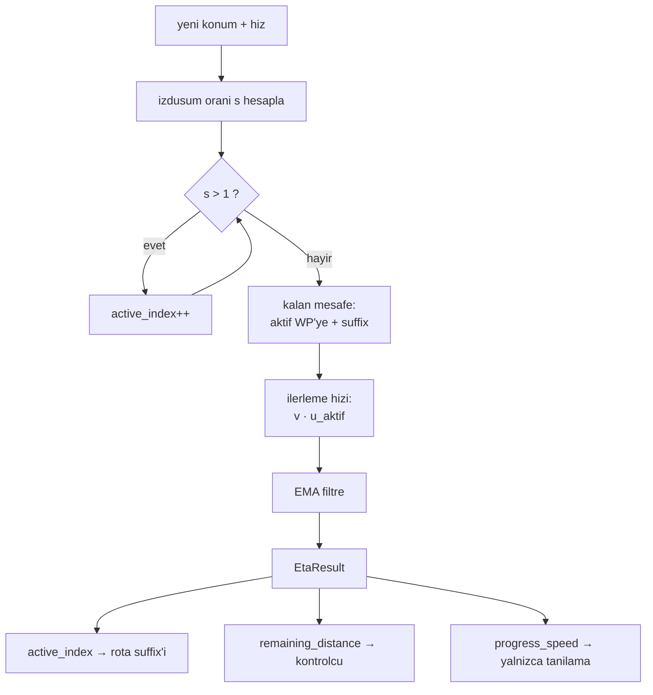

# ETA ve Kalan Mesafe (Aktif Waypoint Takibi)

## 1. Sezgisel Tanım

"Şu an rotanın neresindeyim ve hedefe kaç metre kaldı?"

Araç bir waypoint dizisini takip ediyor. Kalan mesafe iki parçadan oluşur:
**şu an gittiğim waypoint'e olan mesafe** artı **ondan sonraki bacakların
toplamı**.

Zor kısım "şu an gittiğim waypoint" sorusudur. Araç bir noktaya en yakın olduğu
anda ona gitmiyor olabilir, üzerinden geçmiş, bir sonrakine dönüyor olabilir.
Kabul yarıçapı 120 m olduğu için araç waypoint'in tam üstünden geçmez, kenarından
kestirir.

Sezgi: Otoyolda çıkışları sayıyorsun. "En yakın çıkış" yanlış ölçüttür, az önce
geçtiğin çıkış hâlâ en yakın olabilir. Doğru soru: **hangi çıkışı geçtim?**
Geçtiysen artık bir sonrakine gidiyorsundur ve geri dönmezsin.

Bu modül tam bunu yapar: waypoint'i **geçip geçmediğine** bakar, geçtiyse indeksi
ilerletir ve **asla geri almaz**.

## 2. Neden Var? Hangi Problemi Çözüyor?

Üç şey üretir ve üçü de sistemin farklı yerlerini besler:

| Çıktı | Kullanan |
|---|---|
| `active_index` hangi bacaktayız | rota suffix'i, kapı geçiş denetimi, sapma ölçümü |
| `remaining_distance_m` kalan rota | kontrolcünün gerekli hız hesabı |
| `progress_speed_mps` ilerleme hızı | tanılama (ETA'da **kullanılmaz**, bkz. §9) |

**Aktif indeksin doğru olması kritiktir** çünkü rota suffix'i ondan türetilir.
Yanlış indeks, yanlış kalan rota, yanlış plan demektir. Ayrıca rota sapması
yanlış bacağa göre ölçülürse 500 m sınırı anlamsız yerde denetlenir.

## 3. Nasıl Çalışır? (Adım Adım)

### Adım 1 Geçildi mi? (`_has_passed`)

Aktif waypoint'e giden bacak, yerel düzleme izdüşürülür. Aracın bu bacak
üzerindeki **izdüşüm oranı** hesaplanır:

```python
along_track = (current[0] * leg[0] + current[1] * leg[1]) / leg_squared
return along_track > 1.0
```

Oran 1'i aştıysa araç waypoint'in **ötesine** geçmiştir. Mesafeye bakılmaz
kestirerek geçse bile izdüşüm oranı 1'i aşar.

### Adım 2 İndeksi ilerlet (`_advance_active_index`)

```python
while self._active_index < len(self._route) - 1:
    if not self._has_passed(position, self._active_index):
        break
    self._active_index += 1
```

`while` döngüsü önemli: tek tick'te birden fazla waypoint geçilmiş olabilir
(telemetri kesintisi sonrası). İndeks **hedefte durur**, taşmaz.

Geri gitme yoktur. Araç manevra yapıp geriye düşse bile indeks korunur, aksi
halde rota suffix'i salınır ve plan titrer.

### Adım 3 Kalan mesafe

```python
to_active = geodesic_distance_m(position, self._route[self._active_index])
return to_active + self._suffix_lengths[self._active_index]
```

`_suffix_lengths` başlangıçta bir kez hesaplanır: her waypoint'ten hedefe kadar
kalan rota uzunluğu. Böylece her tick'te tüm rota yeniden toplanmaz.

### Adım 4 İlerleme hızı

Hız vektörünün **aktif waypoint doğrultusundaki bileşeni**:

```python
unit = direction / |direction|
return velocity_en[0] * unit[0] + velocity_en[1] * unit[1]
```

Yer hızının kendisi değil, hedefe **yaklaşma** hızı. Yan rüzgârda araç hızlı
uçar ama yavaş yaklaşır; bu ayrımı yakalar.

### Adım 5 Filtrele

Üstel hareketli ortalama, $dt$'den türetilen ağırlıkla:

```python
alpha = 1.0 - math.exp(-dt_s / self._speed_filter_tau_s)
self._filtered_speed_mps += alpha * (raw_speed_mps - self._filtered_speed_mps)
```

## 4. Matematiksel Temel

### Geçiş testi

Bacak vektörü $\vec{L}$ (aktif waypoint'e), konum $\vec{p}$ (bacak başlangıcına
göre). İzdüşüm oranı:

$$s = \frac{\vec p \cdot \vec L}{\|\vec L\|^2}$$

$$\text{geçildi} \iff s > 1$$

Bu, mesafe tabanlı testten üstündür. Kabul yarıçapı $R_a = 120$ m ile araç
waypoint'e en fazla $R_a$ kadar yaklaşır; "mesafe < eşik" testi eşiği $R_a$'dan
büyük seçmeyi gerektirir ve o zaman da erken tetiklenir. İzdüşüm testi
yarıçaptan bağımsızdır.

### Kalan mesafe

$$D_{\text{kalan}} = \|\,\vec{p} - W_k\,\| + \sum_{i=k}^{n-1} \|W_{i+1} - W_i\|$$

$k$ aktif indeks, $W_i$ waypoint'ler. İkinci terim önceden hesaplanır
($O(1)$ erişim).

### İlerleme hızı

$$v_{\text{ilerleme}} = \vec{v}_{\text{yer}} \cdot \hat{u}_{\text{aktif}}$$

Bu, yer hızının büyüklüğünden **küçüktür** (eşitlik yalnızca tam hedefe doğru
uçarken). Aradaki fark yengeç açısı ve dönüş geometrisidir.

### ETA ve neden kullanılmadığı

Modül şunu hesaplar:

$$\text{ETA}_{\text{ölçüm}} = \frac{D_{\text{kalan}}}{\max(v_{\text{ilerleme}},\; v_{\min})}$$

**Ama sistem bu değeri zamanlama için kullanmaz.** Kullanılan
[07 - Rüzgâr Düzeltmeli Rota Süresi](07-ruzgar-duzeltmeli-rota-suresi.md)'nin
model tabanlı hesabıdır.

Neden: ölçülen hıza bölmek gürültüyü doğrudan ETA'ya taşır. Dönüşlerde
$v_{\text{ilerleme}}$ anlık olarak çöker, ETA fırlar, kontrolcü kovalar.
**Ölçüldü: ETA salınımı ±15 s.** Model tabanlı hesaba geçilince **±0.7 s.**

`progress_speed_mps` yine de yayınlanır, tanılama için değerlidir, ama plan
hesabına girmez.

## 5. Geometrik/Görsel Sezgi

```
  IZDUSUM TESTI: "gectim mi?" sorusu mesafeyle degil oranla cevaplanir

                          s = 0.5          s = 1.0      s = 1.2
   W_k-1 ●━━━━━━━━━━━━━━━━━━━●━━━━━━━━━━━━━━━━● W_k ╌╌╌╌╌●
         │                                      ╲         │
         │                      kabul yaricapi   ╲        │ arac burada:
         │                      R = 120 m         ╲       │ s > 1 -> GECILDI
         │                    ╭─────────────╮      ╲      │
         │                   ╱               ╲      ╲     ▼
         └──────────────────│       ● W_k     │──────╲────●
                             ╲               ╱        ╲   arac
                              ╰─────────────╯          ╲
                                                        ▼ bir sonraki
                                                          waypoint'e

  Arac W_k'nin 118 m yanindan kestirerek gecti.
  "Mesafe < 120 m" testi tetiklerdi ama ne zaman? Belirsiz.
  Izdusum orani s > 1 kesin: waypoint duzleminin otesindeyiz.
```



## 6. Parametreler ve Etkileri

| Parametre | Değer | Etki |
|---|---|---|
| `DEFAULT_ADVANCE_RADIUS_M` | kod sabiti | İzdüşüm testi kullanıldığı için pratikte belirleyici değil. |
| `DEFAULT_SPEED_FILTER_TAU_S` | kod sabiti | İlerleme hızı filtresinin zaman sabiti. Yalnızca tanılamayı etkiler. |
| `DEFAULT_MIN_PROGRESS_SPEED_MPS` | kod sabiti | Sıfıra bölmeyi engeller. |
| `wp_accept_radius_m` (config) | 120 m | Otopilotun waypoint kabul yarıçapı. Belge en fazla 400 m'ye izin veriyor; L1 takibi için dar seçildi. Bizim izdüşüm testimizi etkilemez ama **aracın gerçek yolunu** etkiler. |

## 7. Çalışılmış Örnek (Gerçek Sayılarla)

**Bağlam:** HA-3, WP3 → WP4 bacağında ilerliyor. Rota:

| Bacak | Uzunluk |
|---|---|
| WP1→WP2 | 1529 m |
| WP2→WP3 | 1668 m |
| WP3→WP4 | 3003 m |
| WP4→hedef | 1304 m |

**Suffix uzunlukları** (başlangıçta bir kez hesaplanır):

$$\text{suffix}[3] = 1304, \quad \text{suffix}[2] = 3003 + 1304 = 4307$$

**Durum:** Araç WP4'e 1200 m kala. Aktif indeks 3 (WP4'e gidiyor).

$$D_{\text{kalan}} = 1200 + \text{suffix}[3] = 1200 + 1304 = 2504\ \text{m}$$

**Geçiş anı.** Araç WP4'ün 118 m yanından kestirerek geçiyor. Bacak boyunca
izdüşüm:

- WP4'e 200 m kala: $s = 0.933$ → geçilmedi
- WP4'e 118 m kala (en yakın): $s = 0.996$ → **hâlâ geçilmedi**
- 60 m ötesinde: $s = 1.020$ → **geçildi**, indeks 4'e ilerler

En yakın noktada ($118$ m) test **tetiklemedi**. Mesafe tabanlı bir test
"120 m'nin altına indi, geçtim" derdi ve indeksi erken ilerletirdi, kalan mesafe
1304 m'ye düşerdi, oysa araç henüz WP4'ü geçmemişti.

**İlerleme hızı örneği.** Rüzgâr 9.4 m/s 330°'den, araç WP4→hedef bacağında
(rota 135°), yer hızı 25.7 m/s ve tam bacak doğrultusunda uçuyor:

$$v_{\text{ilerleme}} = 25.7 \times \cos(0°) = 25.7\ \text{m/s}$$

Dönüş sırasında ise araç anlık olarak bacak doğrultusundan 40° sapabilir:

$$v_{\text{ilerleme}} = 25.7 \times \cos(40°) = 19.7\ \text{m/s}$$

**ETA'ya etkisi.** Kalan 2504 m için:

$$\text{ETA}_{\text{düz}} = \frac{2504}{25.7} = 97.4\ \text{s}, \qquad
\text{ETA}_{\text{dönüşte}} = \frac{2504}{19.7} = 127.1\ \text{s}$$

**Fark 30 saniye**, araç aynı yerde, aynı hızda, sadece dönüş yapıyor.
Kontrolcü bu sinyali izleseydi 30 saniyelik hayalî bir gecikmeyi kapatmaya
çalışır, hızlanır, sonra dönüş bitince fazla erken kalırdı. Ölçülen ±15 s'lik
salınımın kaynağı tam budur.

## 8. Sonuç Nasıl Olur?

`update()` her tick'te bir `EtaResult` döndürür: aktif indeks, kalan mesafe,
filtrelenmiş ilerleme hızı ve ölçüm tabanlı ETA.

Görev yöneticisi ilk ikisini kullanır; ETA'yı **kendi model tabanlı hesabıyla**
değiştirir. `progress_speed_mps` yalnızca loglara ve tanılamaya gider.

## 9. Sınırlamalar / Yapamayacağı

- **`eta_s` alanı yanıltıcıdır.** Hesaplanır, döndürülür, ama zamanlama
  kararlarında kullanılmaz. Adı aynı kaldığı için kodu okuyan biri kullanıldığını
  sanabilir. Kullanılan: `_model_eta_s`.
- **İndeks geri alınamaz.** Araç gerçekten geriye giderse (RTL, iptal) model
  bunu yansıtmaz. Bu bilinçli: salınımı engeller.
- **Rota sabittir.** Uçuş sırasında waypoint eklenip çıkarılamaz.
- **Kestirmeyi modellemez.** Kalan mesafe waypoint'lerden geçtiğimizi varsayar;
  araç 120 m yarıçapla kestirdiği için gerçek yol biraz kısadır. Bu, sistematik
  ve küçük bir iyimserlik kaynağıdır.
- **İlerleme hızı gürültülüdür.** Filtreye rağmen dönüşlerde çöker; bu yüzden
  plan hesabına sokulmaz.

## 10. Kodda Nerede

| Bileşen | Yer |
|---|---|
| Kestirici | [`eta_estimator.py`](../../ros2_ws/src/oasy_uav_agent/oasy_uav_agent/estimation/eta_estimator.py) |
| Rota uzunluğu | [`eta_estimator.py:30` `route_length_m`](../../ros2_ws/src/oasy_uav_agent/oasy_uav_agent/estimation/eta_estimator.py#L30) |
| Geçiş testi | `_has_passed` (aynı dosya) |
| Çağrı yeri | [`mission_manager.py` `_track_arrival`](../../ros2_ws/src/oasy_uav_agent/oasy_uav_agent/mission_manager.py) |
| Model tabanlı ETA | [`mission_manager.py:766` `_model_eta_s`](../../ros2_ws/src/oasy_uav_agent/oasy_uav_agent/mission_manager.py#L766) |

## 11. Kod Örneği

İzdüşüm tabanlı geçiş testi ve ilerletme:

```python
def _advance_active_index(self, position: LatLon) -> None:
    """Aktif indeksi ilerletir; geri gitmez, hedefte durur."""
    while self._active_index < len(self._route) - 1:
        if not self._has_passed(position, self._active_index):
            break
        self._active_index += 1
```

```python
# _has_passed içinde mesafe değil, bacak boyunca izdüşüm oranı kullanılır
along_track = (current[0] * leg[0] + current[1] * leg[1]) / leg_squared
return along_track > 1.0
```

## 12. İlgili Kavramlar

- [07 - Rüzgâr Düzeltmeli Rota Süresi](07-ruzgar-duzeltmeli-rota-suresi.md) ETA'yı gerçekte üreten model.
- [09 - Jeodezi](09-jeodezi.md) mesafe ve izdüşüm hesapları.
- [11 - Varış Zamanı Kontrolcüsü](11-varis-zamani-kontrolcusu.md) kalan mesafenin tüketicisi.
- [10 - Varış Tespiti](10-varis-tespiti.md) rota takibinin bittiği nokta.

## 13. Kaynaklar

- Vaka belgesi madde 4: *"Rota noktalarının kabul yarıçapları en fazla 400m
  olarak kullanınız."*, bizim seçimimiz 120 m.
- Kod yorumu, `mission_manager.py` ölçülen hıza bölme kusurunun ve
  ±15 s → ±0.7 s düzelmesinin kaydı.
