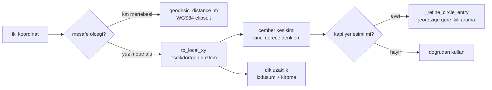

# Jeodezi (Mesafe, Yerel Düzlem ve Çember Kesişimi)

## 1. Sezgisel Tanım

Dünya küre, harita düz. Bu modül ikisi arasında gidip gelir.

İki tür hesap gerekir ve **farklı araçlar** ister:

- **"İki nokta arası kaç metre?"** Kilometrelerce mesafe, yüksek doğruluk.
  Dünyanın basıklığı önemli. WGS84 elipsoidi üzerinde çözülür.
- **"Bu nokta şu çemberin içinde mi?"** Birkaç yüz metrelik yerel iş.
  Düzlem varsaymak yeterli, hatta zorunlu: çember-doğru kesişimi düzlemde
  ikinci derece denklemdir, elipsoit üzerinde çirkin bir problem.

Sezgi: Şehirler arası mesafeyi hesaplarken dünyanın yuvarlaklığını hesaba
katarsın. Odandaki masanın köşesine olan uzaklığı ölçerken katmazsın, cetvel
yeterli. Bu modül hangi durumda hangisinin kullanılacağını bilir.

## 2. Neden Var? Hangi Problemi Çözüyor?

Sistem üç yerde geometri sorar:

1. **Rota uzunluğu ve kalan mesafe**, kilometrelerce, jeodezik doğruluk gerekir.
2. **Kabul çemberine giriş**, 5 m yarıçap, düzlemsel kesişim gerekir.
3. **Rota sapması**, belge madde 4'ün 500 m sınırı, noktanın doğru parçasına
   dik uzaklığı.

Karıştırmak pahalıdır. Elipsoit üzerinde çember kesişimi çözmeye çalışmak
gereksiz karmaşıklık; 7 km'lik rotayı düzlem varsayarak ölçmek ise gerçek hata
üretir.

**Bu ayrımın bedelini bu projede bir kez ödedik.** Kapı konumu düzlem
izdüşümünde tam 2500 m'ye yerleştiriliyor, sonra jeodezik mesafeyle
denetleniyordu. İki model 2.5 km yarıçapta **3.1 m** ayrışıyordu; birim testi
±2 m tolerans istediği için kırılıyordu. Çözüm: düzlem çözümünü başlangıç kabul
edip jeodezik mesafeye göre ikili aramayla düzeltmek
([`_refine_circle_entry`](../../ros2_ws/src/oasy_uav_agent/oasy_uav_agent/estimation/geodesy.py)).

## 3. Nasıl Çalışır? (Adım Adım)

### Jeodezik mesafe `geodesic_distance_m`

```python
_GEOD = Geodesic.WGS84
return _GEOD.Inverse(a.lat, a.lon, b.lat, b.lon)["s12"]
```

`geographiclib` kütüphanesi Karney'in algoritmasıyla WGS84 elipsoidi üzerinde
**ters jeodezik problemi** çözer: iki nokta verildiğinde aralarındaki en kısa
yüzey mesafesi ve kerteriz. Doğruluk nanometre mertebesindedir.

### Yerel düzlem `to_local_xy` / `from_local_xy`

Eşdikdörtgen (equirectangular) izdüşüm:

```python
lat_rad = math.radians(origin.lat)
east  = math.radians(point.lon - origin.lon) * _EARTH_RADIUS_M * math.cos(lat_rad)
north = math.radians(point.lat - origin.lat) * _EARTH_RADIUS_M
```

Boylam farkı enlemin kosinüsüyle ölçeklenir, kutuplara yaklaştıkça meridyenler
yakınsar. Origin noktasında hata sıfır, uzaklaştıkça büyür.

### Dik uzaklık `cross_track_distance_m`

Konumun bacak doğru parçasına en kısa uzaklığı. Bacak uçlarının dışında kalınırsa
uç noktaya olan mesafe kullanılır (doğru parçası, sonsuz doğru değil).

### Çember kesişimi `circle_entry_fraction`

Doğru parçası ile çemberin **giriş** noktasını $[0,1]$ oranı olarak döndürür.
Matematiği [§4](#4-matematiksel-temel)'te; kullanımı
[10 - Varış Tespiti](10-varis-tespiti.md)'nde.

### Son giriş `last_circle_entry_on_route`

Bir rotanın bir çembere **son dıştan-içe girişini** bulur. Rota koruma bölgesine
girip yeniden çıkabilir; bekleme için geri dönülemez son fırsat **sonraki**
giriştir. Bu yüzden ilk değil son giriş aranır
([12 - Son Yasal Kapı](12-son-yasal-kapi.md)).

## 4. Matematiksel Temel

### Eşdikdörtgen izdüşüm hatası

Origin'den $d$ mesafede, izdüşümün bağıl hatası kabaca:

$$\frac{\Delta d}{d} \approx \frac{d^2}{6R^2} + \text{elipsoit terimi}$$

$R = 6378137$ m için mesafeye göre:

| Mesafe | Küresel terim | Toplam gözlenen hata |
|---|---|---|
| 100 m | ~4×10⁻¹⁰ | ihmal edilebilir |
| 1 km | ~4×10⁻⁸ | < 1 mm |
| 2.5 km | ~2.6×10⁻⁷ | **~3 m** (elipsoit baskın) |

2.5 km'deki 3 m'lik sapma küresellikten değil, sabit `_EARTH_RADIUS_M`
kullanılmasından gelir: WGS84'te meridyen eğrilik yarıçapı 47.5° enlemde
6378137 değil ~6367000 m'dir. Bağıl fark ~%0.17 → 2500 m'de 4.4 m mertebesi.

### Çemberdoğru parçası kesişimi

$P(t) = P_0 + t(P_1 - P_0)$, çember merkezi orijinde, yarıçap $r$:

$$\|P_0 + t\,\vec{d}\|^2 = r^2 \;\Longrightarrow\; a t^2 + bt + c = 0$$

$$a = \|\vec d\|^2, \quad b = 2\,P_0 \cdot \vec d, \quad c = \|P_0\|^2 - r^2$$

**Giriş** küçük köktür:

$$t^* = \frac{-b - \sqrt{b^2 - 4ac}}{2a}, \qquad t^* \in [0,1]$$

İki koşul da gerekir: diskriminant $\ge 0$ (doğru çemberi kesiyor) **ve**
$t^* \in [0,1]$ (kesişim parça üzerinde, uzantısında değil).

### Dik uzaklık

Bacak $\vec{L} = P_{\text{son}} - P_{\text{ilk}}$, nokta $\vec{p}$ (bacak
başlangıcına göre):

$$s = \frac{\vec p \cdot \vec L}{\|\vec L\|^2}, \qquad
s_{\text{kırpılmış}} = \max(0, \min(1, s))$$

$$d_\perp = \left\|\vec p - s_{\text{kırpılmış}}\,\vec L\right\|$$

Kırpma, doğru parçasının dışında kalındığında uç noktaya olan mesafeyi verir.

### Jeodezik düzeltme (ikili arama)

Düzlem çözümü $t_0$ başlangıç kabul edilir, $[t_0 - 0.02,\; t_0 + 0.02]$
aralığında jeodezik mesafeye göre ikili arama yapılır:

$$f(t) = \text{geodesic}(P(t),\; \text{merkez}) - r$$

40 iterasyonda kalan belirsizlik $0.04 \times L_{\text{bacak}} / 2^{40}$
nanometre altı. Aşırıya kaçmış bir sayı ama maliyet önemsiz: fonksiyon görev
başına yalnızca **iki kez** çağrılır (kapı kurulumu ve terminal giriş noktası).

## 5. Geometrik/Görsel Sezgi

```
  Iki farkli hesap, iki farkli arac:

  ROTA UZUNLUGU (kilometrelerce)          CEMBER KESISIMI (metrelerce)
  ─────────────────────────────           ────────────────────────────
                                                    P1
     A ●                                            ●
        ╲___                                       ╱
            ╲___  elipsoit uzerinde              ╱  duzlemde ikinci
                ╲___  en kisa yol             ╱     derece denklem
                    ╲___                    ╱
                        ╲___             ╱   ╭────╮
                            ● B        ● ──╱──●   │
                                      P0   │      │  r
     geographiclib WGS84                   ╲     ╱
     hata: nanometre                        ╰───╯

                                          to_local_xy + kok bulma
                                          hata: milimetre alti (<200 m)
```

Kapı yerleşiminde iki modelin ayrışması:

```
  Duzlem izdusumunde tam 2500 m'ye konulan nokta,
  jeodezik olarak olculdugunde 2496.9 m cikiyordu.

     hedef ●━━━━━━━━━━━━━━━━━━━━━━━━━━━━━━━━━━━━━━━●  duzlem: 2500.0 m
           ●━━━━━━━━━━━━━━━━━━━━━━━━━━━━━━━━━━━━━●    jeodezik: 2496.9 m
                                                  ↑
                                            3.1 m fark

  Cozum: duzlem cozumunu baslangic al, jeodezik mesafeye gore
         ikili aramayla duzelt -> iki olcu ayni cemberi gosterir.
```



## 6. Parametreler ve Etkileri

| Sabit | Değer | Etki |
|---|---|---|
| `_GEOD` | `Geodesic.WGS84` | Elipsoit modeli. Küresel modele geçmek 2.5 km'de ~3 m hata ekler. |
| `_EARTH_RADIUS_M` | 6378137.0 | Yerel düzlem ölçeği (ekvatoral yarıçap). 47.5°'de meridyen eğriliği ~6367 km olduğu için uzak mesafede %0.17 sapma verir jeodezik düzeltmenin gerekçesi. |
| Düzeltme bandı | ±0.02 bacak | İkili aramanın kuşatma aralığı. İzdüşüm hatasından büyük olması yeter. |
| Düzeltme iterasyonu | 40 | Fazlasıyla yeterli; maliyet önemsiz (görev başına iki çağrı). |

## 7. Çalışılmış Örnek (Gerçek Sayılarla)

**Bağlam:** HA-3'ün son bacağı, WP4 → hedef.

**Jeodezik mesafe:**

| Nokta | Koordinat |
|---|---|
| WP4 | 47.543977 N, −122.240829 W |
| Hedef | 47.535683 N, −122.228584 W |

`geodesic_distance_m` → **1304 m**, kerteriz **135°**.

**Aynı hesap yerel düzlemde.** Origin WP4:

$$\Delta\text{lat} = -0.008294° \rightarrow \text{north} = \frac{-0.008294 \times \pi}{180} \times 6378137 = -923.3\ \text{m}$$

$$\Delta\text{lon} = +0.012245° \rightarrow \text{east} = \frac{0.012245 \times \pi}{180} \times 6378137 \times \cos(47.544°) = +919.4\ \text{m}$$

$$d_{\text{düzlem}} = \sqrt{923.3^2 + 919.4^2} = \sqrt{852{,}483 + 845{,}296} = 1303.0\ \text{m}$$

**Fark: 1304 − 1303 = 1 m**, 1.3 km'de %0.08. Bu bacak için düzlem kabul
edilebilir, ama rota toplamında (9269 m) hata birikir; o yüzden mesafeler daima
jeodezik hesaplanır.

**Çember kesişimi örneği.** Araç hedefe 6.2 m uzaklıkta ($P_0$), bir sonraki
örnekte 4.1 m ($P_1$), aralarındaki mesafe 1.3 m. Hedef merkezli düzlemde
kabaca $P_0 = (6.2, 0)$, $P_1 = (4.9, 0)$ alalım (radyal yaklaşma):

$$\vec d = (-1.3,\; 0), \quad a = 1.69, \quad b = 2(6.2)(-1.3) = -16.12, \quad c = 6.2^2 - 25 = 13.44$$

$$\text{disk} = (-16.12)^2 - 4(1.69)(13.44) = 259.9 - 90.8 = 169.1$$

$$t^* = \frac{16.12 - 13.00}{2 \times 1.69} = \frac{3.12}{3.38} = 0.923$$

$t^* = 0.923 \in [0,1]$ → kesişim var. Varış anı, iki örnek arasındaki sürenin
%92.3'ünde. 20 Hz'de örnek aralığı 50 ms olduğuna göre varış anı ilk örnekten
**46 ms** sonra.

**Yorum:** İnterpolasyon olmasaydı varış ikinci örnekte (50 ms sonra) raporlanır,
4 ms hata olurdu. Bu örnekte küçük; ama teğet geçişte ikinci örnek çemberin
dışında kalabilir ve varış hiç görülmezdi.

## 8. Sonuç Nasıl Olur?

Modül saf fonksiyonlar sunar, durum tutmaz, yan etkisi yoktur. Çıktılar:
metre cinsinden mesafe, `(doğu, kuzey)` metre çifti, `[0,1]` oranı ya da `None`.

Tüm sistem geometriyi buradan alır: rota uzunluğu, kalan mesafe, rota sapması
denetimi, kabul çemberi, kapı yerleşimi.

## 9. Sınırlamalar / Yapamayacağı

- **İki boyutlu.** İrtifa hiçbir hesaba girmez. Tüm görev 400 m MSL'de olduğu
  için geçerli; farklı irtifalarda eğik mesafe gerekirdi.
- **Yerel düzlem uzakta bozulur.** `to_local_xy` origin'den uzaklaştıkça hata
  büyütür. Birkaç yüz metre için güvenli, kilometrelerce için değil. Kod bu
  ayrımı **dokümante eder ama zorlamaz**, yanlış kullanım sessizce yanlış sonuç
  verir.
- **Elipsoit yüksekliği yok.** Jeoit-elipsoit ayrımı (Seattle civarında ~−22 m)
  hesaba girmez; yatay mesafeler için önemsizdir.
- **`circle_entry_fraction` yalnızca girişi verir.** Çıkış kökü hesaplanmaz.
- **Düzeltme sessizce vazgeçebilir.** `_refine_circle_entry` beklenen kuşatmayı
  kuramazsa düzlem çözümünü olduğu gibi döndürür ve bunu bildirmez.

## 10. Kodda Nerede

| Fonksiyon | Yer | Kullanan |
|---|---|---|
| `geodesic_distance_m` | [geodesy.py:18](../../ros2_ws/src/oasy_uav_agent/oasy_uav_agent/estimation/geodesy.py#L18) | rota uzunluğu, kalan mesafe, her yer |
| `initial_bearing_deg` | [geodesy.py:23](../../ros2_ws/src/oasy_uav_agent/oasy_uav_agent/estimation/geodesy.py#L23) | bacak yönü |
| `to_local_xy` / `from_local_xy` | [geodesy.py:28](../../ros2_ws/src/oasy_uav_agent/oasy_uav_agent/estimation/geodesy.py#L28) | çember, sapma, rüzgâr ayrıştırma |
| `cross_track_distance_m` | [geodesy.py:48](../../ros2_ws/src/oasy_uav_agent/oasy_uav_agent/estimation/geodesy.py#L48) | 500 m sapma denetimi |
| `circle_entry_fraction` | [geodesy.py](../../ros2_ws/src/oasy_uav_agent/oasy_uav_agent/estimation/geodesy.py) | [10 - Varış Tespiti](10-varis-tespiti.md) |
| `last_circle_entry_on_route` | [geodesy.py](../../ros2_ws/src/oasy_uav_agent/oasy_uav_agent/estimation/geodesy.py) | [12 - Son Yasal Kapı](12-son-yasal-kapi.md) |

## 11. Kod Örneği

Yerel düzlem izdüşümü ve tersi:

```python
def to_local_xy(point: LatLon, origin: LatLon) -> Tuple[float, float]:
    """Origin merkezli duzlemsel metre koordinati (dogu, kuzey).

    Kabul cemberi tespiti yalnizca hedefin birkac yuz metre yakininda
    calistigi icin esdikdortgen yaklasimi milimetre altinda hata birakir.
    """
    lat_rad = math.radians(origin.lat)
    east = math.radians(point.lon - origin.lon) * _EARTH_RADIUS_M * math.cos(lat_rad)
    north = math.radians(point.lat - origin.lat) * _EARTH_RADIUS_M
    return east, north
```

## 12. İlgili Kavramlar

- [10 - Varış Tespiti](10-varis-tespiti.md) `circle_entry_fraction`'ın ana tüketicisi.
- [12 - Son Yasal Kapı](12-son-yasal-kapi.md) `last_circle_entry_on_route` ve jeodezik düzeltme.
- [07 - Rüzgâr Düzeltmeli Rota Süresi](07-ruzgar-duzeltmeli-rota-suresi.md) bacak yönünü `to_local_xy` ile çıkarır.
- [08 - ETA ve Kalan Mesafe](08-eta-ve-kalan-mesafe.md) jeodezik mesafeyle rota takibi.

## 13. Kaynaklar

- Vaka belgesi madde 4: *"rotadan en fazla 500m sapma sağlanmalıdır"*
  `cross_track_distance_m`'in ölçtüğü büyüklük.
- C. F. F. Karney, *Algorithms for geodesics* (2013) `geographiclib`'in temeli.
- `tests/unit/test_geodesy.py` kapı yerleşiminin ±2 m toleransla doğrulandığı
  ve jeodezik düzeltmeyi gerektiren testler.
