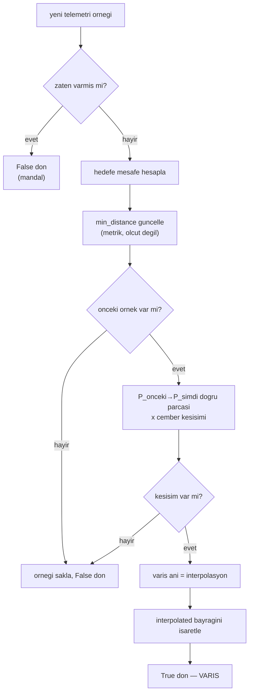

# Varış Tespiti (Kabul Çemberine Giriş ve İnterpolasyon)

## 1. Sezgisel Tanım

"Araç hedefe vardı" kararının **tam anını** bulmak.

Belge diyor ki: hedefin kabul yarıçapı 5 metre alınabilir. Yani araç hedefin
5 m'lik çemberine girdiği anda varmış sayılır. Kulağa basit geliyor —
"mesafeyi ölç, 5'in altına düşünce varış de."

Ama telemetri **ayrık örneklerle** gelir. Araç 26 m/s hızla uçuyor ve detektör
20 Hz besleniyorsa iki örnek arasında **1.3 metre** yol alır. Çemberden tam
ortasından geçerse içeride 7–8 örnek düşer, sorun yok. Ama **kenarından**
geçerse — ki 5 m'lik bir çemberde 4.9 m'den geçmek gayet mümkündür — içeride
kalan yay 1.4 metreye iner ve tek bir örnek bile düşmeyebilir.

Sezgi: Elinde saniyede yirmi kare çeken bir fotoğraf makinesi var ve koşan
birinin bir kapıdan geçtiği **anı** soruyorsun. Kapının ortasından geçerse
birkaç karede içeride görürsün. Ama söveyi sıyırarak geçerse hiçbir karede
içeride olmayabilir. İki kareyi birleştirip **aradaki doğruyu kapı çizgisiyle
kesiştirirsen** geçiş anını yine de bulursun.

Bu modülün yaptığı tam olarak budur: ardışık iki konum arasındaki doğru parçasını
çemberle kesiştirip giriş anını **interpolasyonla** bulur.

## 2. Neden Var? Hangi Problemi Çözüyor?

Varış anı, bu sistemin **tek başarı ölçütüdür**. 20 saniyelik varış farkı şartı
bu anlar arasındaki farkla ölçülür. Ölçüm hatası doğrudan sonuca yansır.

Üç sorunu birden çözer:

1. **Örnekler arası kaçırma.** Yukarıdaki geometri. Interpolasyon olmadan araç
   çemberden geçtiği halde "varmadı" denebilir, ya da varış bir örnek geç
   raporlanır.

2. **Kuantalama hatası.** Interpolasyon olmasa bile, en yakın örneği varış kabul
   etmek 20 Hz'de **±50 ms** hata verir. Üç araçta bileşik hata ~71 ms olur;
   ±1 s toleransın %7'si, bedava kazanılabilecek bir pay.

3. **Tekrarlı tetikleme.** Araç hedefin üzerinden geçip RTL'e girerken çemberden
   çıkıp yeniden girebilir. Varış olayı **bir kez** üretilmelidir; ikinci giriş
   yeni bir varış değildir.

## 3. Nasıl Çalışır? (Adım Adım)

### Adım 1 — Konumu hedef merkezli düzleme taşı

```python
current_xy = to_local_xy(position, self._target)
distance_m = math.hypot(*current_xy)
```

Hedef merkezde olduğu için mesafe doğrudan vektör normudur.

### Adım 2 — En yakın geçişi kaydet

```python
self.min_distance_m = min(self.min_distance_m, distance_m)
```

Bu **başarı ölçütü değildir**. Yalnızca metrik ve teşhis içindir: varış
olmadıysa "ne kadar yaklaşmıştı" sorusunu cevaplar.

### Adım 3 — Bir önceki örnekle doğru parçası kur, çemberle kesiştir

```python
fraction = circle_entry_fraction(previous_xy, current_xy, self._radius_m)
```

`circle_entry_fraction` ([09 - Jeodezi](09-jeodezi.md)) doğru parçasının çembere
**girdiği** noktayı $[0, 1]$ aralığında bir oran olarak döndürür; kesişim yoksa
`None`.

### Adım 4 — Giriş anını interpolasyonla bul

```python
self.arrival_monotonic_ns = previous_ns + int(
    fraction * (monotonic_ns - previous_ns)
)
```

Zaman, konumla aynı oranda ilerlemiş varsayılır (iki örnek arasında sabit hız).

### Adım 5 — Türetilmiş mi işaretle

```python
self.interpolated = distance_m > self._radius_m
```

Eğer mevcut örnek çemberin **dışındaysa** ama kesişim bulunduysa, araç çemberi
iki örnek arasında geçmiş demektir — varış anı doğrudan gözlenmedi, türetildi.
Bu bayrak logda raporlanır; ölçümün ne kadarının gözlem ne kadarının çıkarım
olduğu gizlenmez.

### Adım 6 — Mandalla

```python
if self.arrived:
    return False
```

İlk varıştan sonra tüm çağrılar `False` döner. RTL sırasında çemberden yeniden
geçmek yeni bir varış üretmez.

## 4. Matematiksel Temel

### Doğru parçası–çember kesişimi

Ardışık iki konum $P_0, P_1$ (hedef merkezli yerel düzlemde), çember yarıçapı $r$.
Doğru parçası:

$$P(t) = P_0 + t\,(P_1 - P_0), \qquad t \in [0, 1]$$

Çember denklemi $\|P(t)\|^2 = r^2$ açılırsa ikinci derece denklem:

$$a t^2 + b t + c = 0$$

$$a = \|P_1 - P_0\|^2, \qquad b = 2\,P_0 \cdot (P_1 - P_0), \qquad c = \|P_0\|^2 - r^2$$

**Giriş** kökü küçük olandır (çembere ilk değme):

$$t^* = \frac{-b - \sqrt{b^2 - 4ac}}{2a}$$

Kesişim koşulu: $b^2 - 4ac \ge 0$ **ve** $t^* \in [0, 1]$. İkinci koşul önemli —
diskriminant pozitif olsa bile kesişim doğru parçasının dışında kalabilir
(çember ileride ya da geride).

### Zaman interpolasyonu

$$t_{\text{varış}} = t_{n-1} + t^* \left(t_n - t_{n-1}\right)$$

### Hata analizi — interpolasyonun gerçek katkısı

Detektör görev döngüsünün her tick'inde beslenir: `TICK_INTERVAL_S = 0.05` s,
yani **20 Hz**. (Karıştırmamak gerekir: 5 Hz olan `status_publish_hz`, peer'lara
yapılan *durum yayınıdır* — telemetri değil. Loglarda telemetri yaşı 0.00–0.04 s
görünür, bu 20 Hz beslemeyi doğrular.)

Örnekleme aralığı $\Delta t = 0.05$ s, yer hızı $v \approx 26$ m/s → örnekler
arası mesafe:

$$v\,\Delta t = 26 \times 0.05 = 1.3\ \text{m}$$

İnterpolasyonsuz en kötü hata bir örnekleme aralığıdır:

$$e_{\max} = \Delta t = 50\ \text{ms}$$

Üç araç bağımsız hata yaparsa iki varış arasındaki farkın hatası
$\sqrt{2} \times 50 = 71$ ms — ±1 s toleransın **%7'si**. Kritik değil ama
bedava kazanılabilecek bir pay; interpolasyonla milisaniye mertebesine iner.

### Asıl risk: teğet geçiş

Tam atlama koşulu bizim hızlarımızda gerçekleşmez:

$$v\,\Delta t > 2r \;\Longrightarrow\; v > \frac{2 \times 5}{0.05} = 200\ \text{m/s}$$

Ama **teğet geçiş** gerçek bir risktir. Araç merkeze $d$ mesafeden geçerse
çemberin içinde kalan kiriş:

$$\ell = 2\sqrt{r^2 - d^2}$$

İçeride kalan örnek sayısı $\approx \ell / (v\,\Delta t)$:

| En yakın geçiş $d$ | Kiriş $\ell$ | İçeride kalan örnek |
|---|---|---|
| 3.0 m | 8.00 m | ~6 |
| 4.0 m | 6.00 m | ~5 |
| 4.79 m | 2.87 m | ~2 |
| 4.95 m | 1.41 m | ~1 |
| 4.99 m | 0.63 m | **0–1** |

Sınıra yaklaştıkça içeride örnek kalmama olasılığı hızla artar. İnterpolasyon
bu kuyruk durumunu kapatır: kiriş ne kadar kısa olursa olsun, doğru parçası
çemberi kesiyorsa varış yakalanır.

## 5. Geometrik/Görsel Sezgi

```
  TEGET GECIS: arac cemberi siyirarak geciyor (d = 4.95 m)

                        hedef
                     ╭─────────╮
                    ╱     ●     ╲        r = 5.0 m
                   │             │
       P0 ●        │             │       kiris = 2·sqrt(25-24.5)
          ╲        │  ╌╌╌╌╌╌╌╌╌  │              = 1.41 m
           ╲       ╲  ↑ 1.41 m  ╱
            ╲       ╲__________╱
             ╲            ↑
              ● P1        cemberin icinde kalan yay

  Ornekler arasi 1.3 m, kiris 1.41 m.
  Bir sonraki ornek P1 cemberin DISINA dusebilir.

  circle_entry_fraction(P0, P1, 5.0) -> t* = 0.62
  varis ani = t0 + 0.62 x (t1 - t0)

  interpolated = True  (mevcut ornek disarida, an turetildi)
```



## 6. Parametreler ve Etkileri

| Parametre | Değer | Etki |
|---|---|---|
| `DEFAULT_ARRIVAL_RADIUS_M` | 5.0 m | Belge madde 2'den: *"kabul yarıçapı 5 metre alınabilir"*. Büyütmek varışı erkene çeker ve ölçümü kolaylaştırır — ama şartın kendisini gevşetir. |
| `TICK_INTERVAL_S` | 0.05 s (20 Hz) | Detektörün besleme hızı. 26 m/s'de örnekler arası 1.3 m. Düşürmek teğet geçişte varışı kaçırma riskini artırır. |
| `status_publish_hz` | 5 Hz | **Karıştırılmamalı:** bu peer yayın hızıdır, telemetri değil. Varış tespitiyle ilgisi yoktur. |

Görev listesindeki hedef waypoint'inin kabul yarıçapı da (`TARGET_WP_ACCEPT_RADIUS_M = 5.0`,
[`mission_builder.py`](../../ros2_ws/src/oasy_uav_agent/oasy_uav_agent/autopilot_adapter/mission_builder.py))
buna göre seçilmiştir. **Neden:** otopilota geniş kabul yarıçapı verilirse
(rotanın geri kalanında 120 m) araç hedefe 5 m yaklaşmadan görevi tamamlanmış
sayar, dönüşe başlar ve çemberin içine hiç girmez. Varış kararı bizim
detektörümüzde ama **aracın oraya kadar uçması** otopilotun kabul yarıçapına
bağlı.

## 7. Çalışılmış Örnek (Gerçek Sayılarla)

**Bağlam:** Doğrulama koşusu `logs/run_20260804_172043`. Üç aracın ölçülen en
yakın geçiş mesafeleri:

| Araç | En yakın geçiş | Varış tespiti |
|---|---|---|
| HA-1 | 3.83 m | doğrudan (çember içinde örnek var) |
| HA-2 | 4.79 m | doğrudan |
| HA-3 | 4.75 m | doğrudan |

Üçü de 5 m sınırının altında; kabul ölçütü sağlandı. **Üçünde de tespit
"doğrudan"** — yani çemberin içinde en az bir telemetri örneği düştü,
interpolasyona gerek kalmadı.

**Peki interpolasyon boşuna mı?** Hayır — ne kadar dar bir paydan geçildiğine
bakalım. HA-2 en sınırdaki araç, 4.79 m. Çemberin içinde kalan kiriş:

$$\ell = 2\sqrt{r^2 - d_{\min}^2} = 2\sqrt{25 - 22.94} = 2\sqrt{2.06} = 2.87\ \text{m}$$

Yer hızı ~26 m/s, örnekleme 20 Hz → örnekler arası **1.3 m**. Kirişe düşen örnek
sayısı:

$$\frac{2.87}{1.3} \approx 2.2$$

**İki örnek.** Geçiş 0.2 m daha uzaktan olsaydı (4.99 m) kiriş 0.63 m'ye iner ve
içeride örnek kalmama olasılığı ciddileşirdi. Yani bu koşuda interpolasyon
devreye girmedi ama **marj iki örnekti** — sistemin sağlamlığı ona bağlı.

**Zamanlama sonucu:** HA-2 − HA-1 = 19.89 s (sapma −0.11 s), HA-3 − HA-2 =
20.17 s (sapma +0.17 s).

İnterpolasyonun bu koşudaki somut katkısı kuantalama payıdır: onsuz her varış anı
en fazla 50 ms yuvarlanır, üç araçta bileşik hata ~71 ms olur. Ölçülen sapmaların
(0.11 ve 0.17 s) **yarısına yakını** bu tek kaynaktan gelebilirdi.

## 8. Sonuç Nasıl Olur?

`update()` varış o çağrıda oluştuysa `True` döner ve üç alan doldurulur:

| Alan | Anlam |
|---|---|
| `arrival_monotonic_ns` | Varış anı (interpolasyonlu) |
| `min_distance_m` | En yakın geçiş — metrik, ölçüt değil |
| `interpolated` | Anın gözlemden mi çıkarımdan mı geldiği |

Bu an peer'lara yayınlanır ve diğer araçların çıpa hesabına **olgu** olarak
girer ([02 - Merkeziyetsiz Çıpa](02-merkeziyetsiz-capa.md)) — tahmin değil.

## 9. Sınırlamalar / Yapamayacağı

- **Sabit hız varsayar.** İki örnek arası doğru parçası ve tekdüze zaman
  ilerlemesi varsayılır. Sert manevrada bu yaklaşım bozulur; düz son yaklaşmada
  hata milisaniye mertebesindedir.
- **Yalnızca giriş.** Çıkış anı hesaplanmaz, gerekmez.
- **Yatay mesafe.** İrtifa farkı yok sayılır. Tüm görev 400 m MSL'de olduğu için
  geçerlidir; farklı irtifalarda 3B mesafe gerekirdi.
- **Kaçan telemetri.** İki örnek arasında uzun boşluk olursa (DDS tıkanması)
  doğru parçası gerçek yolu temsil etmez. Telemetri yaşı ayrıca izlenir ve
  bayatlarsa uyarılır.
- **Mandal geri alınamaz.** Varış bir kez tetiklendikten sonra sıfırlanamaz;
  aynı süreçte ikinci bir görev çalıştırılamaz.

## 10. Kodda Nerede

| Bileşen | Yer |
|---|---|
| Detektör | [`arrival_detector.py`](../../ros2_ws/src/oasy_uav_agent/oasy_uav_agent/estimation/arrival_detector.py) |
| Çember kesişimi | [`geodesy.py` `circle_entry_fraction`](../../ros2_ws/src/oasy_uav_agent/oasy_uav_agent/estimation/geodesy.py) |
| Çağrı yeri | [`mission_manager.py` `_track_arrival`](../../ros2_ws/src/oasy_uav_agent/oasy_uav_agent/mission_manager.py) |
| Hedef WP yarıçapı | [`mission_builder.py` `TARGET_WP_ACCEPT_RADIUS_M`](../../ros2_ws/src/oasy_uav_agent/oasy_uav_agent/autopilot_adapter/mission_builder.py) |
| Doğrulama | [`scripts/analyze_run.py`](../../scripts/analyze_run.py) — 5 m ölçütünü koşu logundan denetler |

## 11. Kod Örneği

Kesişim ve interpolasyon ([`arrival_detector.py`](../../ros2_ws/src/oasy_uav_agent/oasy_uav_agent/estimation/arrival_detector.py)):

```python
if self._previous is not None:
    previous_xy, previous_ns = self._previous
    fraction = circle_entry_fraction(previous_xy, current_xy, self._radius_m)
    if fraction is not None:
        self.arrival_monotonic_ns = previous_ns + int(
            fraction * (monotonic_ns - previous_ns)
        )
        # Dogrudan cember icinde bir ornek yoksa giris ani turetilmistir.
        self.interpolated = distance_m > self._radius_m
        return True
```

## 12. İlgili Kavramlar

- [09 - Jeodezi](09-jeodezi.md) — `circle_entry_fraction` ve yerel düzlem izdüşümü.
- [02 - Merkeziyetsiz Çıpa](02-merkeziyetsiz-capa.md) — varış anının olgu olarak çıpaya girmesi.
- [01 - Görev Durum Makinesi](01-gorev-durum-makinesi.md) — varışın `ARRIVED` geçişini tetiklemesi.
- [08 - ETA ve Kalan Mesafe](08-eta-ve-kalan-mesafe.md) — varıştan sonra ETA'nın anlamını yitirmesi.

## 13. Kaynaklar

- Vaka belgesi madde 2: *"Hedef noktanın kabul yarıçapı 5 metre alınabilir,
  noktaya varıldıktan sonra HA'lar RTL moduna alınmalıdır."*
- Doğrulama koşusu `logs/run_20260804_172043` — [§7](#7-çalışılmış-örnek-gerçek-sayılarla)'deki
  en yakın geçiş mesafeleri.
