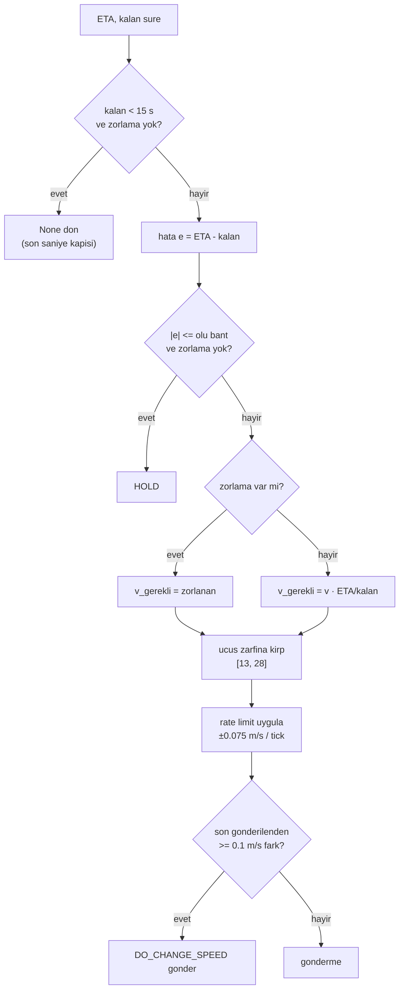

# Varış Zamanı Kontrolcüsü (Hızla Zamanlama Düzeltmesi)

## 1. Sezgisel Tanım

"Planladığım anda varmak için ne kadar hızlı uçmalıyım?"

Araç bir varış anına taahhüt etmiş durumda. Her tick'te iki sayı karşılaştırılır:

- **ETA** mevcut hızla ne kadar sürede varırım
- **Kalan süre** plana göre ne kadar zamanım var

İkisi eşitse her şey yolunda. ETA daha büyükse geç kalacağım, hızlanmalıyım.
Daha küçükse erken varacağım, yavaşlamalıyım.

Sezgi: Randevuya arabayla gidiyorsun. Navigasyon "17:05'te varırsın" diyor,
randevu 17:00. Beş dakika geç kalacaksın, gaza basarsın. Ama gaz pedalının
sınırı var (azami hız), fren de sınırlı (asgari hız), ve arabanın hızlanması
zaman alır (rate limit). Üç sınırın üçü de bu kontrolcüde var.

Gerekli hız oranla bulunur:

$$v_{\text{gerekli}} = v_{\text{mevcut}} \times \frac{\text{ETA}}{\text{kalan süre}}$$

## 2. Neden Var? Hangi Problemi Çözüyor?

Belge madde 5, izin verilen yöntemlerden biri olarak **"seyir hızını dinamik
olarak yönetme"** diyor. Bu modül o yöntemin tamamıdır.

Sistemin katmanlarında yeri: kalkış gecikmesi kaba ayar, kapı loiteri büyük
düzeltme, **hız kontrolü ince ayardır**. Varış hatasını ±1 s'nin altına indiren
son katman budur.

Dört koruma katmanı içerir ve her biri gerçek bir başarısızlığı önler:

| Koruma | Neyi önler |
|---|---|
| Ölü bant | Gürültüde sürekli komut değiştirmek |
| Doygunluk | Fiziksel olmayan hız istemek |
| Rate limit | Aracın takip edemeyeceği ani değişim |
| Son saniye kapısı | Sıfıra bölme ve anlamsız komutlar |

## 3. Nasıl Çalışır? (Adım Adım)

### Adım 1 Son saniye kapısı

```python
if remaining_time_s < MIN_REMAINING_TIME_S and forced_airspeed_mps is None:
    return None
```

Varışa 15 saniyeden az kaldığında oran hesabı sayısal olarak patlar: paydadaki
`remaining_time_s` sıfıra giderken gerekli hız sonsuza gider. Bu bölgede kontrol
bırakılır.

**İstisna:** terminal rezerv bariyeri açık bir hız zorluyorsa
(`forced_airspeed_mps`), kapı onu geçirir, çünkü o zorlama oran hesabından
değil, ulaşılabilirlik sınırından gelir
([13 - Terminal Rezerv](13-terminal-rezerv.md)).

### Adım 2 Zamanlama hatası ve ölü bant

$$e = \text{ETA} - t_{\text{kalan}}$$

Pozitif = geç kalacağım. $|e| \le$ ölü bant ise komut değiştirilmez:

```python
if forced_airspeed_mps is None and abs(timing_error_s) <= self._deadband_s:
    return SpeedCommand(action=ControlAction.HOLD, ...)
```

### Adım 3 Gerekli hız

```python
required_mps = self._commanded_mps * (eta_s / remaining_time_s)
```

Oran mantığı: ETA kalan sürenin 1.1 katıysa, %10 daha hızlı uçmam gerekir.

### Adım 4 Doygunluk (uçuş zarfı)

```python
target_mps = _clamp(required_mps, self._min_airspeed_mps, self._max_airspeed_mps)
saturated = not math.isclose(target_mps, required_mps, rel_tol=1e-9)
```

13-28 m/s dışına çıkılamaz. `saturated` bayrağı loglanır, "istediğimi
alamıyorum" sinyali, sessizce yutulmaz.

### Adım 5 Rate limit

```python
max_delta_mps = self._rate_limit_mps_per_s * max(dt_s, 0.0)
if abs(delta_mps) > max_delta_mps:
    delta_mps = math.copysign(max_delta_mps, delta_mps)
```

Hız bir tick'te sıçrayamaz. **Bu parametre bu projede kritik çıktı**, bkz.
[§6](#6-parametreler-ve-etkileri).

### Adım 6 Gönderme eşiği

```python
changed = abs(self._commanded_mps - self._last_sent_mps) >= MIN_COMMAND_STEP_MPS
```

Karşılaştırma **son gönderilen** değere göre yapılır, bir önceki tick'e göre
değil. Yorumda not düşülmüş: tick başına rate limit adımı
$1.5 \times 0.05 = 0.075$ m/s; eşik 0.1 m/s. Bir önceki tick'e göre
karşılaştırılsaydı **hiçbir komut gönderilmezdi**, her adım eşiğin altında
kalırdı.

## 4. Matematiksel Temel

### Oran kontrolü

$$v_{\text{gerekli}} = v_{\text{komut}} \cdot \frac{\text{ETA}}{t_{\text{kalan}}}$$

ETA'nın kendisi $D_{\text{kalan}} / v_{\text{yer}}$ olduğundan, sabit rüzgârda:

$$v_{\text{gerekli}} \approx \frac{D_{\text{kalan}}}{t_{\text{kalan}}} \cdot \frac{v_{\text{komut}}}{v_{\text{yer}}}$$

İkinci çarpan hava hızı/yer hızı oranıdır, rüzgâr düzeltmesini örtük olarak
taşır. ETA model tabanlı hesaplandığı için
([07](07-ruzgar-duzeltmeli-rota-suresi.md)) bu oran doğrudur.

### Kapalı çevrim davranışı

Hata dinamiği yaklaşık birinci derecedir. Rate limit doygun değilken hata
$e$ için düzeltme süresi:

$$\tau_{\text{düzeltme}} \approx \frac{|e| \cdot v}{\Delta v_{\text{uygulanabilir}}}$$

Rate limit doygunsa düzeltme **açık çevrim rampaya** dönüşür: hız sabit ivmeyle
değişir, kontrolcünün istediği önemsizleşir.

### Rate limit doygunluk koşulu

Kontrolcünün istediği değişim tek tick'te uygulanamıyorsa:

$$|v_{\text{hedef}} - v_{\text{komut}}| > a_{\max} \cdot dt$$

$a_{\max} = 1.5$ m/s², $dt = 0.05$ s → tick başına en fazla **0.075 m/s**.
28'den 13'e inmek:

$$\frac{28 - 13}{1.5} = 10\ \text{saniye}$$

Bu 10 saniyede araç ~200 m yol alır. **Yani her hız düzeltmesinin bir "kör
mesafesi" vardır.**

### Ölü bant ve kararlılık

Ölü bant $\delta$, ölçüm gürültüsü $\sigma$. $\delta < \sigma$ ise kontrolcü
gürültüyü kovalar (limit çevrimi). $\delta \gg \sigma$ ise kalıcı hata kalır.
Seçim $\delta = 0.5$ s, ölçülen ETA gürültüsü ±0.7 s mertebesinde, aynı
büyüklükte, bilinçli.

## 5. Geometrik/Görsel Sezgi

```
  KONTROL ZINCIRI: her katman bir sonrakini kisitlar

  hata e = ETA - kalan_sure
       │
       ▼
  ┌─────────────┐
  │  olu bant   │  |e| <= 0.5 s  ─────────────────► HOLD (komut degismez)
  │   0.5 s     │
  └──────┬──────┘
         │ |e| > 0.5 s
         ▼
  ┌─────────────┐
  │ oran hesabi │  v_gerekli = v * ETA / kalan
  └──────┬──────┘
         │
         ▼
  ┌─────────────┐
  │  doygunluk  │  [13, 28] m/s disina cikamaz ───► saturated=True
  └──────┬──────┘
         │
         ▼
  ┌─────────────┐
  │ rate limit  │  tick basina max 0.075 m/s ─────► rate_limited=True
  │  1.5 m/s2   │
  └──────┬──────┘
         │
         ▼
  ┌─────────────┐
  │gonderme esigi│ son gonderilenden >= 0.1 m/s ──► changed=True
  └──────┬──────┘
         ▼
    DO_CHANGE_SPEED (MAVLink)
```



## 6. Parametreler ve Etkileri

| Parametre | Değer | Etki |
|---|---|---|
| `min_airspeed_mps` | 13.0 | Alt sınır. ArduPlane SITL `AIRSPEED_MIN=10`; güvenli içinde tutuldu. |
| `max_airspeed_mps` | 28.0 | Üst sınır. `AIRSPEED_MAX=30`. |
| `airspeed_rate_limit_mps2` | **1.5** | Hız değişim ivmesi. **Bu projenin en pahalı parametresi**, aşağıda. |
| `timing_deadband_s` | 0.5 | Ölü bant. Küçültmek gürültü kovalamaya, büyütmek kalıcı hataya yol açar. |
| `MIN_REMAINING_TIME_S` | 15.0 | Son saniye kapısı. |
| `MIN_COMMAND_STEP_MPS` | 0.1 | Gönderme eşiği; MAVLink trafiğini kısar. |

### Rate limit: 0.5 → 1.5 m/s² değişikliğinin hikâyesi

İlk değer **0.5 m/s²** idi. Bir koşuda kontrolcünün doygunluk oranı ölçüldü:

| Değer | `rate_limited=True` olan tick |
|---|---|
| 0.5 m/s² | **865 / 878 = %98.5** |
| 1.5 m/s² | 350 / 568 = %62 |

**%98.5.** Yani kontrolcü uçuşun neredeyse tamamında istediğini uygulayamıyordu;
komut edilen hız onun kararı değil, limitin izin verdiğiydi. Sistem kapalı çevrim
kontrolcü değil, **açık çevrim rampa** gibi çalışıyordu.

28'den 13'e inmek 0.5 m/s²'de **30 saniye ve ~615 metre** sürüyor. Erkenlik son
bacakta 700 m kala fark edildiğinde düzeltme fiziksel olarak yetişemiyordu.

Bu, aylarca "araç düzeltmeyi yetiştiremiyor" diye gözlemlenen davranışın
altındaki mekanizmaydı.

## 7. Çalışılmış Örnek (Gerçek Sayılarla)

**Bağlam:** HA-3 seyirde, hedefe 2504 m kala, komut edilen hız 22.9 m/s,
model tabanlı ETA 102.4 s, plana göre kalan süre 97.4 s.

**Adım 1, kapı:** $97.4 > 15$ ✓ geçer.

**Adım 2, hata:**

$$e = 102.4 - 97.4 = +5.0\ \text{s}$$

Pozitif → **geç kalacağım**. $|5.0| > 0.5$ → ölü bandın dışında.

**Adım 3, gerekli hız:**

$$v_{\text{gerekli}} = 22.9 \times \frac{102.4}{97.4} = 22.9 \times 1.0513 = 24.07\ \text{m/s}$$

**Adım 4, doygunluk:** $13 \le 24.07 \le 28$ ✓ doygun değil.

**Adım 5, rate limit:**

$$\Delta v_{\text{istenen}} = 24.07 - 22.90 = +1.17\ \text{m/s}$$
$$\Delta v_{\text{izin}} = 1.5 \times 0.05 = 0.075\ \text{m/s}$$

$1.17 > 0.075$ → **rate limitli**. Uygulanan: $22.9 + 0.075 = 22.975$ m/s.

**Adım 6, gönderme:** son gönderilen 22.9 idi, fark 0.075 < 0.1 → **gönderilmez**.
Bir sonraki tick'te birikerek 0.15 olur ve gönderilir.

**Yakınsama süresi:**

$$t = \frac{1.17}{1.5} = 0.78\ \text{saniye}$$

Yani hedef hıza 0.78 s'de ulaşılır, 15 tick. Eski 0.5 m/s² değerinde bu
**2.34 saniye** olurdu.

**Hatanın kapanması.** 24.07 m/s'de kalan 2504 m:

$$t_{\text{yeni}} = \frac{2504}{24.07 \times (25.7/22.9)} = \frac{2504}{27.01} = 92.7\ \text{s}$$

Hedeflenen 97.4 s'ye göre 4.7 s erken, kontrolcü bir sonraki tick'te bunu görüp
komutu geri çeker. Bu, oran kontrolünün doğal davranışıdır: tek adımda tam
düzeltme değil, kademeli yakınsama.

## 8. Sonuç Nasıl Olur?

`update()` bir `SpeedCommand` döndürür ya da `None` (kontrol uygulanamıyor).
Komut, hangi sınırlayıcılardan geçtiğini taşır:

| Alan | Anlam |
|---|---|
| `action` | hizlan / yavasla / sabit |
| `airspeed_mps` | uygulanan komut |
| `timing_error_s` | ham hata |
| `required_speed_mps` | sınırlar öncesi istenen |
| `deadband_active`, `saturated`, `rate_limited` | hangi koruma devrede |
| `changed` | MAVLink'e gönderilecek mi |

Bu bayraklar loglanır. **Tanılama değeri yüksektir**: `required` ile
`airspeed` arasındaki fark, kontrolcünün ne kadar kısıtlandığını doğrudan
gösterir, rate limit bulgusu tam bu farktan çıktı.

## 9. Sınırlamalar / Yapamayacağı

- **Yalnızca hız.** Yol uzatamaz, bekleyemez. Hız yetkisi tükendiğinde
  yapabileceği bir şey kalmaz; o noktada
  [12 - Son Yasal Kapı](12-son-yasal-kapi.md) devreye girmeliydi.
- **Son 15 saniye kör.** `MIN_REMAINING_TIME_S` altında kontrol yok. O bölgede
  hata neyse öyle kalır.
- **Rate limit kör mesafesi.** Tam yetkiyle bile 28→13 geçişi 10 s / ~200 m
  sürer. Bu mesafeden kısa bir rotada düzeltme yetişmez.
- **Oran kontrolü ETA'ya güvenir.** ETA yanlışsa kontrolcü kararlılıkla yanlış
  hedefe yakınsar. ETA'nın model tabanlı olması bu yüzden kritik.
- **Rüzgârı doğrudan görmez.** Rüzgâr etkisi ETA üzerinden dolaylı gelir.
  Kuyruk rüzgârında asgari hız bile yeterince yavaş değilse kontrolcü bunu
  "doygun" diye bildirir ama çözemez.

## 10. Kodda Nerede

| Bileşen | Yer |
|---|---|
| Kontrolcü | [`arrival_controller.py`](../../ros2_ws/src/oasy_uav_agent/oasy_uav_agent/control/arrival_controller.py) |
| Rate limit | `update()` içinde, `max_delta_mps` hesabı |
| Çağrı yeri | [`mission_manager.py:1237` `_regulate_speed`](../../ros2_ws/src/oasy_uav_agent/oasy_uav_agent/mission_manager.py#L1237) |
| Komut gönderimi | [`mavlink_link.py` `set_airspeed`](../../ros2_ws/src/oasy_uav_agent/oasy_uav_agent/autopilot_adapter/mavlink_link.py) `DO_CHANGE_SPEED` |
| Zorlanan hız kaynağı | [`mission_manager.py:1163` `_terminal_reserve_override`](../../ros2_ws/src/oasy_uav_agent/oasy_uav_agent/mission_manager.py#L1163) |

## 11. Kod Örneği

Doygunluk ve rate limit zinciri:

```python
required_mps = (
    forced_airspeed_mps
    if forced_airspeed_mps is not None
    else self._commanded_mps * (eta_s / remaining_time_s)
)
target_mps = _clamp(required_mps, self._min_airspeed_mps, self._max_airspeed_mps)
saturated = not math.isclose(target_mps, required_mps, rel_tol=1e-9)

delta_mps = target_mps - self._commanded_mps
max_delta_mps = self._rate_limit_mps_per_s * max(dt_s, 0.0)
rate_limited = abs(delta_mps) > max_delta_mps
if rate_limited:
    delta_mps = math.copysign(max_delta_mps, delta_mps)
```

Gönderme eşiğinin neden **son gönderilen** değere göre olduğu:

```python
# karşılaştırma son gönderilen değere göre yapılır; önceki tick'e göre
# yapılırsa rate limit adımı eşiğin altında kalıp hiç komut gönderilmezdi
# hicbir komut gonderilmez.
MIN_COMMAND_STEP_MPS = 0.1
```

## 12. İlgili Kavramlar

- [08 - ETA ve Kalan Mesafe](08-eta-ve-kalan-mesafe.md) hata sinyalinin bir yarısı.
- [07 - Rüzgâr Düzeltmeli Rota Süresi](07-ruzgar-duzeltmeli-rota-suresi.md) ETA'yı üreten model.
- [13 - Terminal Rezerv](13-terminal-rezerv.md) `forced_airspeed_mps`'in kaynağı.
- [12 - Son Yasal Kapı](12-son-yasal-kapi.md) hız yetkisi tükendiğinde devreye giren katman.
- [02 - Merkeziyetsiz Çıpa](02-merkeziyetsiz-capa.md) `planned_arrival_monotonic_ns`'i belirleyen katman.

## 13. Kaynaklar

- Vaka belgesi madde 5: *"Seyir hızını dinamik olarak yönetme."*
- Ölçüm: rate limit doygunluk oranı (%98.5 → %62), `logs/run_20260803_161627`
  ve sonrası.
