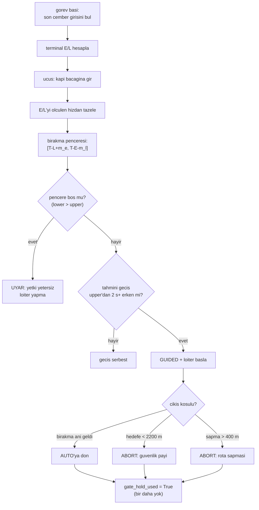

# Son Yasal Kapı (2 km Yasağından Önceki Son Bekleme Fırsatı)

## 1. Sezgisel Tanım

Belge madde 6 kesin: hedefin **2 kilometrelik yarıçapı içinde bekleme çemberi
atmak KESİNLİKLE YASAKTIR.**

Bu, zaman kazanmak için elimizdeki en güçlü aracı, loiter'ı, tam ihtiyaç
duyduğumuz bölgede yasaklıyor. Erkenlik genellikle son yaklaşmada belli olur,
ama orada bekleyemeyiz.

Sonuç: **geri dönülemez bir eşik** var. Rota o çembere girdikten sonra bekleme
imkânı biter. Araç, o eşiği geçmeden önce beklemesi gerekip gerekmediğine karar
vermek zorunda.

Sezgi: Otoyola girmek üzeresin ve girdikten sonra 50 km çıkış yok. Erken
varacaksan **girmeden önce** mola vermelisin. Girdikten sonra "biraz yavaşlarım"
diyebilirsin ama durup bekleyemezsin.

Bu modül o son molanın yerini bulur ve ne kadar süreceğine karar verir.

## 2. Neden Var? Hangi Problemi Çözüyor?

Sistemin üç zaman kazanma katmanı var ve **yetkileri giderek daralır**:

| Katman | Yetki | Nerede |
|---|---|---|
| Kalkış gecikmesi | sınırsız | yerde |
| **Kapı loiteri** | sınırsız ama tek seferlik | 2.5 km çemberi öncesi |
| Hız kontrolü | ±%20 civarı | her yerde |

Kapı, "sınırsız bekleme" yetkisinin **son kullanıldığı yer**. Ondan sonra
yalnızca hız kalır, ve [07](07-ruzgar-duzeltmeli-rota-suresi.md)'de gösterildiği
gibi kuyruk rüzgârında hız yetkisi sıfıra inebilir.

**Neden 2.5 km, 2 km değil?** Belge 2 km diyor; biz 500 m emniyet payı bıraktık
(`MIN_LOITER_DISTANCE_M = 2500`). Loiter dairesinin kendisi bir yarıçapa sahip
ve araç çemberin dışında kalmalı; ayrıca kestirim hataları var.

## 3. Nasıl Çalışır? (Adım Adım)

### Adım 1 Kapıyı bul (görev başında, bir kez)

```python
found = last_circle_entry_on_route(
    self._config.home, self._config.route,
    self._config.target, MIN_LOITER_DISTANCE_M,
)
```

Rotanın 2500 m çemberine **son dıştan-içe girişi**. "Son" kritik: rota çembere
girip yeniden çıkabilir; geri dönülemez eşik **sonuncusudur**.

### Adım 2 Terminal sınırlarını hesapla

Kapıdan sonraki rota için E ve L:

| Sembol | Anlam |
|---|---|
| **E** | Azami hızda, en kötü karşı rüzgârda geçen süre bundan erken varılamaz |
| **L** | Asgari hızda, en kötü kuyruk rüzgârında geçen süre bundan geç varılamaz |

Ayrıntısı [14 - Robust E/L Sınırları](14-robust-e-l-sinirlari.md)'nde.

### Adım 3 Bırakma penceresini türet

```python
lower_ns = target_arrival_ns - int((terminal_latest_s - early_margin_s) * 1e9)
upper_ns = target_arrival_ns - int((terminal_earliest_s + late_margin_s) * 1e9)
```

- **`lower`**: bundan önce bırakırsan, en yavaş uçsan bile erken varırsın
- **`upper`**: bundan sonra bırakırsan, en hızlı uçsan bile geç kalırsın

**Pencere boş olabilir** (`lower > upper`). Bu, seçilen bozucu zarf ve marjlar
altında kapıdan sonraki kontrol yetkisinin yetersiz olduğunu **açıkça** gösterir
sessizce yutulmaz, uyarı üretilir.

### Adım 4 Girişte sınırları tazele

```python
def _refresh_gate_bounds_for_entry(self):
    """Secilen bacaga gelince E/L'yi olculen hizdan bir kez yenile."""
```

Kapı görev başında kurulur ama E/L o an nominal hızla hesaplanır. Araç kapı
bacağına girdiğinde **ölçülen** hızla bir kez tazelenir.

### Adım 5 Tetikleme kararı

```python
predicted_crossing_ns = now_ns + int(eta_to_gate_s * 1e9)
if predicted_crossing_ns > upper_ns:
    # KAPI PENCERESI KACIRILDI
    return False
if predicted_crossing_ns >= release_ns - GATE_HOLD_TRIGGER_S * 1e9:
    return False        # cok az kaldi, beklemeye degmez
```

Tahmini geçiş anı üst sınırdan **2 saniyeden fazla** erkense loiter başlar.

### Adım 6 Loiter ve çıkış

```python
self._commander.set_mode("GUIDED")
self._guided.send(gate.position, self._config.cruise_alt_msl_m)
```

Her tick hedef yeniden gönderilir, `/ap/cmd_gps_pose` BEST_EFFORT'tur, tek
örnek kaybolursa araç eski hedefe gidebilir.

Üç çıkış koşulu:

| Koşul | Sebep |
|---|---|
| `now >= release_ns` | Planlanan bırakma anı geldi |
| `hedefe mesafe <= 2200 m` | Güvenlik payı azaldı 2 km yasağına yaklaşıyoruz |
| `rota sapması >= 400 m` | Madde 4'ün 500 m sınırına yaklaşıyoruz |

Son ikisi **abort** koşullarıdır: zamanlamadan önce kural uyumu gelir.

### Adım 7 Bir kez

```python
self._gate_hold_used = True
```

Çıkıştan sonra aynı kapıda ikinci kez dönülmez. Hem havada beklemeyi
(madde 8) hem de ortak zamanlama salınımını sınırlar.

## 4. Matematiksel Temel

### Bırakma penceresi

Hedef varış $T$, terminal sınırları $E$ ve $L$, marjlar $m_e$ ve $m_l$:

$$t_{\text{alt}} = T - (L - m_e), \qquad t_{\text{üst}} = T - (E + m_l)$$

Kapıyı $t \in [t_{\text{alt}}, t_{\text{üst}}]$ aralığında geçersen hedefe
zamanında varabilirsin.

### Pencere genişliği

$$W = t_{\text{üst}} - t_{\text{alt}} = (L - E) - (m_e + m_l)$$

Marjlar $m_e = 3$ s, $m_l = 20$ s ile:

$$W = (L - E) - 23\ \text{s}$$

**Pencere ancak $L - E > 23$ s ise açıktır.** $L - E$, kapıdan sonraki toplam
hız yetkisidir.

### Yetkinin kaynağı

$$L - E = D_{\text{terminal}}\left(\frac{1}{v_{\min}^{\text{yer}}} - \frac{1}{v_{\max}^{\text{yer}}}\right)$$

Rüzgârsız, $D = 5338$ m, $v \in [13, 28]$:

$$L - E = 5338\left(\frac{1}{13} - \frac{1}{28}\right) = 5338 \times 0.0412 = 220\ \text{s}$$

Bol. Ama kuyruk rüzgârında yer hızları yukarı kayar:

$$v_{\min}^{\text{yer}} = 13 + 9 = 22, \qquad v_{\max}^{\text{yer}} = 28 + 9 = 37$$

$$L - E = 5338\left(\frac{1}{22} - \frac{1}{37}\right) = 5338 \times 0.0184 = 98\ \text{s}$$

Yarıdan fazla kayıp. Rüzgâr arttıkça pencere daralır, **tam ihtiyaç duyulduğu
anda.**

### Bırakma anının seçimi

Kod `release_ns = upper_ns` seçer, yani **mümkün olan en geç** bırakma. Neden:
kapıda beklemek kontrollüdür, kapıdan sonra hata düzeltmek zordur. Ne kadar geç
bırakılırsa terminal fazda o kadar az belirsizlik kalır.

## 5. Geometrik/Görsel Sezgi

```
  KAPI GEOMETRISI (HA-3 rotasi, kusbakisi)

                          WP3 ●
                             ╱ ╲
                            ╱   ╲
        2500 m cemberi ╌╌╌╌╌╌╌╌╌╌╌╌╌╌╌╌╌╌
                        ╱  ★ KAPI      ╲
                       ╱   (son giris)  ╲
      2000 m YASAK ╌╌╌╱╌╌╌╌╌╌╌╌╌╌╌╌╌╌╌╌╌╌╲╌╌
                     ╱                    ╲
                    │      ● HEDEF         │
                    │                      │
                     ╲    WP4 ●           ╱
                      ╲      ╱           ╱
                       ╲    ╱           ╱
                        ╲__╱___________╱

  Kapidan sonra rota uzunlugu: 5338 m
  Kapidan hedefe duz mesafe:   2500 m

  DIKKAT: kapi hedefe 2500 m'de ama rota olarak
  arkasinda 5338 m var, rota ilmek atiyor.
  Yani "2 km icinde" olan bolge 4300 m'lik bir ucus.
```



## 6. Parametreler ve Etkileri

| Parametre | Değer | Kaynak / Etki |
|---|---|---|
| `MIN_LOITER_DISTANCE_M` | 2500 m | Belge 2000 m + 500 m emniyet payı |
| `TERMINAL_RADIUS_M` | 2000 m | Belgenin yasak yarıçapı |
| `GATE_EARLY_MARGIN_S` | 3 s | Alt sınır payı |
| `GATE_LATE_MARGIN_S` | 20 s | Üst sınır payı geç kalmak sıra bozar, erken kalmak bozmaz; asimetri bilinçli |
| `GATE_HOLD_TRIGGER_S` | 2 s | Bundan az erkenlik için beklemeye değmez |
| `GATE_TARGET_DISTANCE_ABORT_M` | 2200 m | 2 km yasağına 200 m kala loiter iptal |
| `GATE_ROUTE_DEVIATION_ABORT_M` | 400 m | Madde 4'ün 500 m sınırına 100 m kala iptal |
| `GATE_CROSSING_HYSTERESIS_M` | 40 m | Geçiş mandalının titremesini engeller |

## 7. Çalışılmış Örnek (Gerçek Sayılarla)

**Bağlam:** Sabit 8 m/s rüzgâr senaryosu, `logs/run_20260804_1*`. HA-3 kapıya
erken geliyor.

**Kapı kurulumu (görev başı).** `last_circle_entry_on_route` HA-3'ün rotasında
2500 m çemberine son girişi buluyor:

| Büyüklük | Değer |
|---|---|
| Kapının hedefe düz mesafesi | 2500 m |
| Kapıdan sonraki rota uzunluğu | **5338 m** |
| Terminal E (azami hız, en kötü karşı) | 252.9 s |
| Terminal L (asgari hız, en kötü kuyruk) | 381.4 s |

**Pencere genişliği:**

$$W = (381.4 - 252.9) - (3 + 20) = 128.5 - 23 = \mathbf{105.5\ s}$$

Pencere açık ve geniş.

**Bırakma anı.** Hedef varış $T$ olsun. Üst sınır:

$$t_{\text{üst}} = T - (252.9 + 20) = T - 272.9\ \text{s}$$

Araç kapıya bu andan **35.3 saniye önce** varacak görünüyor. 35.3 > 2 s
(tetikleme eşiği) → **loiter başlar.**

**Log kaydı:**

```
KAPI LOITER BASLADI | hedefe 2500 m | planlanan cikisa 35.3 s |
                      terminal E 252.9 L 381.4 s
KAPI LOITER BITTI   | rezervli cikis ani geldi
```

**Ölçülen havada bekleme: 62 saniye.** (Planlanan 35.3 s'den uzun, çünkü loiter
dairesi tamamlanana kadar sürüyor.)

**Sonuç:** HA-3 − HA-2 = 20.09 s, sapma **+0.09 s**. Kapı erkenliği yasal bölgede
soğurdu ve terminal faza temiz girildi.

**Karşı örnek, pencerenin boşaldığı durum.** Aynı sistem, eski (gerçek dışı)
rüzgâr profilinde:

```
KAPI PENCERESI BOS: terminal hiz yetkisi secilen zarf ve marjlar icin
                    yetersiz (36.4 s)
```

Burada $L - E < 23$ s çıkmıştı; kapı hiç tetiklenemedi. Bu, sistemin
**sessizce başarısız olmadığını** gösteriyor, yetkisiz kaldığını açıkça
bildiriyor.

## 8. Sonuç Nasıl Olur?

`_handle_hold_gate` bir bool döndürür: loiter aktif mi. `True` ise görev
yöneticisi o tick'te başka kontrol uygulamaz.

Loiter GUIDED modda yapılır ve çıkışta AUTO'ya dönülür. Görev listesi
değişmez, araç kaldığı yerden devam eder.

Kapı olayları loglanır ve `analyze_run.py` bunları "havada loiter" metriğine
çevirir (madde 8 uyumluluğu).

## 9. Sınırlamalar / Yapamayacağı

- **Tek seferlik.** Bir kez kullanıldı mı bitti. İkinci bir erkenlik dalgası
  gelirse çare yok.
- **Kapıdan sonra kör.** Erkenlik kapı geçildikten sonra doğarsa ki bu
  projede ölçüldü, tam olarak böyle oluyor, kapı yapabileceği hiçbir şey yok.
  Üç başarısız koşuda araç kapıya **zamanında** giriyordu (−0.4, −0.3, −8.0 s);
  erkenliğin tamamı sonradan doğdu.
- **GUIDED loiter yarıçapı kontrolsüz.** ArduPlane `WP_LOITER_RAD` kullanır;
  biz yarıçapı belirlemiyoruz. Bu, ölçülen rota sapmasını (127 m) doğrudan
  etkiliyor.
- **E/L bir kez tazelenir.** Kapı bacağına girişte. Sonra rüzgâr değişirse
  sınırlar bayatlar.
- **Pencere boşsa çaresiz.** Uyarı üretir ama alternatif sunmaz. Madde 6
  içinde tek alternatif S-manevrasıydı; o da bu projede çalıştırılamadı
  (bkz. [04 - Gelistirme ve Testler](../04-gelistirme-ve-testler.md)).

## 10. Kodda Nerede

| Bileşen | Yer |
|---|---|
| Kapı kurulumu | [`mission_manager.py:471` `_build_hold_gate`](../../ros2_ws/src/oasy_uav_agent/oasy_uav_agent/mission_manager.py#L471) |
| Ana mantık | [`mission_manager.py:667` `_handle_hold_gate`](../../ros2_ws/src/oasy_uav_agent/oasy_uav_agent/mission_manager.py#L667) |
| Pencere hesabı | [`arrival_schedule.py:104` `compute_gate_release_window`](../../ros2_ws/src/oasy_uav_agent/oasy_uav_agent/coordination/arrival_schedule.py#L104) |
| Geçiş mandalı | [`mission_manager.py:612` `_update_gate_crossing`](../../ros2_ws/src/oasy_uav_agent/oasy_uav_agent/mission_manager.py#L612) |
| Sınır tazeleme | [`mission_manager.py:643` `_refresh_gate_bounds_for_entry`](../../ros2_ws/src/oasy_uav_agent/oasy_uav_agent/mission_manager.py#L643) |
| Çember geometrisi | [`geodesy.py` `last_circle_entry_on_route`](../../ros2_ws/src/oasy_uav_agent/oasy_uav_agent/estimation/geodesy.py) |

## 11. Kod Örneği

Boş pencerenin açıkça bildirilmesi:

```python
if lower_ns > upper_ns:
    if self._loitering:
        self._exit_gate_hold("kapi penceresi bosaldi")
    self._log_gate_problem(
        "KAPI PENCERESI BOS: terminal hiz yetkisi secilen zarf ve "
        f"marjlar icin yetersiz ({(lower_ns - upper_ns) / 1e9:.1f} s)"
    )
    return self._loitering
```

Kural uyumunun zamanlamadan önce gelmesi:

```python
if (
    target_distance_m <= GATE_TARGET_DISTANCE_ABORT_M      # 2 km yasagi
    or route_deviation_m >= GATE_ROUTE_DEVIATION_ABORT_M   # 500 m sapma
):
    self._exit_gate_hold("guvenlik payi azaldi ...")
```

## 12. İlgili Kavramlar

- [14 - Robust E/L Sınırları](14-robust-e-l-sinirlari.md) pencereyi kuran E ve L.
- [13 - Terminal Rezerv](13-terminal-rezerv.md) kapıdan sonraki katman.
- [09 - Jeodezi](09-jeodezi.md) `last_circle_entry_on_route` ve jeodezik düzeltme.
- [11 - Varış Zamanı Kontrolcüsü](11-varis-zamani-kontrolcusu.md) kapıdan sonra kalan tek yetki.
- [05 - Kalkış Slotu](05-kalkis-slotu-ve-yer-gecikmesi.md) bedava bekleme; kapı onun havadaki pahalı karşılığı.

## 13. Kaynaklar

- Vaka belgesi madde 6: *"Hedef noktanın etrafındaki 2 kilometrelik yarıçaplı
  alan içinde bekleme çemberi (Loiter/Orbit) atmak KESİNLİKLE YASAKTIR."*
- Vaka belgesi madde 5: *"Verilen rota üzerindeki ara noktalarda bekleme
  (Loiter) çemberi atma"*, kapının izin aldığı yöntem.
- Vaka belgesi madde 8: havada bekleme asgariye indirilmeli tek seferlik
  kısıtın gerekçesi.
