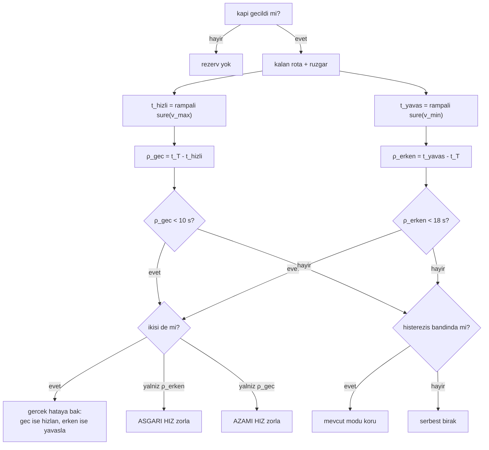

# Terminal Rezerv (Hız Yetkisini Yedekte Tutmak)

## 1. Sezgisel Tanım

Kapı geçildi. Artık bekleme yok, yalnızca hız var. Peki hız yetkisini nasıl
kullanmalı?

Naif cevap: "hatayı gör, düzelt." Ama bu bir tuzağa düşürür. Araç biraz erkense
yavaşlar; yavaşladıkça hız tabanına yaklaşır; tabana yapıştığında **hiçbir
yetkisi kalmaz.** Sonra rüzgâr döner ve daha da erken kalır, yapabileceği bir
şey yoktur.

Sezgi: Dar bir yolda araba sürüyorsun ve frenin sınırlı. Erken varacaksan
frene basarsın. Ama frene sonuna kadar basıp öyle gidersen, önüne bir şey
çıktığında yapacak bir şeyin kalmaz. Akıllıca olan **frenin bir kısmını yedekte
tutmaktır.**

Bu modül tam bunu yapar: aracın hız zarfının **her iki ucuna** da ne kadar payı
kaldığını sürekli ölçer, biri tükenmeye başladığında karşı yöne baskı yapar.

İki rezerv:

| Rezerv | Anlamı | Tükenirse |
|---|---|---|
| **Erken rezerv** | En yavaş uçarsam ne kadar geç varabilirim | Erken varmayı önleyemem |
| **Geç rezerv** | En hızlı uçarsam ne kadar erken varabilirim | Geç kalmayı önleyemem |

## 2. Neden Var? Hangi Problemi Çözüyor?

Terminal faz sistemin **en kırılgan** bölgesidir:

- Loiter yasak (madde 6)
- Kapı kullanılmış (tek seferlik)
- Kalan yol kısa, dolayısıyla hız yetkisi az
- Rüzgâr hâlâ değişiyor

Bu bölgede sıradan bir "hatayı gör, düzelt" kontrolcüsü **geç kalır**. Hatayı
gördüğünde düzeltecek mesafe kalmamış olabilir.

Rezerv mantığı **öngörücüdür**: hatayı beklemez, yetkinin tükenmekte olduğunu
görür ve önlem alır.

**Ölçülen gerekçe.** Bu projede kaydedilen başarısızlıkların imzası:

```
yavasla | zamanlama hatasi -12.2 s | gerekli 13.0 m/s | komut 15.7 m/s
        | rate_limit=True | rezerv erken/gec -12.2/+12.3 s
```

`rezerv erken/gec -12.2`, **negatif**. Yani araç kalan yolu asgari hızda uçsa
bile plandan 12.2 saniye erken varacak. Kontrolcü doğru olanı yapıyor
(`yavasla`, `gerekli 13.0`) ama yetki yok. Rezerv bunu **önceden** görmeliydi.

## 3. Nasıl Çalışır? (Adım Adım)

### Adım 1 Ön koşullar

```python
if (
    self._hold_gate is None
    or not self._gate_crossed        # yalnizca kapi GECILDIKTEN sonra
    or self.state not in AIRBORNE_STATES
    or self._loitering
    or self._planned_arrival_ns <= 0
):
    self._reserve_mode = None
    return None, None
```

Rezerv yalnızca kapıdan sonra anlamlıdır, öncesinde bekleme yetkisi var.

### Adım 2 İki uç senaryoyu hesapla

```python
fast_s = route_duration_with_airspeed_ramp_s(
    snapshot.position, remaining_route,
    current_airspeed_mps, self._config.max_airspeed_mps,
    self._config.airspeed_rate_limit_mps2, wind,
)
slow_s = route_duration_with_airspeed_ramp_s(
    ..., self._config.min_airspeed_mps, ...
)
```

**Rampalı** sürüm kullanılır, hıza anında geçilemez, rate limit modele girer.
Anlık geçiş varsayılsaydı yetki iyimser görünürdü.

### Adım 3 Rezervleri türet

```python
target_in_s = (self._planned_arrival_ns - now_ns) / 1e9
late_reserve_s  = target_in_s - fast_s    # en hizli uçsam ne kadar payim var
early_reserve_s = slow_s - target_in_s    # en yavas uçsam ne kadar payim var
```

### Adım 4 Mod seç (histerezisli)

```python
early_low = early_reserve_s < TERMINAL_EARLY_RESERVE_S   # 18 s
late_low  = late_reserve_s  < TERMINAL_LATE_RESERVE_S    # 10 s

if early_low and late_low:
    # Pencere gecici olarak bos; gercek hatanin yonune gore kurtarilabilir
    # tarafa basilir.
    self._reserve_mode = "fast" if self._timing_error_s() > 0.0 else "slow"
elif early_low:
    self._reserve_mode = "slow"
elif late_low:
    self._reserve_mode = "fast"
elif <histerezis bandinda>:
    pass                      # mevcut modu koru
else:
    self._reserve_mode = None
```

### Adım 5 Hızı zorla

```python
if self._reserve_mode == "slow":
    return self._config.min_airspeed_mps, (early_reserve_s, late_reserve_s)
if self._reserve_mode == "fast":
    return self._config.max_airspeed_mps, (early_reserve_s, late_reserve_s)
```

Bu değer kontrolcüye `forced_airspeed_mps` olarak geçer ve **ölü bandı, oran
hesabını ve son saniye kapısını atlar**, ama rate limit korunur.

## 4. Matematiksel Temel

### Rezerv tanımları

Kalan rota $R$, hedefe kalan süre $t_T$, rüzgâr $\vec w$:

$$t_{\text{hızlı}} = \mathcal{T}(R, v_{\text{şimdi}} \to v_{\max}, \vec w)$$
$$t_{\text{yavaş}} = \mathcal{T}(R, v_{\text{şimdi}} \to v_{\min}, \vec w)$$

$\mathcal{T}$ rampalı rota süresi. Rezervler:

$$\rho_{\text{geç}} = t_T - t_{\text{hızlı}}, \qquad
\rho_{\text{erken}} = t_{\text{yavaş}} - t_T$$

### Anlamları

$\rho_{\text{geç}} > 0$: azami hızda hedefe **yetişebilirim**.
$\rho_{\text{erken}} > 0$: asgari hızda **erken kalmam**.

İkisi de pozitifse hedef ulaşılabilir aralıktadır:

$$t_{\text{hızlı}} \le t_T \le t_{\text{yavaş}}$$

### Toplam yetki

$$\rho_{\text{erken}} + \rho_{\text{geç}} = t_{\text{yavaş}} - t_{\text{hızlı}}$$

Bu, kalan yolda hızla kazanılabilecek **toplam süre**dir ve yola yaklaştıkça
sıfıra gider:

$$\lim_{R \to 0} \left(t_{\text{yavaş}} - t_{\text{hızlı}}\right) = 0$$

Yani rezervler **kaçınılmaz olarak** tükenir. Soru ne zaman tükendiği ve o an
hatanın ne kadar olduğudur.

### Eşiklerin asimetrisi

$$\text{erken eşiği} = 18\ \text{s} \quad > \quad \text{geç eşiği} = 10\ \text{s}$$

Erken rezerve daha erken müdahale edilir. Neden: **erken varmak sırayı bozar**,
geç varmak yalnızca aralığı büyütür. Ayrıca kuyruk rüzgârında erken rezerv çok
daha hızlı tükenir ([§7](#7-çalışılmış-örnek-gerçek-sayılarla)).

### Kuyruk rüzgârında yetki çöküşü

Yer hızları rüzgârla kayar:

$$v_{\min}^{\text{yer}} = v_{\min} + w_\parallel, \qquad v_{\max}^{\text{yer}} = v_{\max} + w_\parallel$$

Toplam yetki:

$$\Delta t = R\left(\frac{1}{v_{\min} + w_\parallel} - \frac{1}{v_{\max} + w_\parallel}\right)$$

$w_\parallel$ büyüdükçe iki terim de küçülür ve fark **hızla** daralır. $R = 1304$ m
(son bacak), $v \in [13, 28]$:

| $w_\parallel$ | Toplam yetki |
|---|---|
| 0 | 53.7 s |
| +5 | 34.3 s |
| **+9** | **24.3 s** |

Kuyruk rüzgârı yetkinin yarısından fazlasını siliyor.

## 5. Geometrik/Görsel Sezgi

```
  REZERV BANTLARI (zaman ekseni, hedefe kalan sure t_T)

    t_hizli                    t_T                      t_yavas
       │                        │                          │
       ├────── ρ_gec ───────────┤────── ρ_erken ───────────┤
       │                        │                          │
   azami hizla              hedef                    asgari hizla
   varis ani                                          varis ani

   ┌────────────────────────────────────────────────────────┐
   │  ρ_gec > 10 s  VE  ρ_erken > 18 s  ->  serbest         │
   │  ρ_erken < 18 s  ->  ASGARI HIZ ZORLA (erken kalmayayim)│
   │  ρ_gec   < 10 s  ->  AZAMI HIZ ZORLA (gec kalmayayim)  │
   │  ikisi de dusuk  ->  gercek hatanin yonune bas         │
   └────────────────────────────────────────────────────────┘

  Yola yaklastikca t_hizli ve t_yavas birbirine yakinsar:

   uzakta:  ├──────── genis yetki ────────┤
   yakinda: ├── dar ──┤
   varista:      ├┤  (yetki sifir)
```



## 6. Parametreler ve Etkileri

| Parametre | Değer | Etki |
|---|---|---|
| `TERMINAL_EARLY_RESERVE_S` | **18 s** | Erken rezerv eşiği. Yüksek tutulmuş: erken varmak sırayı bozar. |
| `TERMINAL_LATE_RESERVE_S` | **10 s** | Geç rezerv eşiği. Daha düşük geç kalmak daha az zararlı. |
| `TERMINAL_RESERVE_HYSTERESIS_S` | 2 s | Mod titremesini engeller. Eşiğe geri dönerken 2 s pay bırakılır. |

**Ayar ipucu:** Erken rezerv eşiğini yükseltmek aracı daha erken yavaşlatır
güvenli ama daha çok "yavaş uçma" süresi. Düşürmek yetkinin tükenme riskini
artırır. 18 s, son bacaktaki toplam yetkinin (~24 s kuyruk rüzgârında) yaklaşık
%75'i.

## 7. Çalışılmış Örnek (Gerçek Sayılarla)

**Bağlam:** HA-3, son bacakta, kuyruk rüzgârı. `logs/run_20260804_153014`.

**Durum:** Hedefe 352 m kala, rüzgâr 9.4 m/s 330°'den ($w_\parallel = +9.08$ m/s),
komut edilen hız 16.8 m/s.

**İki uç senaryo** (rampa dahil, 1.5 m/s²):

Azami hıza (28 m/s) çıkış, mevcut 16.8'den 11.2 m/s artış, $11.2/1.5 = 7.5$ s
rampa. Ama kalan mesafe zaten kısa; rampa tamamlanmadan varılır. Yaklaşık
ortalama yer hızı:

$$\bar v_{\text{hızlı}} \approx \frac{16.8 + 22}{2} + 9.08 \approx 28.5\ \text{m/s}
\;\Rightarrow\; t_{\text{hızlı}} \approx \frac{352}{28.5} = 12.4\ \text{s}$$

Asgari hıza (13 m/s) iniş, 3.8 m/s azalış, 2.5 s rampa:

$$\bar v_{\text{yavaş}} \approx 13.5 + 9.08 = 22.6\ \text{m/s}
\;\Rightarrow\; t_{\text{yavaş}} \approx \frac{352}{22.6} = 15.6\ \text{s}$$

**Toplam yetki:**

$$t_{\text{yavaş}} - t_{\text{hızlı}} = 15.6 - 12.4 = \mathbf{3.2\ s}$$

352 metre kala elimizde **yalnızca 3.2 saniyelik** hız yetkisi var. Eşikler
18 s ve 10 s olduğuna göre **ikisi de tükenmiş** durumda, rezerv modu gerçek
hatanın yönüne basar.

**Bu yüzden erkenlik son bacağa girmeden kapatılmalıdır.** Rezerv bariyeri son
metrelerde bir mucize yaratamaz; yaptığı şey, yetkinin **tükenmekte olduğunu
erkenden** görüp önlem almaktır.

**Başarısızlık imzası** (eski rüzgâr profili, `run_20260804_110145`):

```
kalan 232 m | hata +7.1 s | komut 13.0 | yer hizi 3.9 | rezerv -12.2/+12.3
```

`ρ_erken = -12.2`, negatif. Araç asgari hızda uçsa bile 12.2 s erken varacak.
Rezerv bunu görüyor ve asgari hızı zorluyor, ama **matematiksel olarak
çözümsüz** bir durum.

**Başarılı koşuda** (yeni profil, `run_20260804_153014`) araç son yaklaşmada
16.8 m/s komut ediyordu, tabanda değil. Yani rezerv sistemi yetkinin bir
kısmını korumayı başarmıştı:

$$\text{kalan yetki} = 16.8 - 13.0 = 3.8\ \text{m/s}$$

Sonuç: HA-3 − HA-2 = 20.17 s, sapma **+0.17 s**.

## 8. Sonuç Nasıl Olur?

`_terminal_reserve_override` iki değer döndürür:

| Değer | Kullanım |
|---|---|
| `forced_airspeed_mps` | Kontrolcüye geçer; ölü bandı ve oran hesabını atlar |
| `(early_reserve_s, late_reserve_s)` | Yalnızca log |

Rezervler her kontrol satırında raporlanır:

```
rezerv erken/gec +15.1/+22.3 s
```

Bu iki sayı, terminal fazın sağlığını tek bakışta gösterir. Negatife düşen bir
rezerv, o yönde çaresizlik demektir.

## 9. Sınırlamalar / Yapamayacağı

- **Yetki yaratmaz, korur.** Rezerv sistemi mevcut yetkinin tükenmesini
  geciktirir. Yetki fiziksel olarak yoksa (kuyruk rüzgârında son bacak)
  yapabileceği bir şey yoktur.
- **Kapıdan sonra devreye girer.** Öncesinde bekleme yetkisi olduğu için
  gereksiz; ama bu, kapı kararının rezerv bilgisinden **yararlanmadığı**
  anlamına da gelir. Kapı kendi E/L'siyle karar verir.
- **Zorlama ölü bandı atlar.** `forced_airspeed_mps` verildiğinde kontrolcü
  ölü bandı yok sayar. Bu, sık mod değişiminde komut titremesine yol açabilir;
  histerezis bunu sınırlar ama tamamen engellemez.
- **Rampa modeli yaklaşıktır.** `route_duration_with_airspeed_ramp_s` rampayı
  sayısal olarak entegre eder ama sabit rüzgâr varsayar.
- **Bu oturumda bir kez yanlış kullanıldı.** S-manevrası denemesinde
  `forced_airspeed_mps` bir **taban** yerine **kilit** olarak kullanıldı; araç
  20 m/s'ye kilitlendi ve hızlanması gerektiğinde çıkamadı, planından +35 s geç
  kaldı. Zorlama mekanizması güçlüdür ve dikkatli kullanılmalıdır.

## 10. Kodda Nerede

| Bileşen | Yer |
|---|---|
| Rezerv hesabı | [`mission_manager.py:1163` `_terminal_reserve_override`](../../ros2_ws/src/oasy_uav_agent/oasy_uav_agent/mission_manager.py#L1163) |
| Rampalı süre | [`wind_estimator.py:184` `route_duration_with_airspeed_ramp_s`](../../ros2_ws/src/oasy_uav_agent/oasy_uav_agent/estimation/wind_estimator.py#L184) |
| Kontrolcüye aktarım | [`mission_manager.py:1237` `_regulate_speed`](../../ros2_ws/src/oasy_uav_agent/oasy_uav_agent/mission_manager.py#L1237) |
| Zorlamanın işlenmesi | [`arrival_controller.py`](../../ros2_ws/src/oasy_uav_agent/oasy_uav_agent/control/arrival_controller.py) `forced_airspeed_mps` |

## 11. Kod Örneği

Mod seçimi ve her iki rezerv de tükendiğinde ne yapıldığı:

```python
early_low = early_reserve_s < TERMINAL_EARLY_RESERVE_S
late_low = late_reserve_s < TERMINAL_LATE_RESERVE_S
if early_low and late_low:
    # pencere geçici olarak boş; gerçek hatanın yönüne göre kurtarılabilir
    # tarafa basılır
    self._reserve_mode = "fast" if self._timing_error_s() > 0.0 else "slow"
elif early_low:
    self._reserve_mode = "slow"
elif late_low:
    self._reserve_mode = "fast"
```

## 12. İlgili Kavramlar

- [11 - Varış Zamanı Kontrolcüsü](11-varis-zamani-kontrolcusu.md) zorlamanın uygulandığı yer.
- [12 - Son Yasal Kapı](12-son-yasal-kapi.md) rezervin devreye girdiği andan önceki katman.
- [07 - Rüzgâr Düzeltmeli Rota Süresi](07-ruzgar-duzeltmeli-rota-suresi.md) rampalı sürümün temeli.
- [14 - Robust E/L Sınırları](14-robust-e-l-sinirlari.md) benzer mantığın rota geneline uygulanması.

## 13. Kaynaklar

- Vaka belgesi madde 6: 2 km içinde loiter yasağı rezervin neden tek çare
  olduğunun gerekçesi.
- Ölçüm: `logs/run_20260804_153014` (başarılı) ve `run_20260804_110145`
  (negatif rezerv imzası).
