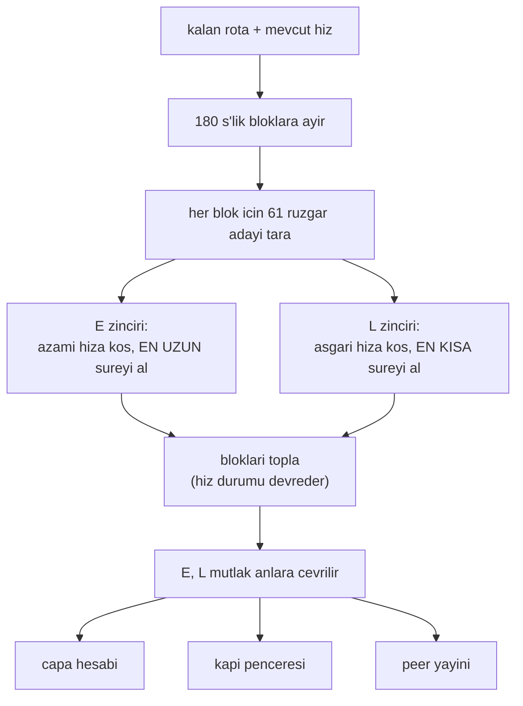

# Robust E/L Sınırları (Ulaşılabilirlik Zarfı)

## 1. Sezgisel Tanım

"Hedefe en erken ne zaman, en geç ne zaman varabilirim?"

Bu iki sayı — **E** (earliest) ve **L** (latest) — aracın zaman ekseni üzerindeki
hareket alanıdır. Plan bu aralığın içinde olmalıdır; dışındaysa ulaşılamaz.

Ama "en erken" ne demek? Rüzgâr bilinmiyorsa cevap belirsizdir. İki seçenek var:

- **İyimser:** şu anki rüzgâr devam eder varsay. Rüzgâr değişince plan tutmaz.
- **Kötümser:** rüzgâr mümkün olan en kötü şekilde davranır varsay. Plan sağlam
  ama aşırı temkinli.

Sezgi: Yolculuğa çıkıyorsun ve "en erken 2 saatte, en geç 4 saatte varırım"
diyorsun. Bu aralık trafiğin ne kadar kötü olabileceğine dair varsayımına
bağlı. Aralığı geniş tutarsan güvendesin ama randevu veremezsin; dar tutarsan
randevu verirsin ama tutturamayabilirsin.

Bu modül aralığı **bozucu zarf** üzerinden kurar: rüzgârın alabileceği tüm
makul değerleri tarar ve en kötü durumları bulur.

## 2. Neden Var? Hangi Problemi Çözüyor?

E ve L üç yerde kullanılır:

| Kullanım | Nasıl |
|---|---|
| **Merkeziyetsiz çıpa** | Her araç E'sini yayınlar; çıpa en kısıtlı araca göre kurulur ([02](02-merkeziyetsiz-capa.md)) |
| **Kapı penceresi** | Bırakma aralığı $[T-L, T-E]$ ([12](12-son-yasal-kapi.md)) |
| **Terminal rezerv** | Aynı mantığın kalan yola uygulanması ([13](13-terminal-rezerv.md)) |

Ortak amaç: **ulaşılamaz bir plana taahhüt etmemek.** Araç "12:00:20'de
varacağım" diyorsa, o anın gerçekten ulaşılabilir olduğunu bilmeli.

## 3. Nasıl Çalışır? (Adım Adım)

### Adım 1 — Rotayı zaman bloklarına ayır

```python
def _wind_blocks(self, position, remaining):
    """Kalan rotayi ruzgar tutarlilik suresine gore bloklara ayirir."""
```

Rüzgâr sabit değil; zamanla değişiyor. Tüm rotaya tek bir sabit rüzgâr uygulamak
gerçekçi değildir.

Rota, **rüzgâr tutarlılık süresine** (`DISTURBANCE_COHERENCE_S = 180 s`) göre
bloklara ayrılır. Her blok kendi en kötü rüzgârını alabilir.

### Adım 2 — Her blok için rüzgâr adaylarını tara

```python
ruzgar_hizi = 0.0
while ruzgar_hizi <= DISTURBANCE_WIND_MAX_MPS + 1e-9:      # 0 -> 10 m/s
    yonler = (0.0,) if ruzgar_hizi == 0.0 else tuple(
        float(d) for d in range(0, 360, int(DISTURBANCE_DIRECTION_STEP_DEG))
    )                                                       # 12 yon
    for derece in yonler:
        ...
    ruzgar_hizi += DISTURBANCE_WIND_SPEED_STEP_MPS          # 2 m/s adim
```

$6 \times 12 = 61$ aday (sıfır rüzgârda yönler özdeş).

### Adım 3 — Her aday için iki uç süre

```python
en_yavas_s = max(en_yavas_s, route_duration_with_airspeed_ramp_s(
    position, remaining, slow_initial, self._config.max_airspeed_mps, ...))
en_hizli_s = min(en_hizli_s, route_duration_with_airspeed_ramp_s(
    position, remaining, fast_initial, self._config.min_airspeed_mps, ...))
```

Dikkat: **iki ayrı uçuş** modellenir.

| Sınır | Hız hedefi | Rüzgâr seçimi | Anlamı |
|---|---|---|---|
| **E** | azami | en kötü (en uzun süre) | Tam gaz gitsem bile bundan erken varamam |
| **L** | asgari | en iyi (en kısa süre) | Gaz kesik gitsem bile bundan geç kalamam |

### Adım 4 — Blokları topla, hız zincirlerini ayrı taşı

```python
yavas_hiz = initial_airspeed_mps
hizli_hiz = initial_airspeed_mps
for blok_index, (blok_baslangic, blok_noktalar) in enumerate(bloklar):
    yavas_s, hizli_s = self._block_bounds_s(...)
    toplam_yavas_s += yavas_s
    toplam_hizli_s += hizli_s
    # Ilk bloktan sonra her zincir kendi hedef hizina ulasmistir
    yavas_hiz = self._config.max_airspeed_mps
    hizli_hiz = self._config.min_airspeed_mps
```

**İki zincir ayrı hız durumu taşır.** E zinciri azami hıza koşar, L zinciri
asgariye. İkisine aynı hızı devretmek, L zincirine her blokta yavaşlama
rampasını yeniden ödetirdi.

### Adım 5 — Mutlak anlara çevir

```python
self._robust_earliest_ns = start_ns + int(earliest_s * NANOSECONDS_PER_SECOND)
```

## 4. Matematiksel Temel

### Tanımlar

Kalan rota $R$, rüzgâr zarfı $\mathcal{W}$, hız zarfı $[v_{\min}, v_{\max}]$:

$$E = \max_{\vec w \in \mathcal{W}} \mathcal{T}(R,\; v \to v_{\max},\; \vec w)$$

$$L = \min_{\vec w \in \mathcal{W}} \mathcal{T}(R,\; v \to v_{\min},\; \vec w)$$

$\mathcal{T}$ rampalı rota süresi ([07](07-ruzgar-duzeltmeli-rota-suresi.md)).

**Neden E'de `max`, L'de `min`?** Garantili sınırlar istiyoruz:

- E: "bundan erken varamam" — en kötü durumda azami hızla ne kadar sürer
- L: "bundan geç kalamam" — en iyi durumda asgari hızla ne kadar sürer

### Blok modeli

Rota $N$ bloğa ayrılır, her blok $\le \tau_c = 180$ s:

$$E = \sum_{k=1}^{N} \max_{\vec w_k \in \mathcal{W}} \mathcal{T}(R_k, \ldots)$$

Her blok **bağımsız** en kötü rüzgârını alır. Bu, tek sabit rüzgâr varsayımından
daha kötümserdir ama daha gerçekçidir: rüzgâr 180 saniyede bir değişir, "erken
bacaklarda karşıdan, son bacakta arkadan" bileşimi mümkündür.

**Ölçülmüş gerekçe:** tek sabit rüzgâr varsayımıyla HA-3, hedefe 4532 m kala
plan $T+253$ s iken $L = 436$ s görüyordu — yani "çok bol yetkim var" diyordu.
Gerçekte yoktu.

### Zarf ile yetki arasındaki gerilim

Pencere genişliği $L - E$ hem rota uzunluğuna hem hız zarfına hem de **rüzgâr
zarfının genişliğine** bağlıdır. Rüzgâr zarfı genişledikçe:

- $E$ büyür (daha kötü karşı rüzgâr mümkün)
- $L$ küçülür (daha kötü kuyruk rüzgârı mümkün)

$$\frac{\partial (L-E)}{\partial w_{\max}} < 0$$

**Ölçüldü:** $\pm 10$ m/s zarfla ortak pencere örneklerin yalnızca **%31**'inde
açıktı; $\pm 13$ m/s'ye çıkarınca ortalama $L-E$ 32.4 s'den 5.6 s'ye düştü.

Yani zarfı büyütmek "daha güvenli" değil, **daha felçli** yapar.

### Ölçülen zarf–yetki uyumsuzluğu

Hız yetkisinin zaman kazanma kapasitesi:

$$\Delta t_{\text{hız}} = R\left(\frac{1}{v_{\min}} - \frac{1}{v_{\max}}\right)$$

Rüzgârın etkisi:

$$\Delta t_{\text{rüzgâr}} \approx \frac{2 R\, w_{\max}}{v^2}$$

$R = 5338$ m, $v \in [13, 28]$, $w_{\max} = 10$:

$$\Delta t_{\text{hız}} = 5338 \times 0.0412 = 220\ \text{s}$$
$$\Delta t_{\text{rüzgâr}} \approx \frac{2 \times 5338 \times 10}{20^2} = 267\ \text{s}$$

**Bozucu, kontrol yetkisinden büyük.** Bu, sistemin temel zorluğudur ve E > L
durumunun (boş pencere) neden sık görüldüğünü açıklar.

## 5. Geometrik/Görsel Sezgi

```
  E ve L: zaman ekseninde hareket alani

  simdi                                                    zaman ──►
    │
    ├──────────── E ────────────┤
    │  azami hizda, en kotu     │
    │  karsi ruzgarda           │
    │                           │
    ├──────────────────── L ────────────────────┤
    │  asgari hizda, en iyi kuyruk ruzgarinda   │
    │                           │               │
    │                           ├─── yetki ─────┤
    │                           │   (L - E)     │
    │                           │               │
    │                    plan buraya            │
    │                    dusmeli                │

  RUZGAR ZARFI GENISLERSE:
    E buyur (daha kotu karsi mumkun)  ──►
    L kucul (daha kotu kuyruk mumkun) ◄──
    yetki daralir, hatta E > L olur (BOS PENCERE)
```



## 6. Parametreler ve Etkileri

| Parametre | Değer | Etki |
|---|---|---|
| `DISTURBANCE_WIND_MAX_MPS` | 10.0 | Zarfın tepe hızı. Büyütmek yetkiyi hızla yer (ölçüldü: 13'e çıkarınca $L-E$ 32.4 → 5.6 s). |
| `DISTURBANCE_WIND_SPEED_STEP_MPS` | 2.0 | Tarama adımı. Küçültmek maliyeti artırır, doğruluğu az etkiler. |
| `DISTURBANCE_DIRECTION_STEP_DEG` | 30 | 12 yön. |
| `DISTURBANCE_COHERENCE_S` | 180 s | Blok uzunluğu. Doğrulama profilinin basamak aralığıyla eşleşir. |
| `ROBUST_BOUNDS_INTERVAL_S` | 1 s | Yeniden hesaplama sıklığı. 61 aday × blok sayısı × 2 zincir, saniyede bir. |

## 7. Çalışılmış Örnek (Gerçek Sayılarla)

**Bağlam:** HA-3 kapı bacağına giriyor, kapıdan sonraki rota 5338 m.
Sınırlar ölçülen hızdan tazeleniyor.

**Log kaydı:**

```
KAPI LOITER BASLADI | hedefe 2500 m | planlanan cikisa 35.3 s |
                      terminal E 252.9 L 381.4 s
```

**Doğrulama — E neyi temsil ediyor?** Azami hız 28 m/s, en kötü karşı rüzgâr
10 m/s:

$$v^{\text{yer}} = 28 - 10 = 18\ \text{m/s} \;\Rightarrow\; t = \frac{5338}{18} = 297\ \text{s}$$

Ölçülen E = 252.9 s, hesabımızdan kısa. Çünkü rota **ilmek atıyor**: 10 m/s'lik
tek yönlü rüzgâr tüm bacaklarda karşıdan olamaz. Blok modeli bunu yakalıyor ama
tam kötümser değil.

**L neyi temsil ediyor?** Asgari hız 13 m/s, en iyi kuyruk rüzgârı 10 m/s:

$$v^{\text{yer}} = 13 + 10 = 23\ \text{m/s} \;\Rightarrow\; t = \frac{5338}{23} = 232\ \text{s}$$

Ölçülen L = 381.4 s — hesabımızdan **uzun**. Aynı sebep: rüzgâr tüm bacaklarda
kuyruk olamaz.

**Yetki:**

$$L - E = 381.4 - 252.9 = 128.5\ \text{s}$$

Kapı marjları (3 + 20 = 23 s) düşülünce pencere 105.5 s. Bol.

**Karşı örnek — zarfın felç ettiği durum.** Bu projede ölçülen istatistik:

| Zarf | Pencere açık oranı | Ortalama $L-E$ |
|---|---|---|
| Mutlak 0–10 m/s | %51 | +32.4 s |
| Mutlak 0–13 m/s | %51 | **+5.6 s** |
| Ölçülen ±2 m/s, ±30° | %92 | +111.5 s |

Zarfı 13 m/s'ye çıkarmak pencere **açıklığını** değiştirmedi ama yetkiyi altıya
böldü. Ölçülen rüzgâr etrafında dar bant kurmak ise pencereyi %92'ye çıkardı.

**Ama üçüncü satır uygulanmadı ve geri alındı.** Denendi: pencere açıldı,
zamanlama düzelmedi (−11.97 s), havada bekleme 44 s'den 115 s'ye fırladı.
Teşhis yanlıştı — bağlayıcı kısıt pencere kullanılabilirliği değil, **son
bacaktaki fiziksel yetki yokluğuydu**
([16 - Rüzgâr Profili](16-ruzgar-profili-ve-gercekcilik.md)).

## 8. Sonuç Nasıl Olur?

İki mutlak an: `_robust_earliest_ns` ve `_robust_latest_ns`, artı saniye
cinsinden `_robust_earliest_s` / `_robust_latest_s` (tanılama ve peer yayını).

Loglarda her durum satırında görünür:

```
E 469 L 527
```

Bu iki sayı, aracın o andaki hareket alanını tek bakışta verir. $E > L$ ise
plan ulaşılamaz demektir.

## 9. Sınırlamalar / Yapamayacağı

- **Zarf ölçülen rüzgârı yok sayar.** Mutlak 0–10 m/s taranır; araç 4 m/s
  rüzgârda uçarken bile 10 m/s karşı rüzgâr varsayılır. Bu, rüzgâr kestirimi
  için harcanan emeği burada **çöpe atar**. Ölçülen rüzgâr etrafında bant
  kurmak denendi; pencere açıldı ama zamanlama düzelmedi ve havada bekleme
  arttı — geri alındı.
- **Blok sınırları konuma bağlı.** Araç ilerledikçe bloklar yeniden bölünür ve
  E/L waypoint geçişlerinde sıçrayabilir. Ölçüldü: HA-3'te uçuş başına 5 sıçrama,
  L'de 145 s'ye varan. Sabit yay uzunluğuna bağlamak bu süreksizliği giderirdi.
- **Toplam sınırlar yerel kısıtı gizler.** 5338 m'nin toplamında "100 s esneme
  var" görünürken son 1304 m'de sıfır olabilir. Bu, bu projedeki en pahalı
  yanılgıydı ([12](12-son-yasal-kapi.md), [13](13-terminal-rezerv.md)).
- **Maliyeti yüksek.** 61 aday × blok sayısı × 2 zincir × saniyede bir. Rota
  uzadıkça artar.
- **Formal garanti değil.** Belge rüzgârın değişim hızını sınırlamıyor;
  seçilen 0–10 m/s zarfı bir **operasyonel** sınırdır, matematiksel bir
  adversarial garanti değil. Kod bunu açıkça belirtir.

## 10. Kodda Nerede

| Bileşen | Yer |
|---|---|
| Blok bölme | [`mission_manager.py:930` `_wind_blocks`](../../ros2_ws/src/oasy_uav_agent/oasy_uav_agent/mission_manager.py#L930) |
| Ana hesap | [`mission_manager.py:959` `_bounds_for_route_s`](../../ros2_ws/src/oasy_uav_agent/oasy_uav_agent/mission_manager.py#L959) |
| Rüzgâr adayları | [`mission_manager.py:1010` `_wind_candidates`](../../ros2_ws/src/oasy_uav_agent/oasy_uav_agent/mission_manager.py#L1010) |
| Blok sınırları | [`mission_manager.py:1033` `_block_bounds_s`](../../ros2_ws/src/oasy_uav_agent/oasy_uav_agent/mission_manager.py#L1033) |
| Periyodik güncelleme | [`mission_manager.py:1090` `_refresh_robust_bounds`](../../ros2_ws/src/oasy_uav_agent/oasy_uav_agent/mission_manager.py#L1090) |
| Rampalı süre | [`wind_estimator.py:184`](../../ros2_ws/src/oasy_uav_agent/oasy_uav_agent/estimation/wind_estimator.py#L184) |

## 11. Kod Örneği

İki zincirin ayrı hız durumu taşıması ve gerekçesi:

```python
# Iki sinir iki ayri ucusu temsil eder: E azami hiza, L asgari
# hiza kosar. Ikisine de ayni hizi devretmek, L zincirine her
# blokta yavaslama rampasini yeniden odetip L'yi kucultuyordu.
yavas_hiz = initial_airspeed_mps
hizli_hiz = initial_airspeed_mps
for blok_index, (blok_baslangic, blok_noktalar) in enumerate(bloklar):
    yavas_s, hizli_s = self._block_bounds_s(
        blok_baslangic, blok_noktalar, yavas_hiz, hizli_hiz, blok_index
    )
    toplam_yavas_s += yavas_s
    toplam_hizli_s += hizli_s
    yavas_hiz = self._config.max_airspeed_mps
    hizli_hiz = self._config.min_airspeed_mps
```

## 12. İlgili Kavramlar

- [07 - Rüzgâr Düzeltmeli Rota Süresi](07-ruzgar-duzeltmeli-rota-suresi.md) — taranan modelin kendisi.
- [12 - Son Yasal Kapı](12-son-yasal-kapi.md) — E/L'nin bırakma penceresine çevrilmesi.
- [13 - Terminal Rezerv](13-terminal-rezerv.md) — aynı mantığın kalan yola uygulanması.
- [02 - Merkeziyetsiz Çıpa](02-merkeziyetsiz-capa.md) — E'nin peer'lara yayınlanması.
- [16 - Rüzgâr Profili](16-ruzgar-profili-ve-gercekcilik.md) — zarfın karşılaştığı gerçek rüzgâr.

## 13. Kaynaklar

- Vaka belgesi madde 7: robustluk şartı — zarf yaklaşımının gerekçesi.
- Ölçüm: zarf genişliği ile pencere doluluk oranı karşılaştırması (63 örnek,
  iki koşu).
- Kod yorumu, `mission_manager.py` — geri alınan ölçülen-rüzgâr bandı denemesi.
