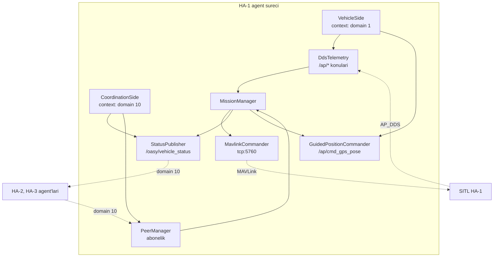

# DDS Mimarisi ve Domain Ayrımı (Tek Süreçte İki Ağ)

## 1. Sezgisel Tanım

Üç ArduPlane SITL örneği aynı makinede çalışıyor. Her biri AP_DDS ile
telemetrisini ROS 2 ağına yayınlıyor. Ve hepsi **aynı konu adlarını** kullanıyor:
`/ap/twist/filtered`, `/ap/pose/filtered`, `/ap/airspeed_vector`…

Üçü de aynı ağda olsaydı, HA-1'in agent'ı `/ap/twist/filtered`'a abone
olduğunda hangi aracın telemetrisini alırdı? **Belli olmaz.** Üçü karışır.

Sezgi: Üç kişi aynı odada telsizle konuşuyor ve hepsi aynı frekansı kullanıyor.
Kimin sesi kime ait, ayırt edemezsin. Çözüm: **herkese ayrı frekans ver.**
Ama bir de ortak bir kanal lazım ki birbirlerini duyabilsinler.

Bu mimari tam olarak budur:

| Kanal | Domain | İçerik |
|---|---|---|
| HA-1 telemetrisi | `ROS_DOMAIN_ID=1` | AP_DDS konuları |
| HA-2 telemetrisi | `ROS_DOMAIN_ID=2` | AP_DDS konuları |
| HA-3 telemetrisi | `ROS_DOMAIN_ID=3` | AP_DDS konuları |
| **Koordinasyon** | `ROS_DOMAIN_ID=10` | `/oasy/vehicle_status` |

Her agent **iki domaine birden** bağlanır: kendi aracınınkine (telemetri
okumak için) ve ortak olana (peer'ları duymak için).

## 2. Neden Var? Hangi Problemi Çözüyor?

Belge madde: *"Her HA'nın telemetri verilerini ArduPilot'un yerleşik DDS
(XRCE-DDS) kütüphanesini kullanarak doğrudan ROS 2 ortamına aktarınız."*

Bu, AP_DDS kullanmayı zorunlu kılıyor. AP_DDS ise konu adlarını sabitliyor ve
araç numarasına göre ön ek eklemiyor. Dolayısıyla ayrım **domain seviyesinde**
yapılmak zorunda.

Üç problem çözülür:

1. **Telemetri karışması.** Aynı domainde üç araç, aynı konu adı → belirsizlik.
2. **Merkeziyetsizlik.** Koordinasyon domaini herkese açık; hiçbir araç
   diğerinin telemetrisine erişmez, yalnızca yayınlanan özetleri görür.
3. **Yanlış bağlanmanın sessizliği.** Domain karışırsa sistem **hata vermez**,
   sessizce yanlış aracın telemetrisini okur. Bu, en tehlikeli arıza tipidir.

## 3. Nasıl Çalışır? (Adım Adım)

### Adım 1 — Tek süreçte iki rclpy context

Normal ROS 2 kullanımında bir süreç tek domaine bağlanır (`ROS_DOMAIN_ID`
ortam değişkeni). İki domaine bağlanmak için **iki ayrı context** gerekir:

```python
class VehicleSide:
    """Araca ozel domain: AP_DDS telemetrisi."""
    def __init__(self, context, config):
        self.node = rclpy.create_node(f"ha{config.vehicle_id}_vehicle", context=context)
        self.telemetry = DdsTelemetry(self.node)
        self.guided = GuidedPositionCommander(self.node)


class CoordinationSide:
    """Ortak domain: durum yayini ve peer dinleme."""
    def __init__(self, context, config):
        self.node = rclpy.create_node(f"ha{config.vehicle_id}_agent", context=context)
        self.publisher = StatusPublisher(self.node, config.vehicle_id)
        self.peers = PeerManager(...)
```

Her context kendi `SingleThreadedExecutor`'ında çalışır.

### Adım 2 — Yanlış domain tespiti

Domain karışması sessiz bir arızadır. Bu yüzden ilk telemetri örneği
**doğrulanır**:

```python
def check_home_sanity(logger, position, config) -> bool:
    """Okunan telemetrinin gercekten bu araca ait oldugunu dogrular."""
    offset_m = geodesic_distance_m(position, config.home)
    if offset_m <= HOME_SANITY_RADIUS_M:      # 1000 m
        return True
    logger.error(
        f"TELEMETRI UYUSMUYOR: okunan konum kendi kalkis noktasindan "
        f"{offset_m:.0f} m uzakta. Arac domain {config.vehicle_domain_id} "
        f"baska bir araca baglanmis olabilir."
    )
    return False
```

Üç kalkış noktası birbirinden kilometrelerce uzak olduğu için bu test kesin
sonuç verir.

### Adım 3 — Durum yayını

```python
STATUS_TOPIC = "/oasy/vehicle_status"
qos = QoSProfile(depth=10, reliability=ReliabilityPolicy.BEST_EFFORT)
```

**Neden BEST_EFFORT?** Kod yorumunda: *"Durum yayini yuksek frekansli ve eskiyen
veri oldugu icin kaybolan bir ornegin yeniden gonderilmesinin degeri yok."*

RELIABLE seçilseydi kayıp bir mesaj yeniden gönderilir, ama o mesaj çoktan
bayatlamış olurdu. Tazelik mekanizması ([03](03-peer-yonetimi-ve-tazelik.md))
zaten kayıp toleranslıdır.

### Adım 4 — Komut yolu ayrı

Telemetri DDS'ten okunur ama komutlar **MAVLink**'ten gider:

| İş | Kanal | Neden |
|---|---|---|
| Telemetri okuma | AP_DDS | Belge şartı |
| Görev yükleme | MAVLink | AP_DDS 4.6.3'te görev servisi yok |
| Hız komutu | MAVLink | `DO_CHANGE_SPEED`'in DDS karşılığı yok |
| Mod değiştirme | MAVLink | Aynı |
| GUIDED konum hedefi | AP_DDS | `/ap/cmd_gps_pose` var |

Bu **hibrit kontrol düzlemi** bilinçli bir tasarım kararıdır, eksiklik değil.

## 4. Matematiksel Temel

Bu modül geometri ya da kontrol içermez; ama iki nicel tasarım kararı vardır.

### Domain numaralandırma

$$\text{araç domain} = \text{vehicle\_id} \in \{1, 2, 3\}, \qquad \text{koordinasyon} = 10$$

Ayrık tutulmuş: koordinasyon domaini araç sayısı büyüse bile çakışmaz.

### QoS ve kayıp toleransı

Yayın hızı $f = 5$ Hz, tazelik eşiği $t_{\text{eski}} = 2$ s:

$$n_{\text{tolere edilen kayıp}} = f \times t_{\text{eski}} = 10\ \text{mesaj}$$

BEST_EFFORT ile ardışık 10 kayıp normal sayılır. Bu, QoS seçimiyle tazelik
eşiklerinin **birlikte** tasarlandığını gösterir.

### Home doğrulama yarıçapı

$$R_{\text{sanity}} = 1000\ \text{m}$$

Kalkış noktaları arası en kısa mesafe:

| Çift | Mesafe |
|---|---|
| HA-1 ↔ HA-2 | 8845 m |
| HA-1 ↔ HA-3 | **7754 m** |
| HA-2 ↔ HA-3 | 8981 m |

En yakın çift 7754 m ayrı; 1000 m eşik yaklaşık **8 kat** marjla yanlış
bağlanmayı yakalar.

## 5. Geometrik/Görsel Sezgi

```
  DOMAIN AYRIMI: her arac iki agda birden

  ┌─────────────────── DOMAIN 1 ───────────────────┐
  │  SITL HA-1 ──AP_DDS──► /ap/twist/filtered      │
  │                        /ap/pose/filtered        │
  │                        /ap/airspeed_vector      │
  └────────────────────┬────────────────────────────┘
                       │ okur
                 ┌─────▼──────┐
                 │  HA-1      │
                 │  agent     │──MAVLink──► SITL HA-1 (komut)
                 │  (surec)   │
                 └─────┬──────┘
                       │ yayinlar + dinler
  ┌────────────────────▼────────────────────────────┐
  │            DOMAIN 10 (koordinasyon)              │
  │         /oasy/vehicle_status                     │
  │    ▲                ▲                  ▲         │
  └────┼────────────────┼──────────────────┼─────────┘
       │                │                  │
   HA-1 agent      HA-2 agent         HA-3 agent
                        │                  │
  ┌─────────────────────▼──────┐  ┌────────▼─────────┐
  │  DOMAIN 2: SITL HA-2       │  │ DOMAIN 3: HA-3   │
  └────────────────────────────┘  └──────────────────┘

  Her agent kendi aracinin telemetrisini gorur,
  digerlerinin yalnizca YAYINLANAN OZETINI gorur.
```



## 6. Parametreler ve Etkileri

| Parametre | Değer | Etki |
|---|---|---|
| `vehicle_domain_id` | 1, 2, 3 | Araca özel telemetri domaini. Yanlışsa başka aracın telemetrisi okunur. |
| `coordination_domain_id` | 10 | Ortak yayın domaini. Üç araçta da aynı olmalı. |
| `STATUS_TOPIC` | `/oasy/vehicle_status` | Koordinasyon konusu. |
| `status_publish_hz` | 5.0 | Yayın hızı; tazelik eşikleriyle birlikte tasarlanmış. |
| QoS | BEST_EFFORT, depth 10 | Eskiyen veri için yeniden gönderim anlamsız. |
| `HOME_SANITY_RADIUS_M` | 1000 m | Yanlış domain tespiti. Kalkış noktaları ≥7 km ayrı. |
| `TELEMETRY_TIMEOUT_S` | 3.0 s | Telemetri kesilirse uyarı. |

## 7. Çalışılmış Örnek (Gerçek Sayılarla)

**Bağlam:** Sistem ayağa kalkarken loglar.

**Domain doğrulaması:**

```
telemetri dogrulandi: kalkis noktasina 3 m
```

Okunan ilk konum kendi home'una 3 metre uzaklıkta — doğru araca bağlanılmış.

**Yanlış bağlanma senaryosu.** Eğer HA-1'in agent'ı yanlışlıkla domain 3'e
bağlansaydı, HA-3'ün telemetrisini okurdu:

$$d(\text{HA-3 home},\ \text{HA-1 home}) = 7754\ \text{m} \gg 1000\ \text{m}$$

```
TELEMETRI UYUSMUYOR: okunan konum kendi kalkis noktasindan 7000 m uzakta.
Arac domain 1 baska bir araca baglanmis olabilir.
```

(Mesaj 7754 m yazardı.) Bu kontrol olmasaydı sistem **çalışıyor görünürdü** — telemetri akar, ETA
hesaplanır, komutlar gider. Ama araç başka birinin konumuna göre uçardı.

**Peer görünürlüğü.** Normal işleyişte her durum satırı peer yaşlarını
raporlar:

```
peer: HA-1: 0.2 s, HA-3: 0.2 s
```

İki peer da taze. Üç agent aynı domain 10'da birbirini görüyor.

**Kayıp mesaj sayacı.** Doğrulama koşularında `kayip mesaj 0` — sırasız teslim
ya da reddedilen mesaj yaşanmadı. BEST_EFFORT QoS'in bu ölçekte yeterli olduğunu
gösteriyor.

## 8. Sonuç Nasıl Olur?

Her agent süreci iki executor thread'i çalıştırır:

| Thread | Görev |
|---|---|
| Araç context executor'ı | AP_DDS telemetri callback'leri |
| Koordinasyon context executor'ı | Durum yayını, peer callback'leri |
| Görev yöneticisi thread'i | 20 Hz kontrol döngüsü |

Görev yöneticisi ROS callback'lerinden **bağımsız** bir thread'de çalışır —
MAVLink çağrıları bloklayıcı olduğu için rclpy executor'larını tıkamamalıdır.

## 9. Sınırlamalar / Yapamayacağı

- **Tek makine varsayımı.** Üç domain aynı makinede. Gerçek dağıtık donanımda
  domain yerine ağ segmentasyonu ve ortak zaman kaynağı gerekirdi.
- **`monotonic_ns` süreç yereldir.** Aynı makinede karşılaştırılabilir; farklı
  makinelerde anlamsız olurdu.
- **Domain karışması yalnızca başlangıçta yakalanır.** `check_home_sanity` ilk
  telemetride çalışır. Uçuş sırasında domain değişmez, dolayısıyla yeterli.
- **AP_DDS eksikleri MAVLink'e itiliyor.** Görev yükleme ve hız komutu için DDS
  yolu yok. AP_DDS geliştikçe bu hibrit yapı sadeleşebilir.
- **BEST_EFFORT kayıp toleransı sınırlı.** Ağ ciddi tıkanırsa 10 ardışık kayıp
  aşılır ve peer eskir. Bu ölçekte gözlenmedi.
- **Güvenlik yok.** Domain 10'a bağlanan herhangi biri sahte `VehicleStatus`
  yayınlayabilir. Simülasyon için kabul edilebilir.

## 10. Kodda Nerede

| Bileşen | Yer |
|---|---|
| İki context kurulumu | [`agent_node.py`](../../ros2_ws/src/oasy_uav_agent/oasy_uav_agent/agent_node.py) — `VehicleSide`, `CoordinationSide` |
| Domain doğrulama | [`agent_node.py` `check_home_sanity`](../../ros2_ws/src/oasy_uav_agent/oasy_uav_agent/agent_node.py) |
| Telemetri abonelikleri | [`dds_telemetry.py`](../../ros2_ws/src/oasy_uav_agent/oasy_uav_agent/autopilot_adapter/dds_telemetry.py) |
| GUIDED komutu | [`dds_commands.py`](../../ros2_ws/src/oasy_uav_agent/oasy_uav_agent/autopilot_adapter/dds_commands.py) |
| Durum yayını | [`status_publisher.py`](../../ros2_ws/src/oasy_uav_agent/oasy_uav_agent/coordination/status_publisher.py) |
| MAVLink komutları | [`mavlink_link.py`](../../ros2_ws/src/oasy_uav_agent/oasy_uav_agent/autopilot_adapter/mavlink_link.py) |
| Mesaj tanımı | [`VehicleStatus.msg`](../../ros2_ws/src/oasy_interfaces/msg/VehicleStatus.msg) |
| Domain ayarı | [`config/ha*.yaml`](../../ros2_ws/src/oasy_bringup/config/) |

## 11. Kod Örneği

Sessiz arızanın yakalanması:

```python
def check_home_sanity(logger, position, config: VehicleConfig) -> bool:
    """Okunan telemetrinin gercekten bu araca ait oldugunu dogrular."""
    offset_m = geodesic_distance_m(position, config.home)
    if offset_m <= HOME_SANITY_RADIUS_M:
        logger.info(f"telemetri dogrulandi: kalkis noktasina {offset_m:.0f} m")
        return True
    logger.error(
        f"TELEMETRI UYUSMUYOR: okunan konum kendi kalkis noktasindan "
        f"{offset_m:.0f} m uzakta. Arac domain {config.vehicle_domain_id} "
        f"baska bir araca baglanmis olabilir."
    )
    return False
```

QoS seçiminin gerekçesi:

```python
# Durum yayini yuksek frekansli ve eskiyen veri oldugu icin
# kaybolan bir ornegin yeniden gonderilmesinin degeri yok.
qos = QoSProfile(depth=QOS_DEPTH, reliability=ReliabilityPolicy.BEST_EFFORT)
```

## 12. İlgili Kavramlar

- [03 - Peer Yönetimi ve Tazelik](03-peer-yonetimi-ve-tazelik.md) — koordinasyon domaininden gelen verinin işlenmesi.
- [02 - Merkeziyetsiz Çıpa](02-merkeziyetsiz-capa.md) — yayınlanan verinin amacı.
- [06 - Rüzgâr Kestirimi](06-ruzgar-kestirimi.md) — araç domaininden okunan telemetri.
- [01 - Görev Durum Makinesi](01-gorev-durum-makinesi.md) — iki kanalı birleştiren döngü.

## 13. Kaynaklar

- Vaka belgesi: *"ArduPilot'un yerleşik DDS (XRCE-DDS) kütüphanesini kullanarak
  doğrudan ROS 2 ortamına aktarınız (MAVROS kullanımı zorunlu değildir,
  doğrudan DDS köprüsü tercih edilmelidir)."*
- Vaka belgesi madde 1: merkeziyetsizlik — koordinasyon domaininin tasarımı.
- ArduPilot AP_DDS 4.6.3 — konu adlarının araç bazında ön ek almaması.
