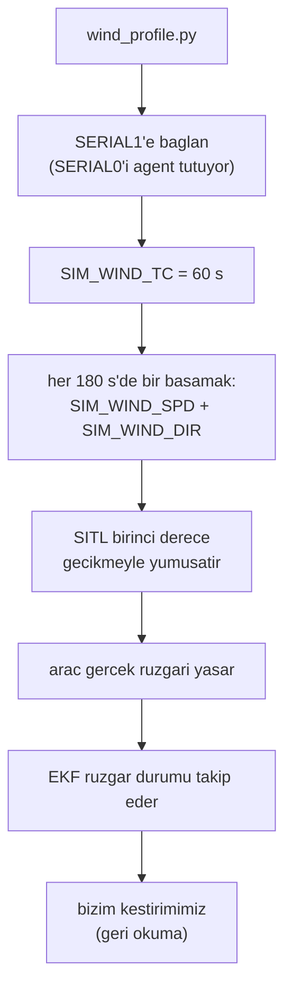

# Rüzgâr Profili ve Gerçekçilik (Kendi Testimizin Fiziği)

## 1. Sezgisel Tanım

Belge "değişken şiddet ve yönde rüzgâr" istiyor ama **ne kadar değişken**
olduğunu söylemiyor. O seçim bize kalıyor, ve bu sayfanın konusu, o seçimi
yanlış yapmanın haftalarca yanlış yerde hata aramaya nasıl yol açtığı.

Sezgi: Bir arabanın frenini test ediyorsun. "Zorlu koşul" diye buzda test
edersen ve fren tutmazsa, sorun frende mi buzda mı? Eğer o araç hiç buza
çıkmayacaksa, buzda başarısız olmasını düzeltmeye çalışmak boşa emektir. Önce
**testin gerçekçi olduğunu** doğrulaman gerekir.

Bizim profilimiz rüzgârı **20 saniyede 110 derece** döndürüyordu. Bu, sakin bir
günün değişkenliği değil; **fırtına çıkış cephesi** (gust front) seviyesidir.
Gerçek harekâtta o koşulda uçuş iptal edilir.

## 2. Neden Var? Hangi Problemi Çözüyor?

Belge madde 7: *"Simülasyon sırasında rotalar üzerinde değişken şiddet ve yönde
rüzgar parametreleri kullanınız. Algoritmanızın rüzgara karşı dirençli (robust)
olmasını ve varış zamanını korumasını sağlayınız."*

Şiddet ya da değişim hızı belirtilmemiş. Bu, doğrulama senaryosunu **bizim
tasarlamamız** demek, ve tasarımın savunulabilir olması gerekiyor.

**Sabit rüzgâr yetmez.** SITL'in `SIM_WIND_SPD` parametresi rüzgârı sabit tutar;
`SIM_WIND_TURB` yalnızca ortalamanın etrafında salınım üretir, ortalamayı
değiştirmez. Gerçekten değişken bir profil için parametreler **uçuş sırasında**
güncellenmelidir. `scripts/wind_profile.py` bunu yapar.

## 3. Nasıl Çalışır? (Adım Adım)

### Adım 1 İkinci bir MAVLink bağlantısı aç

Aracın SERIAL0'ını agent kullanıyor ve SITL'in TCP portu tek istemci kabul
ediyor. `start_sitl.sh` bu yüzden ikinci bir port açar:

```
--serial1=tcp:2  ->  5762 + 10 x (arac - 1)
```

### Adım 2 Geçiş zaman sabitini ayarla

```python
set_param(link, "SIM_WIND_TC", WIND_CHANGE_TC_S)
```

### Adım 3 Profili zamanla uygula

```python
for saniye, speed, direction in profile:
    bekleme = saniye - (time.monotonic() - baslangic)
    if bekleme > 0:
        time.sleep(bekleme)
    apply_step(links, speed, direction)   # SIM_WIND_SPD + SIM_WIND_DIR
```

Basamaklar üç araca **aynı anda** uygulanır, uzamsal bir cephe simüle
edilmez, yalnızca zamansal değişim.

### Adım 4 SITL yumuşak geçiş yapar

Basamak verilse de SITL ani atlamaz. `AP_HAL_SITL/SITL_State.cpp:338`:

```cpp
const float alpha = calc_lowpass_alpha_dt(dt, 1.0/tc);
_sitl->wind_speed_active     += (_sitl->wind_speed - _sitl->wind_speed_active) * alpha;
_sitl->wind_direction_active += (wrap_180(_sitl->wind_direction - _sitl->wind_direction_active)) * alpha;
```

Birinci derece gecikme. Bu, profilin gerçekçiliğini belirleyen **tek**
parametredir.

## 4. Matematiksel Temel

### Tepe dönüş hızı

Birinci derece gecikmede en hızlı değişim $t=0$ anındadır:

$$\left.\frac{d\theta}{dt}\right|_{\max} = \frac{\Delta\theta}{\tau}$$

Bu tek formül, profilin hangi meteorolojik olguya karşılık geldiğini belirler.

### Gerçek atmosferle karşılaştırma

| Durum | Dönüş hızı |
|---|---|
| Sakin hava, gün içi salınım | < 0.1 °/s |
| **Cephe geçişi** (frontal passage) | **0.2-0.5 °/s** |
| Fırtına çıkış cephesi (gust front) | 1.5-3 °/s |
| Mikropatlama (microburst) | > 5 °/s, çok kısa ve yerel |

### Eski profil

$$\frac{110°}{20\ \text{s}} = \mathbf{5.5\ °/s}$$

Fırtına çıkış cephesinin de üstünde, mikropatlama seviyesinde, ve bu, on iki
dakikalık bir görevde **dört kez** tekrarlanıyordu.

### Yeni profil

$$\frac{30°}{60\ \text{s}} = \mathbf{0.50\ °/s}$$

Cephe geçişi seviyesi. Gerçek, zorlu, ama uçulabilir.

### Rüzgâr hızları neden değişmedi

4-10 m/s aralığı Beaufort 3-5'e karşılık gelir:

| Hız | Knot | Beaufort |
|---|---|---|
| 4 m/s | 8 kt | 3 hafif esinti |
| 10 m/s | 19 kt | 5 kuvvetli esinti |

Üstelik biz **400 m AGL**'de uçuyoruz. O yükseklikte rüzgâr yüzey
sürtünmesinden kurtulmuş olur; tipik olarak 10 m yüzey rüzgârının **1.3-2
katıdır**. Yani 10 m/s tepe değerimiz yerde ~5-7 m/s'ye karşılık gelir
oldukça sakin bir gün.

Araca göre oranı:

$$\frac{10}{22.9} = 0.44 \quad \text{(seyir hızına göre)}$$

Sabit kanatlı harekât sınırı tipik olarak 0.5'tir. Yani hızlar zorlu ama
normal. **Gerçek dışı olan tek şey dönüş hızıydı.**

## 5. Geometrik/Görsel Sezgi

```
  RUZGAR YONU ZAMANLA (SIM_WIND_TC birinci derece gecikme)

  ESKI PROFIL (tepe 5.5 derece/s)          YENI PROFIL (tepe 0.50 derece/s)
  ────────────────────────────             ──────────────────────────────

  yon                                      yon
   │                                        │
  340├──────╮                              360├              ╭────────
   │        │                                │             ╱
  270├╮     │                              330├          ╭─╯
   │ │      │                                │        ╭─╯
  200├ ╰──╮ │                              300├     ╭─╯
   │      │ │                                │  ╭──╯
   90├      ╰╯                              270├──╯
   └──┬──┬──┬──┬──► t                       └──┬──┬──┬──┬──► t
      0 180 360 540                            0 180 360 540

  20 s'de 110 derece donuyor                60 s'de 30 derece donuyor
  = firtina cikis cephesi                   = cephe gecisi
```

**Yeni profil daha kolay değil.** Son bacaktaki (rota 135°)
rüzgâr bileşeni:

| Profil | Kuyruk rüzgârlı adım sayısı |
|---|---|
| Eski (uç durum) | 5 adımın **1**'i (+9.1 m/s) |
| **Yeni** | 5 adımın **3**'ü (+5.8, +8.7, +7.1 m/s) |

Bağlayıcı kısıt, son bacakta yavaşlama yetkisinin yok olması, yeni profilde
**daha uzun süre** etkin. Kaldırılan tek şey gerçek dışı dönüş hızı.



## 6. Parametreler ve Etkileri

| Parametre | Değer | Etki |
|---|---|---|
| Yön adımı | **30°** | Tepe dönüş hızının payı. |
| `SIM_WIND_TC` | **60 s** | Tepe dönüş hızının paydası. İkisi birlikte 0.50 °/s verir. |
| Basamak aralığı | 180 s | $3\tau = 180$ s, yani rüzgâr bir sonraki basamaktan önce %95 oturur. |
| Hız aralığı | 4-10 m/s | Beaufort 3-5. Değiştirilmedi. |
| `SIM_WIND_TURB` | 1 | Ortalamanın etrafında gerçekçi salınım. |

### İki profil birden tutuluyor

| Profil | Tepe hız | Kullanım |
|---|---|---|
| `DEFAULT_PROFILE` | 0.50 °/s | Varsayılan doğrulama |
| `EXTREME_PROFILE` | 5.5 °/s | `--extreme` bayrağı; algoritmanın **sınırını** göstermek için |

Sert profil silinmedi. Raporda "algoritma şu koşulda bozulur" demek, yalnızca
başarıyı göstermekten daha dürüsttür.

## 7. Çalışılmış Örnek (Gerçek Sayılarla)

**Yeni profil ve her adımın dönüş hızı** (`--print-profile` çıktısı):

```
t+     0 s    4.0 m/s    270 derece
t+   180 s    6.0 m/s    300 derece  (+30 derece, tepe 0.50 derece/s)
t+   360 s    9.0 m/s    330 derece  (+30 derece, tepe 0.50 derece/s)
t+   540 s   10.0 m/s      0 derece  (+30 derece, tepe 0.50 derece/s)
t+   720 s    7.0 m/s     30 derece  (+30 derece, tepe 0.50 derece/s)
```

**Eski profil aynı çıktıyla:**

```
t+   180 s    9.0 m/s    200 derece  (-70 derece, tepe 3.50 derece/s)
t+   360 s    6.0 m/s     90 derece  (-110 derece, tepe 5.50 derece/s)
t+   540 s   10.0 m/s    340 derece  (-110 derece, tepe 5.50 derece/s)
```

### Sonuç: aynı sistem, iki profil

Kod değişmeden yalnızca profil değiştirildiğinde:

| Profil | HA-3 sapması | Not |
|---|---|---|
| Eski (5.5 °/s) | **−2.55 s** | S-manevrası kapalı, kontrol koşusu |
| **Yeni (0.50 °/s)** | **−0.13 / +0.10 / +0.17 s** | üç bağımsız koşu |

**Zorlu vektör her iki durumda da yaşandı.** Yeni profildeki koşuların son
bacağında ölçülen rüzgâr:

| Koşu | Son bacak rüzgârı | Yer hızı |
|---|---|---|
| #1 | 9.4 m/s, 330° | 25.7 m/s |
| #2 | 9.5 m/s, 330° | 26.3 m/s |
| #3 | 9.3 m/s, 337° | 25.4 m/s |

Yani araç, daha önce bizi −11 ile −13 saniyeye götüren **tam o rüzgâr
vektörünün** içinden geçti ve ±0.2 s tutturdu.

### Neden fark bu kadar büyük

Kritik ölçüm: yeni profilde araç son yaklaşmada **17 m/s** komut ediyordu, taban
olan 13 değil. Yani yavaşlama yetkisinin ~4 m/s'sini **yedekte tutabildi**.

Eski profilde rüzgâr 20 saniyede 110° döndüğü için araç plana bağlandıktan sonra
tepki veremiyor, hız tabanına yapışıyor ve orada kalıyordu. Tabana yapışınca
düzeltme yetkisi sıfırlanıyordu.

$$\text{yetki} = v_{\text{komut}} - v_{\min} = 17 - 13 = 4\ \text{m/s} \quad (\text{yeni})$$
$$\text{yetki} = 13 - 13 = 0\ \text{m/s} \quad (\text{eski})$$

## 8. Sonuç Nasıl Olur?

`scripts/wind_profile.py` bir yan süreç olarak çalışır ve üç SITL örneğine
zamanla değişen rüzgâr enjekte eder. Uçuş kodu bundan habersizdir, profil
tamamen doğrulama tarafındadır.

`--print-profile` bayrağı profili uygulamadan yazdırır ve her adımın dönüş
hızını hesaplar; rapora doğrudan konabilir.

## 9. Sınırlamalar / Yapamayacağı

- **Uzamsal cephe yok.** Basamaklar üç araca aynı anda uygulanır. Gerçekte bir
  cephe uzayda ilerler ve araçlar onu farklı zamanlarda karşılar. Bu, bu projede
  "peer'ın rüzgârını uzamsal önizleme olarak kullanalım" fikrini çürüttü
  ortada önizlenecek bir cephe yok.
- **Faz hizalaması kontrolsüz.** Profil enjeksiyonu ile aracın son bacağa varışı
  arasındaki zaman ilişkisi koşudan koşuya değişir. Bu yüzden tek koşu kanıt
  değildir; zorlu vektörün gerçekten yaşandığı **loglardan doğrulanmalıdır**.
- **Dikey rüzgâr ve kayma yok.** `SIM_WIND_DIR_Z` ve `SIM_WIND_T_ALT`
  kullanılmıyor.
- **Türbülans basit.** `SIM_WIND_TURB` gerçek Dryden/von Kármán modeli değil.
- **Profil sabit uzunlukta.** 720 saniyeden uzun görevlerde son basamak
  sonsuza kadar sürer.

## 10. Kodda Nerede

| Bileşen | Yer |
|---|---|
| Profil betiği | [`scripts/wind_profile.py`](../../scripts/wind_profile.py) |
| Varsayılan profil | `DEFAULT_PROFILE` |
| Uç durum profili | `EXTREME_PROFILE` + `--extreme` |
| Başlangıç parametreleri | [`params/wind/variable.parm`](../../ros2_ws/src/oasy_bringup/params/wind/variable.parm) |
| İkinci port | [`scripts/start_sitl.sh`](../../scripts/start_sitl.sh) `--serial1=tcp:2` |
| SITL yumuşatma | `ardupilot/libraries/AP_HAL_SITL/SITL_State.cpp:338` |

## 11. Kod Örneği

Profil tanımı ve gerekçesi:

```python
# SIM_WIND_TC birinci derece gecikmedir (AP_HAL_SITL/SITL_State.cpp), bu yüzden
# tepe dönüş hızı Delta/tc olur
# Bu, profilin ne kadar gercekci oldugunu belirleyen tek sayidir:
#
#   sakin hava gün içi salınımı   < 0.1 derece/s
#   cephe geçişi                    0.2-0.5 derece/s
#   fırtına çıkış cephesi           1.5-3 derece/s
#
# profil 30 derecelik adım ve 60 s zaman sabitiyle 0.5 derece/s tepe hız verir,
# yani bir cephe geçişi
DEFAULT_PROFILE = (
    (0.0, 4.0, 270.0),
    (180.0, 6.0, 300.0),
    (360.0, 9.0, 330.0),
    (540.0, 10.0, 0.0),
    (720.0, 7.0, 30.0),
)
WIND_CHANGE_TC_S = 60.0
```

## 12. İlgili Kavramlar

- [06 - Rüzgâr Kestirimi](06-ruzgar-kestirimi.md) kestirimin takip edebileceği değişim hızının sınırı.
- [14 - Robust E/L Sınırları](14-robust-e-l-sinirlari.md) bozucu zarfın bu profile göre seçilmesi.
- [13 - Terminal Rezerv](13-terminal-rezerv.md) hız yetkisinin yedekte tutulması.
- [12 - Son Yasal Kapı](12-son-yasal-kapi.md) yetki tükendiğinde son çare.

## 13. Kaynaklar

- Vaka belgesi madde 7: değişken rüzgâr ve robustluk şartı; şiddet belirtilmemiş.
- `ardupilot/libraries/AP_HAL_SITL/SITL_State.cpp:330-345` `SIM_WIND_TC`'nin
  birinci derece gecikme olduğunun kaynağı.
- Beaufort ölçeği hız aralığının sınıflandırması.
- Doğrulama koşuları `logs/run_20260804_1*` yeni profille alınan sonuçlar.
