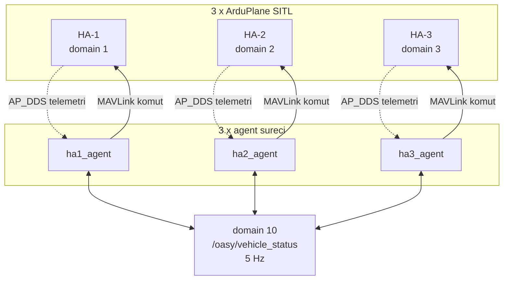

# OASY Merkeziyetsiz Çoklu İHA Varış Koordinasyonu

Üç sabit kanatlı İHA (ArduPlane 4.6.3 SITL) farklı pistlerden otonom kalkıp
ortak bir hedefe HA-1 → HA-2 → HA-3 sırasıyla ve aralarında tam 20 saniye
farkla varır.

Merkezi bir yer kontrol istasyonu ya da master node yoktur; her araç kendi
kararını diğerlerinin DDS yayınlarını dinleyerek bağımsız verir.

## Doğrulanmış Sonuçlar

Senaryo başına iki koşu, altısı da geçti:

| Senaryo | Koşu 1 | Koşu 2 | Havada bekleme |
|---|---|---|---|
| Sakin | −0.00 / −0.00 s | −0.00 / −0.01 s | 0 s |
| Sabit 8 m/s | −0.20 / +0.02 s | −0.29 / +0.09 s | 62 s |
| Değişken rüzgâr | −0.13 / +0.10 s | −0.11 / +0.17 s | 0 s |

| Ölçüt | Sınır | En kötü gözlenen |
|---|---|---|
| Ardışık varış farkı | 20 s ± 1.0 s | +0.17 s |
| Varış sırası | HA-1/2/3 | doğru |
| Hedefe yaklaşma | ≤ 5 m | 4.99 m |
| Rota sapması | ≤ 500 m | 127 m |

Birim testler: 161 test, hepsi geçiyor.

---

## Hızlı Başlangıç

Ön koşullar kuruluysa tek komut yeterlidir:

```bash
./run.sh                # sakin hava
./run.sh steady         # sabit 8 m/s rüzgâr
./run.sh variable       # değişken rüzgâr (cephe geçişi, 0.50 °/s)
./run.sh extreme        # uç durum (fırtına çıkış cephesi, 5.5 °/s)
```

Ön koşulları uçuş yapmadan denetlemek için:

```bash
./run.sh --check
```

`run.sh` ROS ortamını ve çalışma alanını kendisi kaynak alır, önceki
koşudan artan süreçleri temizler, seçilen rüzgâr profilini zamanında enjekte
eder ve üç aracı kaldırır.

Durdurmak için `Ctrl+C`, betik tüm SITL, XRCE agent ve node süreçlerini
kapatır.

### Sonuçları ölçme

```bash
python3 scripts/analyze_run.py --log logs/run_YYYYMMDD_HHMMSS/agents.log
```

Varış sırasını, ardışık farkları, hedefe yaklaşmayı, rota sapmasını ve bekleme
sürelerini raporlar; kabul ölçütleri sağlanmazsa sıfırdan farklı çıkış kodu
döndürür.

---

## Kurulum

### 1. Sistem ortamı

| Bileşen | Sürüm |
|---|---|
| Ubuntu | 22.04.5 LTS |
| ROS 2 | Humble |
| Python | 3.10.12 |
| ArduPlane | 4.6.3 (tag `Plane-4.6.3`, commit `3fc7011a7d`) |
| Micro XRCE-DDS Agent | v2.4.2 |
| Micro XRCE-DDS Gen | v4.5.1 |

ROS 2 Humble kurulumu:
<https://docs.ros.org/en/humble/Installation/Ubuntu-Install-Debs.html>

### 2. Python bağımlılıkları

Yalnızca dört kütüphane gerekir; hepsi `requirements.txt`'te ve `.whl` olarak
`wheelhouse/` dizininde teslim edilmiştir.

Çevrimdışı kurulum (teslim edilen tekerlerden):

```bash
pip install --no-index --find-links=wheelhouse -r requirements.txt
```

Çevrimiçi kurulum:

```bash
pip install -r requirements.txt
```

| Kütüphane | Sürüm | Neden gerekli |
|---|---|---|
| `pymavlink` | 2.4.49 | Görev yükleme, mod, arm, `DO_CHANGE_SPEED` |
| `geographiclib` | 1.52 | WGS84 jeodezik mesafe ve kerteriz |
| `PyYAML` | ≥5.4.1 | Araç konfigürasyonlarının okunması |
| `pytest` | 6.2.5 | Birim testler (çalıştırmak için zorunlu değil) |

> Ortam notu. Ubuntu 22.04 + ROS 2 Humble kurulumunda `geographiclib`,
> `PyYAML` ve `pytest` zaten apt paketi olarak gelir
> (`python3-geographiclib`, `python3-yaml`, `python3-pytest`). Bu ortamda
> yalnızca `pymavlink` pip ile kurulur. Wheelhouse temiz bir ortam için de
> yeterlidir.
>
> `PyYAML` 5.4.1'in hazır tekeri bulunmadığı için wheelhouse'da 6.0.3 vardır;
> kod yalnızca `yaml.safe_load` kullandığı için API farkı yoktur.

ROS 2 tarafındaki bağımlılıklar (`rclpy`, `std_msgs`, `geometry_msgs`,
`geographic_msgs`, `ardupilot_msgs`) pip ile kurulmaz, ROS kurulumundan gelir.

### 3. ArduPilot SITL

ArduPlane 4.6.3 kaynağı `ardupilot/` dizininde teslim edilmiştir.
Kaynak kod üzerinde hiçbir değişiklik yapılmamıştır, tag `Plane-4.6.3`,
commit `3fc7011a7d`, olduğu gibi klonlanmıştır.

```bash
cd ardupilot
./waf configure --board sitl
./waf plane
```

`sim_vehicle.py`'nin `PATH`'te olması ya da
`~/ardu_ws/src/ardupilot/Tools/autotest/` altında bulunması beklenir.

### 4. Micro XRCE-DDS Agent

AP_DDS köprüsü için gereklidir; `~/ardu_ws/install/micro_ros_agent` altında
kurulu olması beklenir.

### 5. Çalışma alanını derleme

```bash
cd ros2_ws
colcon build
source install/setup.bash
```

---

## Sonradan Eklenen ROS Mesajları

`oasy_interfaces` ayrı bir ROS 2 paketidir ve colcon build'e hazırdır.

```
ros2_ws/src/oasy_interfaces/
├── CMakeLists.txt
├── package.xml
└── msg/
    ├── MissionEvent.msg
    └── VehicleStatus.msg
```

Tek başına derlemek ve incelemek:

```bash
cd ros2_ws
colcon build --packages-select oasy_interfaces
source install/setup.bash
ros2 interface show oasy_interfaces/msg/VehicleStatus
ros2 interface show oasy_interfaces/msg/MissionEvent
```

Paketin bağımlılığı yalnızca `std_msgs`'tır.

`VehicleStatus`, araçların birbirine yayınladığı tek sözleşmedir; içeriği ve
her alanın gerekçesi [docs/02-haberlesme-akisi.md](docs/02-haberlesme-akisi.md)'de.
`MissionEvent` kritik olayları ayrı bir kanala taşımak için hazırlanmıştır ancak
mevcut uçuş akışında yayınlanmamakta ve kullanılmamaktadır.

---

## Kaynak Kod Haritası

### Üst düzey

| Yol | İşlev |
|---|---|
| `run.sh` | Tek giriş noktası, ortam hazırlığı, ön koşul denetimi ve senaryo seçimi |
| `requirements.txt` | Python bağımlılıkları |
| `wheelhouse/` | Çevrimdışı kurulum için `.whl` paketleri |
| `ardupilot/` | ArduPlane 4.6.3 kaynağı (değiştirilmedi) |
| `docs/` | Teknik rapor ve 16 kavram sayfası |
| `logs/` | Koşu logları (versiyonlanmaz) |

### Agent paketi `ros2_ws/src/oasy_uav_agent/oasy_uav_agent/`

| Dosya | Satır | İşlev |
|---|---|---|
| `agent_node.py` | 268 | Süreç girişi. İki `rclpy.Context` kurar (araç domaini + koordinasyon domaini), executor'ları çalıştırır, telemetrinin doğru araca ait olduğunu doğrular |
| `mission_manager.py` | 1200 | Çekirdek görev yönetimi, 14 durumlu görev makinesi, 20 Hz kontrol döngüsü, çıpa uygulaması, kapı loiteri, terminal rezerv ve robust E/L sınırları |
| `config_model.py` | 98 | Araç konfigürasyonunun YAML'dan okunması ve doğrulanması |

`autopilot_adapter/`, otopilot arayüzü

| Dosya | Satır | İşlev |
|---|---|---|
| `dds_telemetry.py` | 156 | AP_DDS abonelikleri (`/ap/navsat`, `/ap/twist/filtered`, `/ap/pose/filtered`, `/ap/airspeed_vector`); son geçerli durumu tutar |
| `dds_commands.py` | 40 | GUIDED konum hedefi (`/ap/cmd_gps_pose`) |
| `mavlink_link.py` | 196 | MAVLink komut kanalı: görev yükleme, mod değiştirme, arm, `DO_CHANGE_SPEED` |
| `mission_builder.py` | 46 | Rota noktalarından ArduPlane görev listesi üretimi (MSL irtifa, kabul yarıçapları) |

`estimation/`, kestirim

| Dosya | Satır | İşlev |
|---|---|---|
| `wind_estimator.py` | 241 | Rüzgâr kestirimi (yer hızı − hava hızı), EMA filtre, rüzgâr düzeltmeli rota süresi, rampalı sürüm |
| `eta_estimator.py` | 141 | Aktif waypoint takibi (izdüşüm testi), kalan mesafe, ilerleme hızı |
| `geodesy.py` | 150 | WGS84 mesafe/kerteriz, yerel düzlem izdüşümü, çember kesişimi, rota sapması |
| `arrival_detector.py` | 50 | 5 m kabul çemberine giriş; örnekler arası interpolasyon |

`control/`, kontrol

| Dosya | Satır | İşlev |
|---|---|---|
| `arrival_controller.py` | 138 | Hızla zamanlama düzeltmesi; ölü bant, doygunluk, rate limit, gönderme eşiği |

`coordination/`, merkeziyetsiz koordinasyon

| Dosya | Satır | İşlev |
|---|---|---|
| `arrival_schedule.py` | 93 | Çıpa hesabı, referans varış, kalkış anı, kapı bırakma penceresi |
| `peer_manager.py` | 105 | Peer durumları, tazelik sınıflaması (TAZE/ESKİ/KAYIP), deterministik rüzgâr kaynağı |
| `status_publisher.py` | 67 | `VehicleStatus` üretimi ve yayını |

`safety/`

| Dosya | Satır | İşlev |
|---|---|---|
| `safety_manager.py` | 0 | Boş dosya, `FAILSAFE` durumu enum'da tanımlı ancak işleyici yok ve bu bilinen bir eksik |

### Bringup paketi `ros2_ws/src/oasy_bringup/`

| Yol | İşlev |
|---|---|
| `launch/three_vehicles.launch.py` | Üç agent node'unu tek launch ile başlatır |
| `config/ha{1,2,3}.yaml` | Araç konfigürasyonları: rota (Tablo 1), domain'ler, hız zarfı, kabul yarıçapları |
| `params/ha{1,2,3}.parm` | ArduPlane parametreleri (`ARSPD_USE`, `EK3_WIND_P_NSE` dahil, gerekçeleriyle) |
| `params/wind/steady.parm` | Sabit 8 m/s rüzgâr |
| `params/wind/variable.parm` | Değişken rüzgâr başlangıç durumu |

### Betikler `scripts/`

| Dosya | Satır | İşlev |
|---|---|---|
| `start_all.sh` | 48 | Üç SITL + üç XRCE agent + üç node; DDS oturumunun kurulduğunu loglardan doğrular |
| `start_sitl.sh` | 61 | Tek araç için SITL ve XRCE agent |
| `stop_all.sh` | 48 | Tüm süreçleri durdurur, portları serbest bırakır |
| `wind_profile.py` | 121 | Uçuş sırasında rüzgâr profili enjeksiyonu (`--extreme` ile uç durum, `--print-profile` ile rapor çıktısı) |
| `analyze_run.py` | 256 | Koşu metrikleri ve kabul ölçütü denetimi |

### Testler `tests/unit/`

161 birim testi; uçuş gerektirmeyen tüm mantığı kapsar.

```bash
python3 -m pytest tests/unit -q
```

---

## Sistem Akışı



Her araç iki DDS domaine birden bağlanır: kendi telemetrisi için araca özel
domaine, peer'ları duymak için ortak domaine. AP_DDS konu adları araç bazında
ön ek almadığı için bu ayrım zorunludur.

Görev akışı (14 durum, tek yönlü):

```
INIT → CONNECTING → MISSION_UPLOAD → WAIT_PEERS → WAIT_TAKEOFF_SLOT
     → ARMING → TAKEOFF → CLIMB → CRUISE → TERMINAL → ARRIVED → RTL → DONE
```

Ayrıntı: [docs/01-sistem-mimarisi.md](docs/01-sistem-mimarisi.md)

---

## Dokümantasyon

Teknik rapor, belgenin istediği dört başlıkla birebir hizalıdır:

| Bölüm | İçerik |
|---|---|
| [00 - Genel Bakış](docs/00-genel-bakis.md) | Sonuç özeti, maddekarşılık tablosu, öne çıkan bulgular |
| [01 - Sistem Mimarisi](docs/01-sistem-mimarisi.md) | Mimari ve merkeziyetsiz kontrol yaklaşımı |
| [02 - Haberleşme Akışı](docs/02-haberlesme-akisi.md) | Node'lar arası akış, paket yapısı, akış şemaları |
| [03 - Algoritmalar](docs/03-algoritmalar.md) | Varış kontrolü, rüzgâr kompanzasyonu, algoritmalar |
| [04 - Geliştirme ve Testler](docs/04-gelistirme-ve-testler.md) | Süreç, problemler, test sonuçları |

Ayrıca 16 kavram sayfası bulunur ([docs/kavramlar/](docs/kavramlar/)). Her mekanizma
için neden var, nasıl çalışır, matematiği, gerçek uçuş verisiyle çalışılmış
örneği ve sınırlamaları.

---

## Bilinen Sınırlamalar

| Eksik | Durum |
|---|---|
| `FAILSAFE` işleyicisi | `safety_manager.py` boş; telemetri kesintisi/GPS kaybı için kurtarma yok |
| S-manevrası | Uygulandı ve uçuşta doğrulandı, belge zorunlu tutmadığı için kaldırıldı, gerekçe [docs/04](docs/04-gelistirme-ve-testler.md) |
| Uç durum rüzgârı | 5.5 °/s dönüşte sapma −2.55 s (algoritmanın ölçülmüş sınırı) |
| Split-brain | Ağ bölünmesine karşı koruma yok |
| Tek makine | `monotonic_ns` süreç yerel; gerçek dağıtık donanımda ortak zaman kaynağı gerekir |

---

## Sorun Giderme

| Belirti | Sebep | Çözüm |
|---|---|---|
| `DDS oturumu kurulamadi` | Önceki koşudan artan süreç, port çakışması | `bash scripts/stop_all.sh` sonra tekrar dene |
| `Package 'oasy_bringup' not found` | Çalışma alanı kaynak alınmamış | `run.sh` kullan; kendisi kaynak alır |
| `TELEMETRI UYUSMUYOR` | Araç yanlış DDS domainine bağlanmış | `config/ha*.yaml` içindeki `vehicle_domain_id` değerlerini kontrol et |
| Telemetri yaşı sürekli büyüyor | SITL TCP tamponu dolmuş | Bu, `drain()` çağrılmadığında olur; normal işleyişte görülmemeli |
| Varış sapması büyük | Rüzgâr fazı zorlu vektöre denk gelmiş | Loglardan son bacak rüzgârını kontrol et; tek koşu kanıt değildir |
